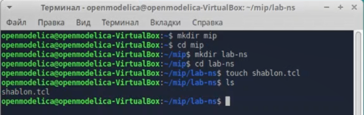
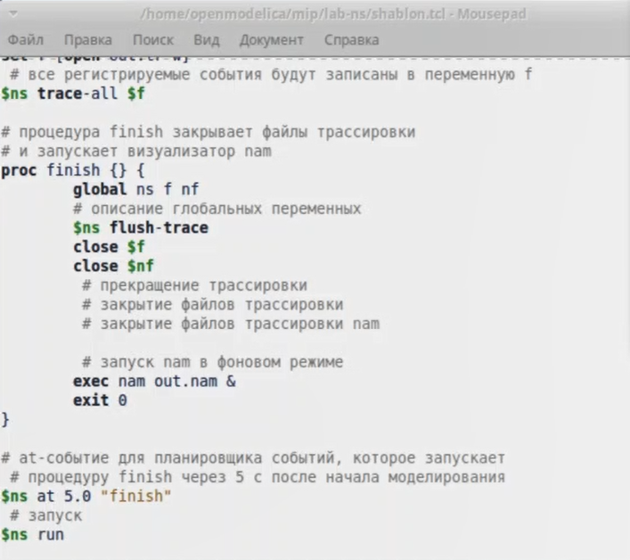
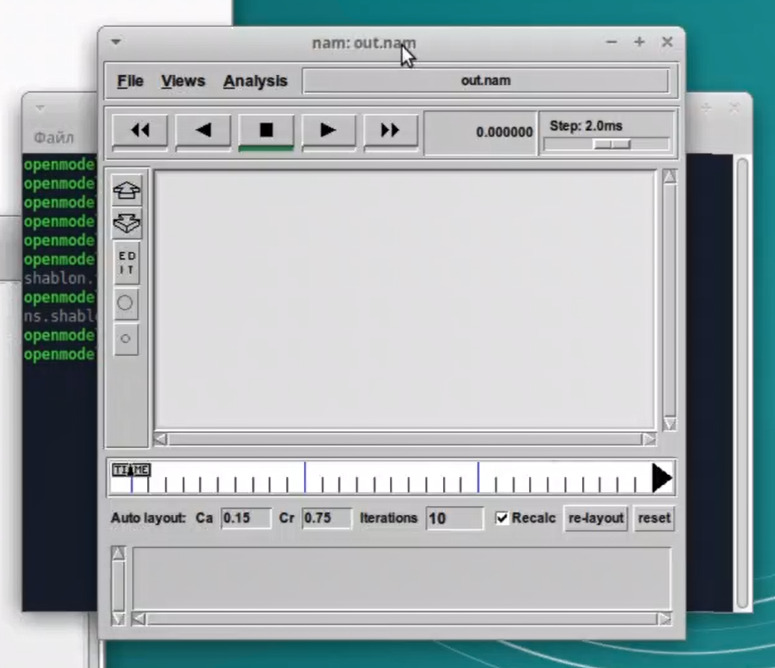
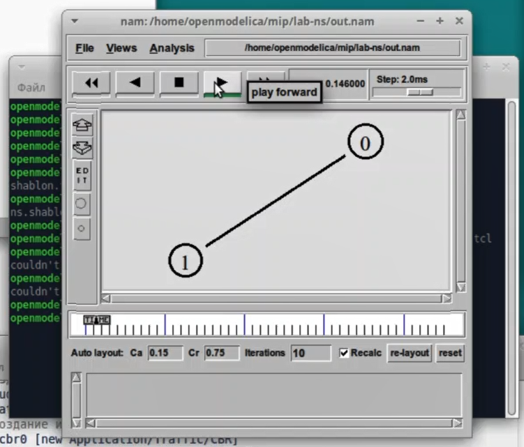
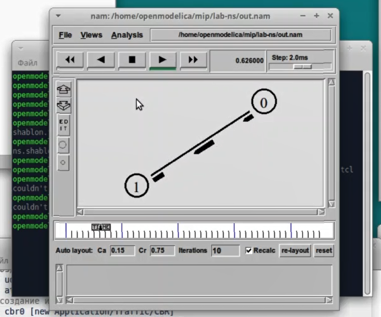
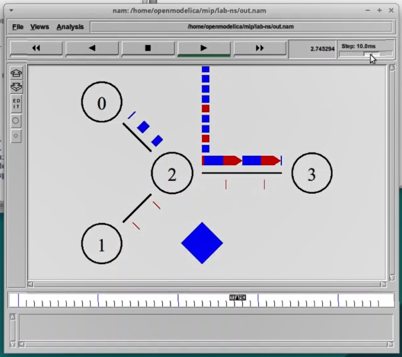
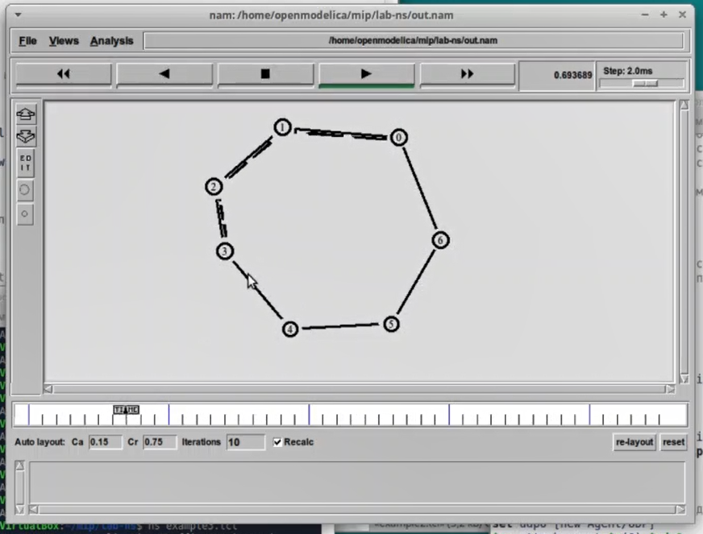
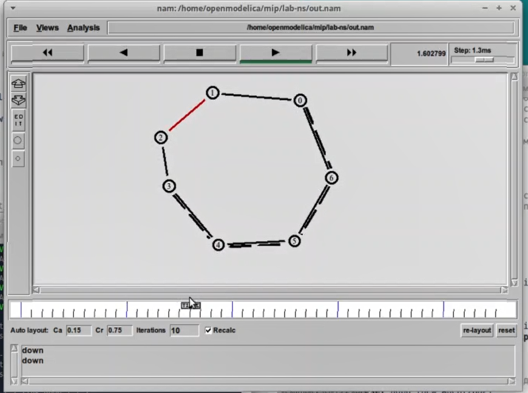
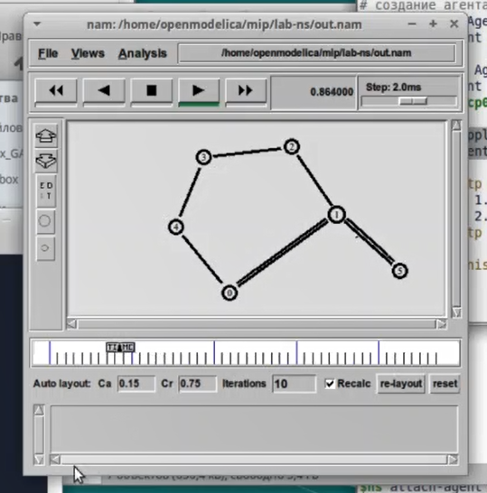
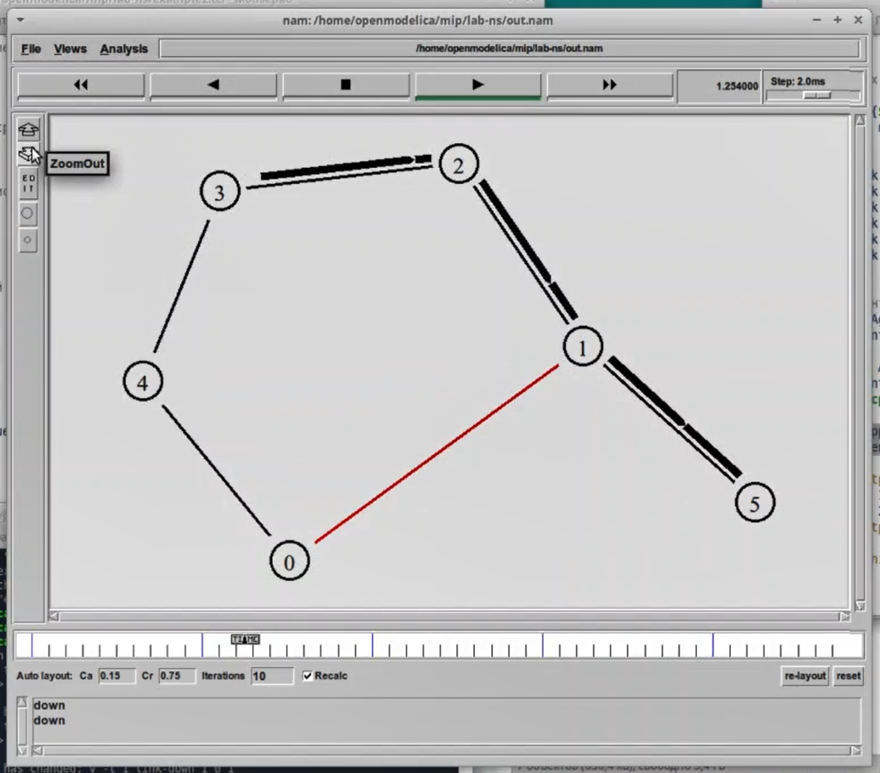

---
## Front matter
lang: ru-RU
title: Лабораторная работа №1
subtitle: Имитационное моделирование
author:
  - Александрова Ульяна
institute:
  - Российский университет дружбы народов, Москва, Россия
date: 14 февраля 2025

## i18n babel
babel-lang: russian
babel-otherlangs: english

## Formatting pdf
toc: false
toc-title: Содержание
slide_level: 2
aspectratio: 169
section-titles: true
theme: metropolis
header-includes:
 - \metroset{progressbar=frametitle,sectionpage=progressbar,numbering=fraction}
---

# Информация

## Докладчик

:::::::::::::: {.columns align=center}
::: {.column width="70%"}

  * Александрова Ульяна
  * студентка 3го курса
  * Факультет физико-математических и естественных наук
  * Российский университет дружбы народов
  * [1132226444@rudn.ru](mailto:1132226444@rudn.ru)

:::
::: {.column width="30%"}

:::
::::::::::::::

# Цель работы

Целью работы является освоение работы с топологиями сетей при помощи средства имитационного моделирования NS-2, а также анализ результатов моделирования.

# Задание

1. Проверить работу примеров из источника;
2. Выполнить упражнение по описанию своей собственной топологии сети.

# Выполнение лабораторной работы

## Шаблон сценария для NS-2

{#fig:001 width=70%}

{#fig:002 width=70%}

## NS

{#fig:003 width=70%}

## Простой пример описания топологии сети, состоящей из двух узлов и одного соединения

{#fig:005 width=70%}

{#fig:006 width=70%}

## Пример с усложнённой топологией сети

{#fig:007 width=70%}

## Пример с кольцевой топологией сети

{#fig:008 width=70%}

{#fig:009 width=70%}

## Упражнение

- передача данных должна осуществляться от узла n(0) до узла n(5) по кратчайшему пути в течение 5 секунд модельного времени;
- передача данных должна идти по протоколу TCP (тип Newreno), на принимающей стороне используется TCPSink-объект типа DelAck; 
- поверх TCP работает протокол FTP с 0,5 до 4,5 секунд модельного времени;
- с 1 по 2 секунду модельного времени происходит разрыв соединения между узлами n(0) и n(1);
- при разрыве соединения маршрут передачи данных должен измениться на резервный, после восстановления соединения пакеты снова должны пойти по кратчайшему пути.

## 

{#fig:010 width=70%}

{#fig:011 width=70%}

# Выводы

Я научилась работать с утилитой NS-2, а также построила простейшие примеры топологии сети, что помогло мне освоить базу для их последующего моделирования.

