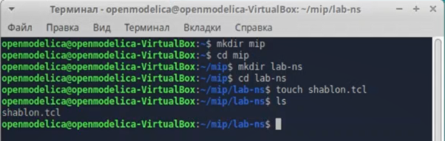
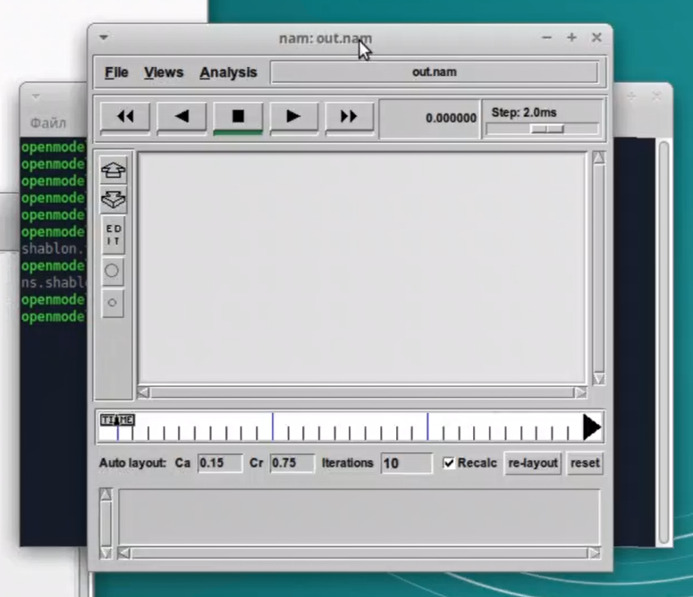
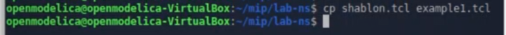
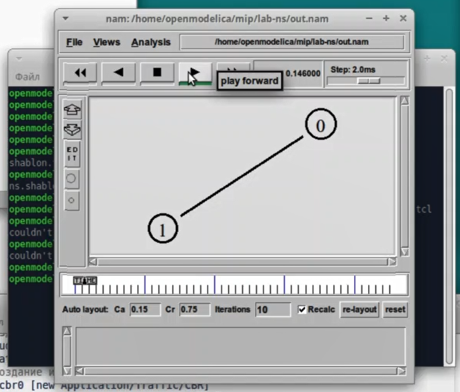
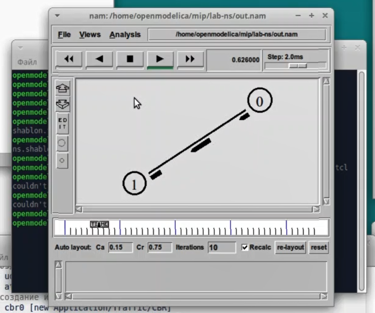
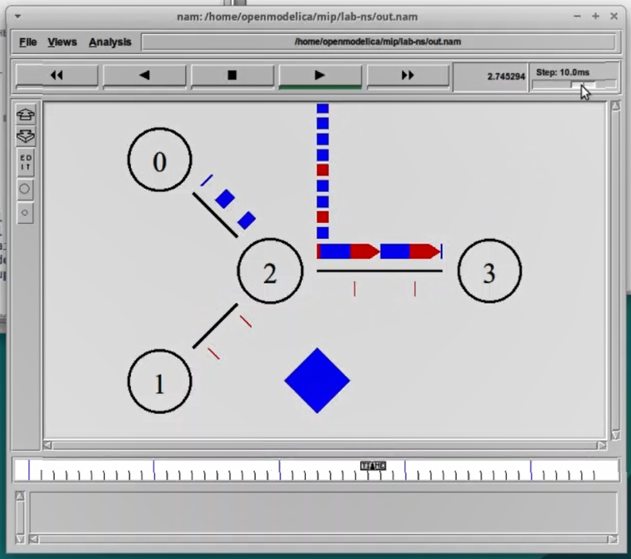
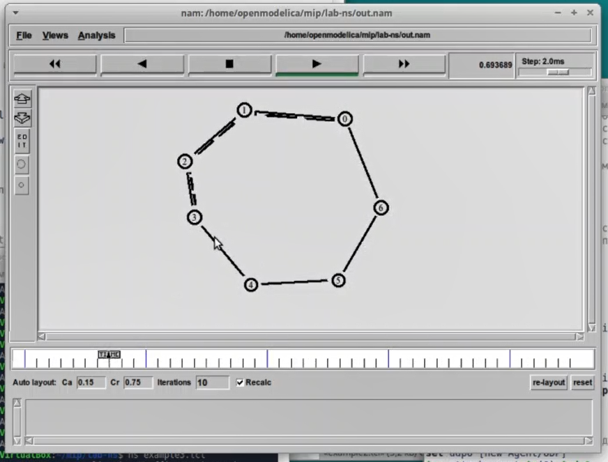
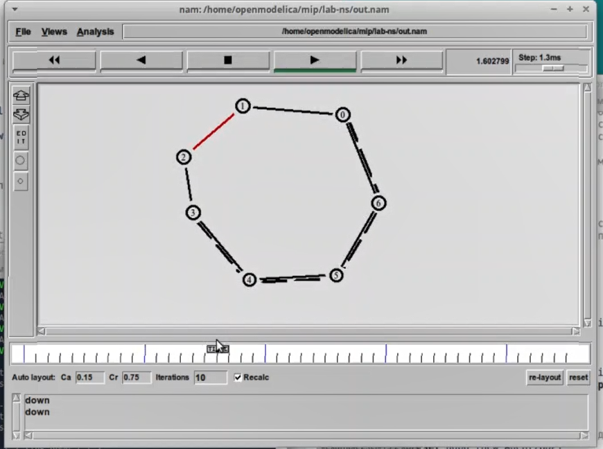
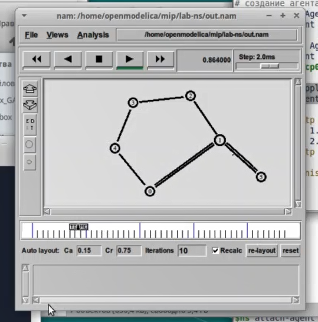
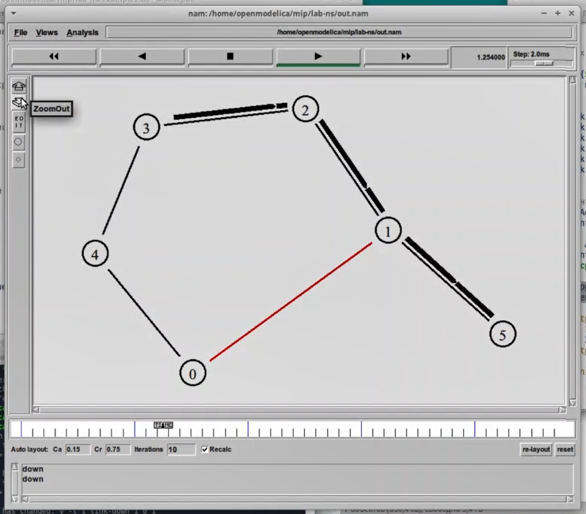

---
## Front matter
title: "Лабораторная работа №1. Простые модели компьютерной сети."
subtitle: Имитационное моделирование"
author: "Александрова Ульяна Вадимовна"

## Generic otions
lang: ru-RU
toc-title: "Содержание"

## Bibliography
bibliography: bib/cite.bib
csl: pandoc/csl/gost-r-7-0-5-2008-numeric.csl

## Pdf output format
toc: true # Table of contents
toc-depth: 2
lof: true # List of figures
lot: true # List of tables
fontsize: 12pt
linestretch: 1.5
papersize: a4
documentclass: scrreprt
## I18n polyglossia
polyglossia-lang:
  name: russian
  options:
	- spelling=modern
	- babelshorthands=true
polyglossia-otherlangs:
  name: english
## I18n babel
babel-lang: russian
babel-otherlangs: english
## Fonts
mainfont: IBM Plex Serif
romanfont: IBM Plex Serif
sansfont: IBM Plex Sans
monofont: IBM Plex Mono
mathfont: STIX Two Math
mainfontoptions: Ligatures=Common,Ligatures=TeX,Scale=0.94
romanfontoptions: Ligatures=Common,Ligatures=TeX,Scale=0.94
sansfontoptions: Ligatures=Common,Ligatures=TeX,Scale=MatchLowercase,Scale=0.94
monofontoptions: Scale=MatchLowercase,Scale=0.94,FakeStretch=0.9
mathfontoptions:
## Biblatex
biblatex: true
biblio-style: "gost-numeric"
biblatexoptions:
  - parentracker=true
  - backend=biber
  - hyperref=auto
  - language=auto
  - autolang=other*
  - citestyle=gost-numeric
## Pandoc-crossref LaTeX customization
figureTitle: "Рис."
tableTitle: "Таблица"
listingTitle: "Листинг"
lofTitle: "Список иллюстраций"
lotTitle: "Список таблиц"
lolTitle: "Листинги"
## Misc options
indent: true
header-includes:
  - \usepackage{indentfirst}
  - \usepackage{float} # keep figures where there are in the text
  - \floatplacement{figure}{H} # keep figures where there are in the text
---

# Цель работы

Целью работы является освоение работы с топологиями сетей при помощи средства имитационного моделирования NS-2, а также анализ результатов моделирования.

# Задание

1. Проверить работу примеров из источника;
2. Выполнить упражнение по описанию своей собственной топологии сети.

# Теоретическое введение

Network Simulator (NS-2) — один из программных симуляторов моделирования процессов в компьютерных сетях. NS-2 позволяет описать топологию сети, конфигурацию источников и приёмников трафика, параметры соединений (полосу пропускания, задержку, вероятность потерь пакетов и т.д.) и множество других параметров моделируемой системы. Данные о динамике трафика, состоянии соединений и объектов сети, а также информация о работе протоколов фиксируются в генерируемом trace-файле.

реализовано на языке С++. В качестве интерпретатора используется язык скриптов (сценариев) OTcl (Object oriented Tool Command Language). NS-2 полностью поддерживает иерархию классов С++ и подобную иерархию классов интерпретатора OTcl. Обе иерархии обладают идентичной структурой, т.е. существует однозначное соответствие между классом одной иерархии и таким же классом другой. Объединение для совместного функционирования С++ и OTcl производится при помощи TclCl (Classes Tcl). В случае, если необходимо реализовать какую-либо специфическую функцию, не реализованную в NS-2 на уровне ядра, для этого используется код на
 С++.
 
Процесс создания модели сети для NS-2 состоит из нескольких этапов:
 
1. создание нового объекта класса Simulator, в котором содержатся методы, необходимые для дальнейшего описания модели (например, методы new и delete используются для создания и уничтожения объектов соответственно);
2. описание топологии моделируемой сети с помощью трёх основных функциональных блоков: узлов (nodes), соединений (links) и агентов (agents);
3. задание различных действий, характеризующих работу сети. 

Для создания узла используется метод node. При этом каждому узлу автоматически присваивается уникальный адрес. Для построения однонаправленных и двунаправленных линий соединения узлов используют методы simplex-link и duplex-link соответственно.

Важным объектом NS-2 являются агенты, которые могут рассматриваться как процессы и/или как транспортные единицы, работающие на узлах моделируемой сети.

Агенты могут выступать в качестве источников трафика или приёмников, а также как динамические маршрутизирующие и протокольные модули. Агенты создаются с помощью методов общего класса Agent и являются объектами его подкласса, т.е. Agent/type, где type определяет тип конкретного объекта.

# Выполнение лабораторной работы

## Шаблон сценария для NS-2

В рабочем каталоге создаю директорию mip и под-директорию lab-ns, где буду выполнять лабораторную работу. Там же создаю файл под названием shablon.tcl (рис. [-@fig:001]).

{#fig:001 width=70%}

Шаблон заполняю кодом (рис. [-@fig:002]):

```
# создание объекта Simulator
set ns [new Simulator]

# открытие на запись файла out.nam для визуализатора nam
set nf [open out.nam w]

 # все результаты моделирования будут записаны в переменную nf
$ns namtrace-all $nf

# открытие на запись файла трассировки out.tr
 # для регистрации всех событий
set f [open out.tr w]
 # все регистрируемые события будут записаны в переменную f
$ns trace-all $f

# процедура finish закрывает файлы трассировки
# и запускает визуализатор nam
proc finish {} {
	global ns f nf
	# описание глобальных переменных
	$ns flush-trace
	close $f
	close $nf
	 # прекращение трассировки
	 # закрытие файлов трассировки
	 # закрытие файлов трассировки nam

	 # запуск nam в фоновом режиме
	exec nam out.nam &
	exit 0
}

# at-событие для планировщика событий, которое запускает
 # процедуру finish через 5 с после начала моделирования
$ns at 5.0 "finish"
 # запуск 
$ns run
```

{#fig:002 width=70%}

Далее запускаю симулятор командой *ns shablon.tcl*, после чего открывается окно симулятора. Однако пока оно пустое, так как мы не сформировали модель  (рис. [-@fig:003]).

{#fig:003 width=70%}

## Простой пример описания топологии сети, состоящей из двух узлов и одного соединения

Требуется смоделировать сеть передачи данных, состоящую из двух узлов, соединённых дуплексной линией связи с полосой пропускания 2 Мб/с и задержкой 10 мс, очередью с обслуживанием типа DropTail. От одного узла к другому по протоколу UDP осуществляется передача пакетов, размером 500 байт, с постоянной скоростью 200 пакетов в секунду.

Копирую шаблон в новый файл (рис. [-@fig:004]).

{#fig:004 width=70%}

Описываю топологию в сети следующим образом:

```
# создание объекта Simulator
set ns [new Simulator]

# открытие на запись файла out.nam для визуализатора nam
set nf [open out.nam w]

 # все результаты моделирования будут записаны в переменную nf
$ns namtrace-all $nf

# открытие на запись файла трассировки out.tr
 # для регистрации всех событий
set f [open out.tr w]
 # все регистрируемые события будут записаны в переменную f
$ns trace-all $f

# процедура finish закрывает файлы трассировки
# и запускает визуализатор nam
proc finish {} {
	global ns f nf
	# описание глобальных переменных
	$ns flush-trace
	close $f
	close $nf
	 # прекращение трассировки
	 # закрытие файлов трассировки
	 # закрытие файлов трассировки nam

	 # запуск nam в фоновом режиме
	exec nam out.nam &
	exit 0
}

# at-событие для планировщика событий, которое запускает
 # процедуру finish через 5 с после начала моделирования

 # создание 2-х узлов:
set N 2
for {set i 0} {$i < $N} {incr i} {
set n($i) [$ns node]
}
 # соединение 2-х узлов дуплексным соединением
 # с полосой пропускания 2 Мб/с и задержкой 10 мс,
 # очередью с обслуживанием типа DropTail
$ns duplex-link $n(0) $n(1) 2Mb 10ms DropTail

# создание агента UDP и присоединение его к узлу n0
set udp0 [new Agent/UDP]
$ns attach-agent $n(0) $udp0
 # создание источника трафика CBR (constant bit rate)
set cbr0 [new Application/Traffic/CBR]
 # устанавливаем размер пакета в 500 байт
$cbr0 set packetSize_ 500
 #задаем интервал между пакетами равным 0.005 секунды,
 #т.е. 200 пакетов в секунду
$cbr0 set interval_ 0.005
 # присоединение источника трафика CBR к агенту udp0
$cbr0 attach-agent $udp0

# Создание агента-приёмника и присоединение его к узлу n(1)
set null0 [new Agent/Null]
$ns attach-agent $n(1) $null0

 # Соединение агентов между собой
$ns connect $udp0 $null0

$ns at 0.5 "$cbr0 start"
 # остановка приложения через 4,5 с
$ns at 4.5 "$cbr0 stop"


$ns at 5.0 "finish"
 # запуск 
$ns run
```

Запускаю симулятор и жду начала работы сети (рис. [-@fig:005]). Пакеты передаются успешно (рис. [-@fig:006]).

{#fig:005 width=70%}

{#fig:006 width=70%}

Мы видим, что узлы действительно соединены дуплексной линией связи с полосой пропускания 2 Мб/с и задержкой 10 мс, очередью с обслуживанием типа DropTail. Значит, мы собрали модель корректно.

## Пример с усложнённой топологией сети

Описание моделируемой сети:
 
- сеть состоит из 4 узлов (n0, n1, n2, n3);
- между узлами n0 и n2, n1 и n2 установлено дуплексное соединение с пропускной способностью 2 Мбит/с и задержкой 10 мс;
- между узлами n2 и n3 установлено дуплексное соединение с пропускной способностью 1,7 Мбит/с и задержкой 20 мс;
- каждый узел использует очередь с дисциплиной DropTail для накопления пакетов, максимальный размер которой составляет 10;
- TCP-источник на узле n0 подключается к TCP-приёмнику на узле n3 (по-умолчанию, максимальный размер пакета, который TCP-агент может генерировать, равняется 1KByte)– TCP-приёмник генерирует и отправляет ACK пакеты отправителю и откидывает полученные пакеты;
- UDP-агент, который подсоединён к узлу n1, подключён к null-агенту на узле n3 (null-агент просто откидывает пакеты);
- генераторы трафика ftp и cbr прикреплены к TCP и UDP агентам соответственно;– генератор cbr генерирует пакеты размером 1 Кбайт со скоростью 1 Мбит/с;
- работа cbr начинается в 0,1 секунду и прекращается в 4,5 секунды, а ftp начинает работать в 1,0 секунду и прекращает в 4,0 секунды.

Копирую шаблон в новый файл example2.tcl и описываю топологию в сети следующим образом:

```
# создание объекта Simulator
set ns [new Simulator]

# открытие на запись файла out.nam для визуализатора nam
set nf [open out.nam w]

 # все результаты моделирования будут записаны в переменную nf
$ns namtrace-all $nf

# открытие на запись файла трассировки out.tr
 # для регистрации всех событий
set f [open out.tr w]
 # все регистрируемые события будут записаны в переменную f
$ns trace-all $f

# процедура finish закрывает файлы трассировки
# и запускает визуализатор nam
proc finish {} {
	global ns f nf
	# описание глобальных переменных
	$ns flush-trace
	close $f
	close $nf
	 # прекращение трассировки
	 # закрытие файлов трассировки
	 # закрытие файлов трассировки nam

	 # запуск nam в фоновом режиме
	exec nam out.nam &
	exit 0
}

# at-событие для планировщика событий, которое запускает
 # процедуру finish через 5 с после начала моделирования

 # создание 2-х узлов:
set N 4
for {set i 0} {$i < $N} {incr i} {
set n($i) [$ns node]
}
 # соединение 2-х узлов дуплексным соединением
 # с полосой пропускания 2 Мб/с и задержкой 10 мс,
 # очередью с обслуживанием типа DropTail
$ns duplex-link $n(0) $n(2) 2Mb 10ms DropTail
$ns duplex-link $n(1) $n(2) 2Mb 10ms DropTail
$ns duplex-link $n(3) $n(2) 1.7Mb 20ms DropTail # опечатка в методическом материале!

$ns duplex-link-op $n(0) $n(2) orient right-down
$ns duplex-link-op $n(1) $n(2) orient right-up
$ns duplex-link-op $n(2) $n(3) orient right

# создание агента UDP и присоединение его к узлу n0
set udp0 [new Agent/UDP]
$ns attach-agent $n(0) $udp0

 # создание источника трафика CBR (constant bit rate)
set cbr0 [new Application/Traffic/CBR]
$cbr0 set packetSize_ 500
$cbr0 set interval_ 0.005
$cbr0 attach-agent $udp0

# создание агента TCP и присоединение его к узлу n(1)
set tcp1 [new Agent/TCP]
$ns attach-agent $n(1) $tcp1

# создание приложения FTP
# и присоединение его к агенту tcp1
set ftp [new Application/FTP]
$ftp attach-agent $tcp1

# Создание агента-приёмника и присоединение его к узлу n(1)
set null0 [new Agent/Null]
$ns attach-agent $n(3) $null0
set sink1 [new Agent/TCPSink]
$ns attach-agent $n(3) $sink1

 # Соединение агентов между собой
$ns connect $udp0 $null0
$ns connect $tcp1 $sink1

$ns color 1 Blue
$ns color 2 Red
$udp0 set class_ 1
$tcp1 set class_ 2

$ns duplex-link-op $n(2) $n(3) queuePos 0.5
$ns queue-limit $n(2) $n(3) 20

$ns at 0.5 "$cbr0 start"
$ns at 1.0 "$ftp start"
$ns at 4.0 "$ftp stop"
$ns at 4.5 "$cbr0 stop"

$ns at 5.0 "finish"
 # запуск 
$ns run
```

Запускаем симулятор и виидм, что очередь и передача данных работает исправно (рис. [-@fig:007]).

{#fig:007 width=70%}

## Пример с кольцевой топологией сети

Требуется построить модель передачи данных по сети с колцевой топологией и динамической маршрутизацией пакетов:

- сеть состоит из 7 узлов, соединённых в кольцо;
- данные передаются от узла n(0) к узлу n(3) по кратчайшему пути;
- с 1 по 2 секунду модельного времени происходит разрыв соединения между узлами n(1) и n(2);
- при разрыве соединения маршрут передачи данных должен измениться на резервный.

Копирую шаблон в новый файл example3.tcl и описываю топологию в сети следующим образом:

```
# создание объекта Simulator
set ns [new Simulator]

$ns rtproto DV

# открытие на запись файла out.nam для визуализатора nam
set nf [open out.nam w]

 # все результаты моделирования будут записаны в переменную nf
$ns namtrace-all $nf

# открытие на запись файла трассировки out.tr
 # для регистрации всех событий
set f [open out.tr w]
 # все регистрируемые события будут записаны в переменную f
$ns trace-all $f

# процедура finish закрывает файлы трассировки
# и запускает визуализатор nam
proc finish {} {
	global ns f nf
	# описание глобальных переменных
	$ns flush-trace
	close $f
	close $nf
	 # прекращение трассировки
	 # закрытие файлов трассировки
	 # закрытие файлов трассировки nam

	 # запуск nam в фоновом режиме
	exec nam out.nam &
	exit 0
}

# at-событие для планировщика событий, которое запускает
 # процедуру finish через 5 с после начала моделирования


 # создание 7 узлов:
set N 7
for {set i 0} {$i < $N} {incr i} {
set n($i) [$ns node]
}

# соединим узлы так, чтобы создать круговую топологию

for {set i 0} {$i < $N} {incr i} {
 $ns duplex-link $n($i) $n([expr ($i+1)%$N]) 1Mb 10ms DropTail
 }


# создание агента UDP и присоединение его к узлу n0
set udp0 [new Agent/UDP]
$ns attach-agent $n(0) $udp0

 # создание источника трафика CBR (constant bit rate)
set cbr0 [new Agent/CBR]
$cbr0 set packetSize_ 500
$cbr0 set interval_ 0.005
$ns attach-agent $n(0) $cbr0

# Создание агента-приёмника и присоединение его к узлу n(1)
set null0 [new Agent/Null]
$ns attach-agent $n(3) $null0


 # Соединение агентов между собой
$ns connect $cbr0 $null0


$ns at 0.5 "$cbr0 start"
$ns rtmodel-at 1.0 down $n(1) $n(2)
$ns rtmodel-at 2.0 up $n(1) $n(2)
$ns at 4.5 "$cbr0 stop"

$ns at 5.0 "finish"
 # запуск 
$ns run
```

Запускаем симулятор и видим, что передача данных работает исправно, а также разрыв соединения моделируется должным образом (рис. [-@fig:008]) (рис. [-@fig:009]).

{#fig:008 width=70%}

{#fig:009 width=70%}

## Упражнение

Необходимо внести следующие изменения в реализацию примера с кольцевой сети:
- передача данных должна осуществляться от узла n(0) до узла n(5) по кратчайшему пути в течение 5 секунд модельного времени;
- передача данных должна идти по протоколу TCP (тип Newreno), на принимающей стороне используется TCPSink-объект типа DelAck; 
- поверх TCP работает протокол FTP с 0,5 до 4,5 секунд модельного времени;
- с 1 по 2 секунду модельного времени происходит разрыв соединения между узлами n(0) и n(1);
- при разрыве соединения маршрут передачи данных должен измениться на резервный, после восстановления соединения пакеты снова должны пойти по кратчайшему пути.

Копирую шаблон в новый файл example3.tcl и описываю топологию в сети следующим образом:

Чтобы выполнить данное упражнение, нам необходимо объединить знания из уже выполненных примеров. Большую часть принципа работы разрыва сигнала я возьму из примера №3.

```
# создание объекта Simulator
set ns [new Simulator]

$ns rtproto DV

# открытие на запись файла out.nam для визуализатора nam
set nf [open out.nam w]

 # все результаты моделирования будут записаны в переменную nf
$ns namtrace-all $nf

# открытие на запись файла трассировки out.tr
 # для регистрации всех событий
set f [open out.tr w]
 # все регистрируемые события будут записаны в переменную f
$ns trace-all $f

# процедура finish закрывает файлы трассировки
# и запускает визуализатор nam
proc finish {} {
	global ns f nf
	# описание глобальных переменных
	$ns flush-trace
	close $f
	close $nf
	 # прекращение трассировки
	 # закрытие файлов трассировки
	 # закрытие файлов трассировки nam

	 # запуск nam в фоновом режиме
	exec nam out.nam &
	exit 0
}

# at-событие для планировщика событий, которое запускает
 # процедуру finish через 5 с после начала моделирования

 # создание 2-х узлов:
set N 6
for {set i 0} {$i < $N} {incr i} {
set n($i) [$ns node]
}

$ns duplex-link $n(0) $n(1) 1Mb 10ms DropTail
$ns duplex-link $n(1) $n(2) 1Mb 10ms DropTail
$ns duplex-link $n(2) $n(3) 1Mb 10ms DropTail
$ns duplex-link $n(3) $n(4) 1Mb 10ms DropTail
$ns duplex-link $n(4) $n(0) 1Mb 10ms DropTail
$ns duplex-link $n(1) $n(5) 1Mb 10ms DropTail

set tcp0 [new Agent/TCP/Newreno]
$ns attach-agent $n(0) $tcp0

set sink1 [new Agent/TCPSink/DelAck]
$ns attach-agent $n(5) $sink1
$ns connect $tcp0 $sink1

set ftp [new Application/FTP]
$ftp attach-agent $tcp0

$ns at 0.5 "$ftp start"
$ns rtmodel-at 1.0 down $n(0) $n(1)
$ns rtmodel-at 2.0 up $n(0) $n(1)
$ns at 4.5 "$ftp stop"

$ns at 5.0 "finish"
 # запуск 
$ns run
```

Запускаем симулятор и видим, что передача данных работает исправно, а также разрыв соединения моделируется должным образом. Топология сформирована корректно, и данные отправляются по кратчайшему пути во время исправной работы и по второму кратчайшему пути во время проблем с соединением (рис. [-@fig:010]) (рис. [-@fig:011]).

{#fig:010 width=70%}

{#fig:011 width=70%}


# Выводы

Я научилась работать с утилитой NS-2, а также построила простейшие примеры топологии сети, что помогло мне освоить базу для их последующего моделирования.

# Список литературы{.unnumbered}

