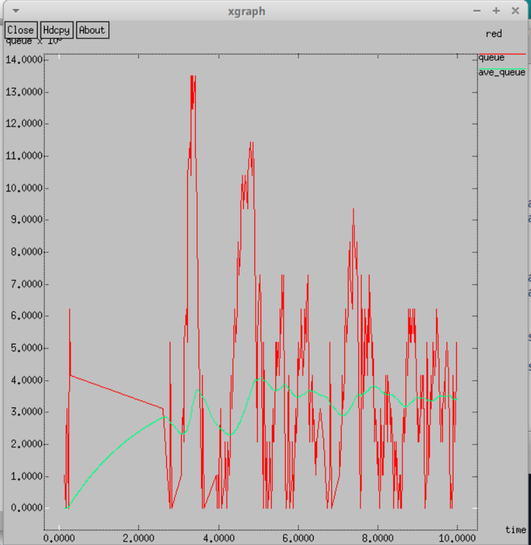
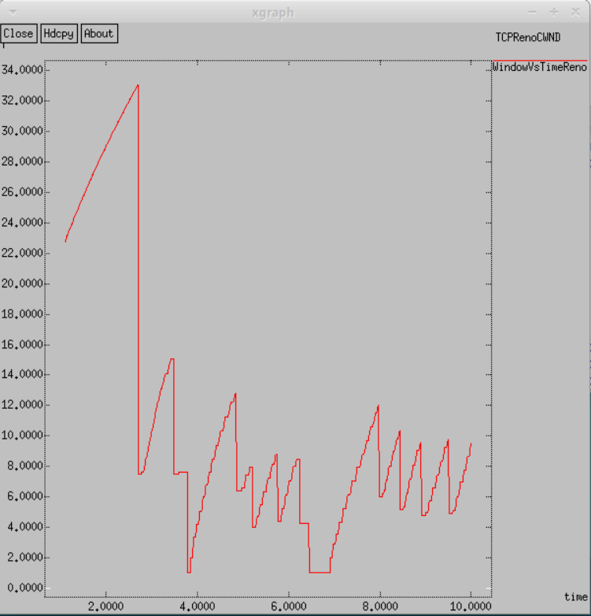
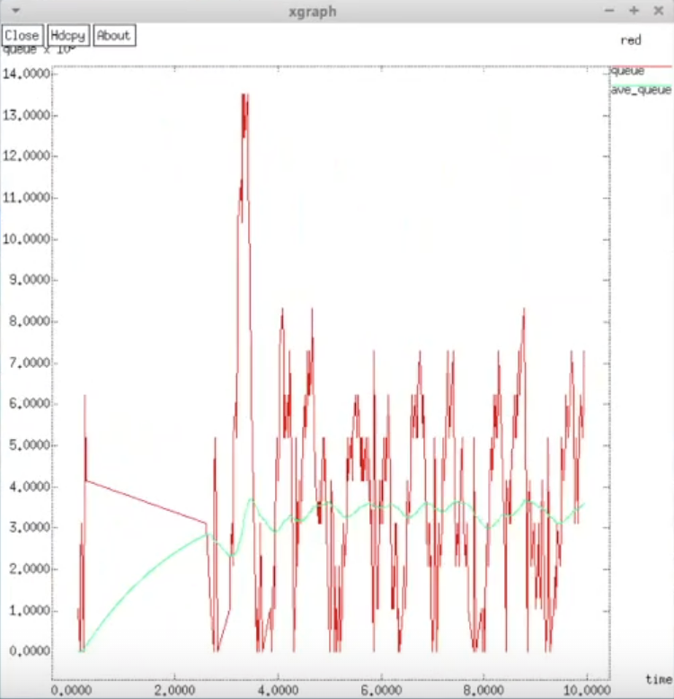
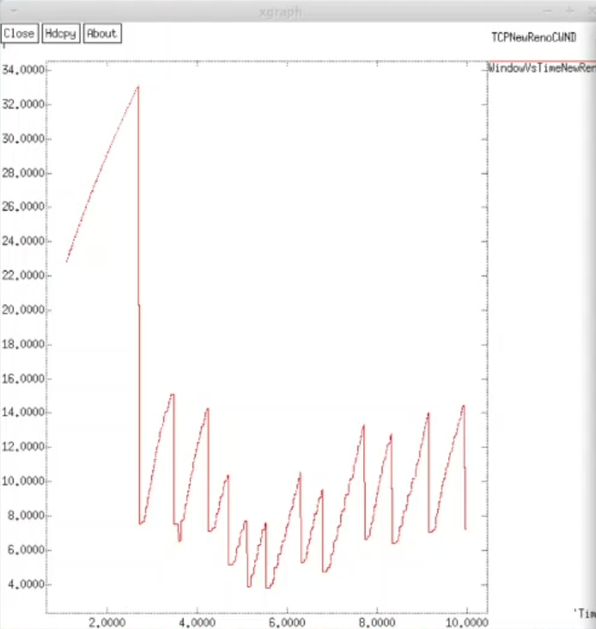
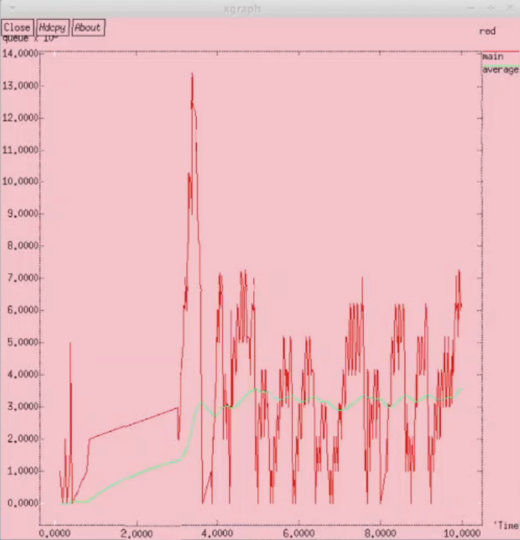
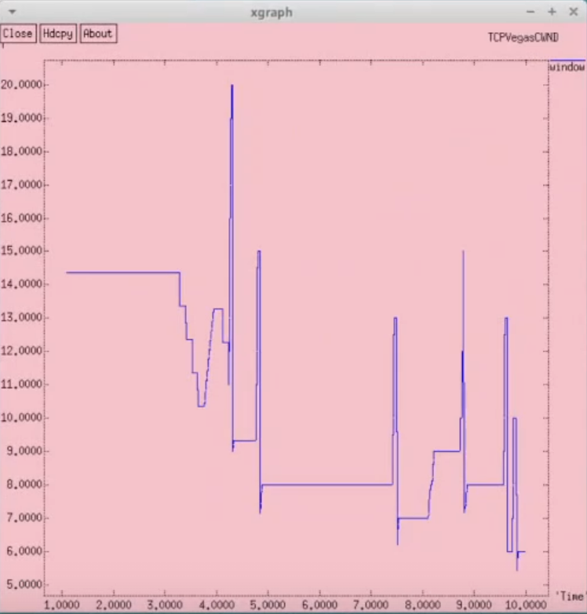

---
## Front matter
title: "Лабораторная работа №2"
subtitle: "Имитационное моделирование"
author: "Александрова Ульяна Вадимовна"

## Generic otions
lang: ru-RU
toc-title: "Содержание"

## Bibliography
bibliography: bib/cite.bib
csl: pandoc/csl/gost-r-7-0-5-2008-numeric.csl

## Pdf output format
toc: true # Table of contents
toc-depth: 2
lof: true # List of figures
lot: true # List of tables
fontsize: 12pt
linestretch: 1.5
papersize: a4
documentclass: scrreprt
## I18n polyglossia
polyglossia-lang:
  name: russian
  options:
	- spelling=modern
	- babelshorthands=true
polyglossia-otherlangs:
  name: english
## I18n babel
babel-lang: russian
babel-otherlangs: english
## Fonts
mainfont: IBM Plex Serif
romanfont: IBM Plex Serif
sansfont: IBM Plex Sans
monofont: IBM Plex Mono
mathfont: STIX Two Math
mainfontoptions: Ligatures=Common,Ligatures=TeX,Scale=0.94
romanfontoptions: Ligatures=Common,Ligatures=TeX,Scale=0.94
sansfontoptions: Ligatures=Common,Ligatures=TeX,Scale=MatchLowercase,Scale=0.94
monofontoptions: Scale=MatchLowercase,Scale=0.94,FakeStretch=0.9
mathfontoptions:
## Biblatex
biblatex: true
biblio-style: "gost-numeric"
biblatexoptions:
  - parentracker=true
  - backend=biber
  - hyperref=auto
  - language=auto
  - autolang=other*
  - citestyle=gost-numeric
## Pandoc-crossref LaTeX customization
figureTitle: "Рис."
tableTitle: "Таблица"
listingTitle: "Листинг"
lofTitle: "Список иллюстраций"
lotTitle: "Список таблиц"
lolTitle: "Листинги"
## Misc options
indent: true
header-includes:
  - \usepackage{indentfirst}
  - \usepackage{float} # keep figures where there are in the text
  - \floatplacement{figure}{H} # keep figures where there are in the text
---

# Цель работы

Целью данной работы является исследование протокола TCP и алгоритма управления очередью RED.

# Задание

1. Прорешать пример с дисциплиной RED
2. Сделать упражнение на исследование других моделей протокола TCP

# Теоретическое введение

Протокол управления передачей (Transmission Control Protocol, TCP) имеет средства управления потоком и коррекции ошибок, ориентирован на установление соединения.

- Флаг Указатель срочности (Urgent Pointer, URG) устанавливается в 1 в случае использования поля Указатель на срочные данные. 
- Флаг Подтверждение (Acknowledgment, ACK) устанавливается в 1 в случае, если поле Номер подтверждения (Acknowledgement Number) содержит данные. В противном случае это поле игнорируется.
- Флаг Выталкивание (Push, PSH) означает, что принимающий стек TCP должен немедленно информировать приложение о поступивших данных, а не ждать, пока буфер заполниться. 
- Флаг Сброс (Reset, RST) используется для отмены соединения из-за ошибки приложения, отказа от неверного сегмента, попытки создать соединение при отсутствии затребованного сервиса.
- Флаг Синхронизация (Synchronize, SYN) устанавливается при инициировании соединения и синхронизации порядкового номера.
- Флаг Завершение (Finished, FIN) используется для разрыва соединения. Он указывает, что отправитель закончил передачу данных.

Объект мониторинга очереди оповещает диспетчера очереди о поступлении пакета. Диспетчер очереди осуществляет мониторинг очереди.

- **qlim_**: Максимально разрешённое число пакетов в очереди.
- **limit_**: Размер очереди в пакетах.
- **blocked_**: Принимает значение true, если очередь заблокирована.
- **unblock_on_resume_**: Принимает значение true, указывая, что очередь должна быть разблокирована после отправки последнего пакета.
- **bytes_**: Принимает значение true, если используется режим передачи в байтах, а не в пакетах.
- **queue-in-bytes_**: Принимает значение true, если используется режим измерения среднего размера очереди в байтах, а не пакетах.
- **thresh_**: Минимальный порог среднего размера очереди (в пакетах).
- **maxthresh_**: Максимальный порог среднего размера очереди (в пакетах).
- **mean_pktsize_**: Грубая оценка среднего размера пакета (в байтах).
- **q_weight_**: Вес очереди (используется при расчёте экспоненциально взвешенного скользящего среднего размера очереди).
- **wait_**: Интервал времени между сброшенными пакетами.
- **size_**: Размер мгновенной длины очереди (в байтах).
- **pkts_**: Размер мгновенной длины очереди (в пакетах).
- **parrivals_**: Промежуточная сумма поступивших пакетов.
- **barrivals_**: Промежуточная сумма байт в поступивших пакетах.
- **pdepartures_**: Промежуточная сумма обслуженных пакетов (не отброшенных).
- **bdepartures_**: Промежуточная сумма байт обслуженных пакетов (не отброшенных).
- **pdrops_**: Общая сумма отброшенных пакетов.
- **bdrops_**: Общая сумма байт отброшенных пакетов.
- **bytesInt_**: Заполненность очереди в байтах.
- **pktsInt_**: Заполненность очереди в пакетах.
- **epdrops_**: Число сброшенных по алгоритму RED пакетов.
- **ebdrops_**: Число байт в сброшенных по алгоритму RED пакетах.
- **enable_in_**: Устанавливается значение true, если требуется мониторинг потока на входе.
- **enable_out_**: Устанавливается значение true, если требуется мониторинг потока на выходе.
- **enable_drop_**: Устанавливается значение true, если требуется мониторинг сброшенных из потока пакетов.
- **enable_edrop_**: Устанавливается значение true, если требуется мониторинг сброшенных из потока пакетов по алгоритму RED.
- **src_**: Адрес источника пакетов, принадлежащих потоку.
- **dst_**: Адрес получателя пакетов, принадлежащих потоку.
- **flowid_**: Идентификатор потока.

# Выполнение лабораторной работы

## Пример

Сначала выполняю пример из методического материала с данными условиями задачи:

Описание моделируемой сети:
- Сеть состоит из 6 узлов.
- Между всеми узлами установлено дуплексное соединение с различными пропускной способностью и задержкой 10 мс.
- Узел r1 использует очередь с дисциплиной RED для накопления пакетов, максимальный размер которой составляет 25.
- TCP-источники на узлах s1 и s2 подключаются к TCP-приёмнику на узле s3.
- Генераторы трафика FTP прикреплены к TCP-агентам.

Реализую модель при помощи данного листинга:

```
# создание объекта Simulator
set ns [new Simulator]

set N 5
for {set i 1} {$i < $N} {incr i} {
set n(s$i) [$ns node]
}

set n(r1) [$ns node]
set n(r2) [$ns node]

$ns duplex-link $n(s1) $n(r1) 10Mb 2ms DropTail
$ns duplex-link $n(s2) $n(r1) 10Mb 3ms DropTail
$ns duplex-link $n(r1) $n(r2) 1.5Mb 20ms RED
$ns queue-limit $n(r1) $n(r2) 25
$ns queue-limit $n(r2) $n(r1) 25
$ns duplex-link $n(s3) $n(r2) 10Mb 4ms DropTail
$ns duplex-link $n(s4) $n(r2) 10Mb 5ms DropTail


set tcp1 [$ns create-connection TCP/Reno $n(s1) TCPSink $n(s3) 0]
$tcp1 set window_ 15
set tcp2 [$ns create-connection TCP/Reno $n(s2) TCPSink $n(s3) 1]
$tcp2 set window_ 15

set ftp1 [$tcp1 attach-source FTP]
set ftp2 [$tcp2 attach-source FTP]

# Мониторинг размера окна TCP:
set windowVsTime [open WindowVsTimeReno w]
set qmon [$ns monitor-queue $n(r1) $n(r2) [open qm.out w] 0.1];
[$ns link $n(r1) $n(r2)] queue-sample-timeout;

# Мониторинг очереди:
set redq [[$ns link $n(r1) $n(r2)] queue]
set tchan_ [open all.q w]
$redq trace curq_
$redq trace ave_
$redq attach $tchan_

$ns at 0.0 "$ftp1 start"
$ns at 1.1 "plotWindow $tcp1 $windowVsTime"
$ns at 3.0 "$ftp2 start"

$ns at 10.0 "finish"

# Формирование файла с данными о размере окна TCP:
proc plotWindow {tcpSource file} {
    global ns
    set time 0.01
    set now [$ns now]
    set cwnd [$tcpSource set cwnd_]
    puts $file "$now $cwnd"
    $ns at [expr $now+$time] "plotWindow $tcpSource $file"
}

# Процедура finish:
proc finish {} {
    global tchan_

    # подключение кода AWK:
    set awkCode {
        {
            if ($1 == "Q" && NF>2) {
                print $2, $3 >> "temp.q";
                set end $2
            }
            else if ($1 == "a" && NF>2)
            print $2, $3 >> "temp.a";
        }
    }

    set f [open temp.queue w]
    puts $f "TitleText: red"
    puts $f "Device: Postscript"

    if { [info exists tchan_] } {
        close $tchan_
    }
    exec rm -f temp.q temp.a
    exec touch temp.a temp.q
  
    exec touch all.q

  # выполнение кода AWK
    exec awk $awkCode all.q 
    puts $f \"queue
    exec cat temp.q >@ $f
    puts $f \n\"ave_queue
    exec cat temp.a >@ $f
    close $f

    set tempQueueContent [exec cat temp.q]
    puts "Содержимое temp.q: $tempQueueContent"

    # Запуск xgraph с графиками окна TCP и очереди:
    exec xgraph -bb -tk -x time -t "TCPRenoCWND" WindowVsTimeReno &
    exec xgraph -bb -tk -x time -y queue temp.queue &
    exit 0
}

 # запуск 
$ns run
```

Запускаю через симулятор и получаю два графика (рис. [-@fig:001]) (рис. [-@fig:002]).

{#fig:001 width=70%}

{#fig:002 width=70%}

Смотря на графики, мы можем заметить, что средняя длина очереди колеблется от 2 до 4, при этом максимума достигает в 14, а минимум по этому графику определить нельзя. Размер окна TCP достигает достаточно больших значений, из чего мы можем сделать вывод, что модель не очень хорошо справляется с удержанием пакетов.

## Упражнение. NewReno

Чтобы выполнить это задание, редактирую уже имеющийся файл и меняю модель с Reno на NewReno, а также меняю цвет фона:

```
# создание объекта Simulator
set ns [new Simulator]

set N 5
for {set i 1} {$i < $N} {incr i} {
set n(s$i) [$ns node]
}

set n(r1) [$ns node]
set n(r2) [$ns node]

$ns duplex-link $n(s1) $n(r1) 10Mb 2ms DropTail
$ns duplex-link $n(s2) $n(r1) 10Mb 3ms DropTail
$ns duplex-link $n(r1) $n(r2) 1.5Mb 20ms RED
$ns queue-limit $n(r1) $n(r2) 25
$ns queue-limit $n(r2) $n(r1) 25
$ns duplex-link $n(s3) $n(r2) 10Mb 4ms DropTail
$ns duplex-link $n(s4) $n(r2) 10Mb 5ms DropTail


set tcp1 [$ns create-connection TCP/Newreno $n(s1) TCPSink $n(s3) 0]
$tcp1 set window_ 15
set tcp2 [$ns create-connection TCP/Reno $n(s2) TCPSink $n(s3) 1]
$tcp2 set window_ 15

set ftp1 [$tcp1 attach-source FTP]
set ftp2 [$tcp2 attach-source FTP]

# Мониторинг размера окна TCP:
set windowVsTime [open WindowVsTimeNewReno w]
set qmon [$ns monitor-queue $n(r1) $n(r2) [open qm.out w] 0.1];
[$ns link $n(r1) $n(r2)] queue-sample-timeout;

# Мониторинг очереди:
set redq [[$ns link $n(r1) $n(r2)] queue]
set tchan_ [open all.q w]
$redq trace curq_
$redq trace ave_
$redq attach $tchan_

$ns at 0.0 "$ftp1 start"
$ns at 1.1 "plotWindow $tcp1 $windowVsTime"
$ns at 3.0 "$ftp2 start"

$ns at 10.0 "finish"

# Формирование файла с данными о размере окна TCP:
proc plotWindow {tcpSource file} {
    global ns
    set time 0.01
    set now [$ns now]
    set cwnd [$tcpSource set cwnd_]
    puts $file "$now $cwnd"
    $ns at [expr $now+$time] "plotWindow $tcpSource $file"
}

# Процедура finish:
proc finish {} {
    global tchan_

    # подключение кода AWK:
    set awkCode {
        {
            if ($1 == "Q" && NF>2) {
                print $2, $3 >> "temp.q";
                set end $2
            }
            else if ($1 == "a" && NF>2)
            print $2, $3 >> "temp.a";
        }
    }

    set f [open temp.queue w]
    puts $f "TitleText: red"
    puts $f "Device: Postscript"

    if { [info exists tchan_] } {
        close $tchan_
    }
    exec rm -f temp.q temp.a
    exec touch temp.a temp.q
  
    exec touch all.q

  # выполнение кода AWK
    exec awk $awkCode all.q 
    puts $f \"queue
    exec cat temp.q >@ $f
    puts $f \n\"ave_queue
    exec cat temp.a >@ $f
    close $f

    set tempQueueContent [exec cat temp.q]
    puts "Содержимое temp.q: $tempQueueContent"

    set windowVsTimeContent [exec cat WindowVsTimeNewReno]
    puts "Содержимое WindowVsTimeNewReno: $windowVsTimeContent"


    # Запуск xgraph с графиками окна TCP и очереди:
    exec xgraph -bb -tk -x time -t "TCPNewRenoCWND" -bg white -lw 1 -x 'Time' WindowVsTimeNewReno &
    exec xgraph -bb -tk -x time -y queue -bg white 'Time' temp.queue &
    exit 0
}

 # запуск 
$ns run
```

Просматриваю результаты и вижу, что они изменились, но не значительно (рис. [-@fig:003]) (рис. [-@fig:004]).

{#fig:003 width=70%}

{#fig:004 width=70%}

## Упражнение. Vegas

Проделываю аналогичные действия для модели Vegas:

```
# создание объекта Simulator
set ns [new Simulator]

set N 5
for {set i 1} {$i < $N} {incr i} {
set n(s$i) [$ns node]
}

set n(r1) [$ns node]
set n(r2) [$ns node]

$ns duplex-link $n(s1) $n(r1) 10Mb 2ms DropTail
$ns duplex-link $n(s2) $n(r1) 10Mb 3ms DropTail
$ns duplex-link $n(r1) $n(r2) 1.5Mb 20ms RED
$ns queue-limit $n(r1) $n(r2) 25
$ns queue-limit $n(r2) $n(r1) 25
$ns duplex-link $n(s3) $n(r2) 10Mb 4ms DropTail
$ns duplex-link $n(s4) $n(r2) 10Mb 5ms DropTail


set tcp1 [$ns create-connection TCP/Vegas $n(s1) TCPSink $n(s3) 0]
$tcp1 set window_ 15
set tcp2 [$ns create-connection TCP/Reno $n(s2) TCPSink $n(s3) 1]
$tcp2 set window_ 15

set ftp1 [$tcp1 attach-source FTP]
set ftp2 [$tcp2 attach-source FTP]

# Мониторинг размера окна TCP:
set windowVsTime [open WindowVsTimeVegas w]
puts $windowVsTime "0.Color: Blue"
puts $windowVsTime \"window
set qmon [$ns monitor-queue $n(r1) $n(r2) [open qm.out w] 0.1];
[$ns link $n(r1) $n(r2)] queue-sample-timeout;

# Мониторинг очереди:
set redq [[$ns link $n(r1) $n(r2)] queue]
set tchan_ [open all.q w]
$redq trace curq_
$redq trace ave_
$redq attach $tchan_

$ns at 0.0 "$ftp1 start"
$ns at 1.1 "plotWindow $tcp1 $windowVsTime"
$ns at 3.0 "$ftp2 start"

$ns at 10.0 "finish"

# Формирование файла с данными о размере окна TCP:
proc plotWindow {tcpSource file} {
    global ns
    set time 0.01
    set now [$ns now]
    set cwnd [$tcpSource set cwnd_]
    puts $file "$now $cwnd"
    $ns at [expr $now+$time] "plotWindow $tcpSource $file"
}

# Процедура finish:
proc finish {} {
    global tchan_

    # подключение кода AWK:
    set awkCode {
        {
            if ($1 == "Q" && NF>2) {
                print $2, $3 >> "temp.q";
                set end $2
            }
            else if ($1 == "a" && NF>2)
            print $2, $3 >> "temp.a";
        }
    }

    set f [open temp.queue w]
    puts $f "TitleText: red"
    puts $f "Device: Postscript"

    if { [info exists tchan_] } {
        close $tchan_
    }
    exec rm -f temp.q temp.a
    exec touch temp.a temp.q
  
    exec touch all.q

  # выполнение кода AWK
    exec awk $awkCode all.q 
    puts $f \"main
    exec cat temp.q >@ $f
    puts $f \n\"average
    exec cat temp.a >@ $f
    close $f

    set tempQueueContent [exec cat temp.q]
    puts "Содержимое temp.q: $tempQueueContent"

    set windowVsTimeContent [exec cat WindowVsTimeVegas]
    puts "Содержимое WindowVsTimeVegas: $windowVsTimeContent"


    # Запуск xgraph с графиками окна TCP и очереди:
    exec xgraph -bb -tk -x time -t "TCPVegasCWND" -bg pink -lw 1 -x 'Time' WindowVsTimeVegas &
    exec xgraph -bb -tk -x time -y queue -bg pink -x 'Time' temp.queue &
    exit 0
}

 # запуск 
$ns run
```

Графики имеют следующий вид (рис. [-@fig:005]) (рис. [-@fig:006]).

{#fig:005 width=70%}

{#fig:006 width=70%}

Теперь амплитуда колебания очереди уменьшиалсь с 2 до 4 до 3 до 4, а также максимальное значение теперь достигаеться в точке 13. График динамики размера окна также отличается. С этим методом, модель гораздо эффективнее работает с пакетами, засчет резкого изменения размера окна.

# Выводы

Я исследовала алгоритмы управления очередью RED.
