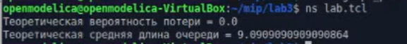

---
## Front matter
title: "Лабораторная работа №3"
subtitle: "Имитационное моделирование"
author: "Александрова Ульяна Вадимовна"

## Generic otions
lang: ru-RU
toc-title: "Содержание"

## Bibliography
bibliography: bib/cite.bib
csl: pandoc/csl/gost-r-7-0-5-2008-numeric.csl

## Pdf output format
toc: true # Table of contents
toc-depth: 2
lof: true # List of figures
lot: true # List of tables
fontsize: 12pt
linestretch: 1.5
papersize: a4
documentclass: scrreprt
## I18n polyglossia
polyglossia-lang:
  name: russian
  options:
	- spelling=modern
	- babelshorthands=true
polyglossia-otherlangs:
  name: english
## I18n babel
babel-lang: russian
babel-otherlangs: english
## Fonts
mainfont: IBM Plex Serif
romanfont: IBM Plex Serif
sansfont: IBM Plex Sans
monofont: IBM Plex Mono
mathfont: STIX Two Math
mainfontoptions: Ligatures=Common,Ligatures=TeX,Scale=0.94
romanfontoptions: Ligatures=Common,Ligatures=TeX,Scale=0.94
sansfontoptions: Ligatures=Common,Ligatures=TeX,Scale=MatchLowercase,Scale=0.94
monofontoptions: Scale=MatchLowercase,Scale=0.94,FakeStretch=0.9
mathfontoptions:
## Biblatex
biblatex: true
biblio-style: "gost-numeric"
biblatexoptions:
  - parentracker=true
  - backend=biber
  - hyperref=auto
  - language=auto
  - autolang=other*
  - citestyle=gost-numeric
## Pandoc-crossref LaTeX customization
figureTitle: "Рис."
tableTitle: "Таблица"
listingTitle: "Листинг"
lofTitle: "Список иллюстраций"
lotTitle: "Список таблиц"
lolTitle: "Листинги"
## Misc options
indent: true
header-includes:
  - \usepackage{indentfirst}
  - \usepackage{float} # keep figures where there are in the text
  - \floatplacement{figure}{H} # keep figures where there are in the text
---

# Цель работы

Целью данной работы является освоение моделирования стохастических процессов.

# Теоретическое введение

## M | M | 1

M/M/1 — однолинейная СМО с накопителем бесконечной ёмкости. Поступающий поток заявок — пуассоновский с интенсивностью \(\lambda\). Времена обслуживания заявок — независимые в совокупности случайные величины, распределённые по экспоненциальному закону с параметром \(\mu\).

# Выполнение лабораторной работы

## Реализация модели на NS-2 и GNU

Для того, чтобы произвести реализацию данной модели, необходимо создать два файла: испольняемы для построения графика и файл для NS-2. В моем случае это будут `graph_plot` и `lab.tcl` соответственно.

Сначала пропишу код для NS-2 с расчетом теоретической вероятности потери и средней длины очереди (рис. [-@fig:001]).

```
# создание объекта Simulator
set ns [new Simulator]

# открытие на запись файла out.tr для регистрации событий
set tf [open out.tr w]
$ns trace-all $tf

# задаём значения параметров системы
set lambda 30.0
set mu 33.0

# размер очереди для M|M|1 (для M|M|1|R: set qsize R)
set qsize 100000

# устанавливаем длительность эксперимента
set duration 1000.0

# задаём узлы и соединяем их симплексным соединением
# с полосой пропускания 100 Кб/с и задержкой 0 мс,
# очередью с обслуживанием типа DropTail
set n1 [$ns node]
set n2 [$ns node]

# создаём симплексное соединение и сохраняем ссылку на него
set link_ [$ns simplex-link $n1 $n2 100Kb 0ms DropTail]

# наложение ограничения на размер очереди:
$ns queue-limit $n1 $n2 $qsize

# задаём распределения интервалов времени
# поступления пакетов и размера пакетов
set InterArrivalTime [new RandomVariable/Exponential]
$InterArrivalTime set avg_ [expr 1/$lambda]
set pktSize [new RandomVariable/Exponential]
$pktSize set avg_ [expr 100000.0/(8*$mu)]

# задаём агент UDP и присоединяем его к источнику,
# задаём размер пакета
set src [new Agent/UDP]
$src set packetSize_ 100000
$ns attach-agent $n1 $src

# задаём агент-приёмник и присоединяем его
set sink [new Agent/Null]
$ns attach-agent $n2 $sink
$ns connect $src $sink

# мониторинг очереди
set qmon [$ns monitor-queue $n1 $n2 [open qm.out w] 0.1]
$link_ queue-sample-timeout

# процедура finish закрывает файлы трассировки
proc finish {} {
    global ns tf
    $ns flush-trace
    close $tf
    exit 0
}

# процедура случайного генерирования пакетов
proc sendpacket {} {
    global ns src InterArrivalTime pktSize
    set time [$ns now]
    $ns at [expr $time +[$InterArrivalTime value]] "sendpacket"
    set bytes [expr round([$pktSize value])]
    $src send $bytes
}

# планировщик событий
$ns at 0.0001 "sendpacket"
$ns at $duration "finish"

# расчет загрузки системы и вероятности потери пакетов
set rho [expr $lambda/$mu]
set ploss [expr (1-$rho)*pow($rho,$qsize)/(1-pow($rho,($qsize+1)))]
puts "Теоретическая вероятность потери = $ploss"
set aveq [expr $rho*$rho/(1-$rho)]
puts "Теоретическая средняя длина очереди = $aveq"

# запуск модели
$ns run
```

{#fig:001 width=70%}

То есть, можно сказать, что пакеты никогда не теряются (чтодостаточно странно), а средняя длина очереди равна 9.

Теперь напишем код для GNU-plot (рис. [-@fig:002]).

```
#!/usr/bin/gnuplot -persist
# задаём текстовую кодировку,
# тип терминала, тип и размер шрифта

set encoding utf8
set term pdfcairo font "Arial,9"

# задаём выходной файл графика

set out 'qm.pdf'

# задаём название графика

set title "График средней длины очереди"

# задаём стиль линии

set style line 2

# подписи осей графика

set xlabel "t"
set ylabel "Пакеты"

# построение графика, используя значения
# 1-го и 5-го столбцов файла qm.out

plot "qm.out" using ($1):($5) with lines title "Размер очереди (в пакетах)",\
"qm.out" using ($1):($5) smooth csplines title " Приближение сплайном ", \
"qm.out" using ($1):($5) smooth bezier title " Приближение Безье "
```

{#fig:002 width=70%}

На графике мы можем видеть очередь с течением времени (в пакетах), а также ее приближегте сплайном и Безье. Мы можем наблюдать скачки, при этом максимальный скачок наблюдается в точке 800 с примерным показателем 70.

# Выводы

Я научилась моделировать стохастические процессы.
