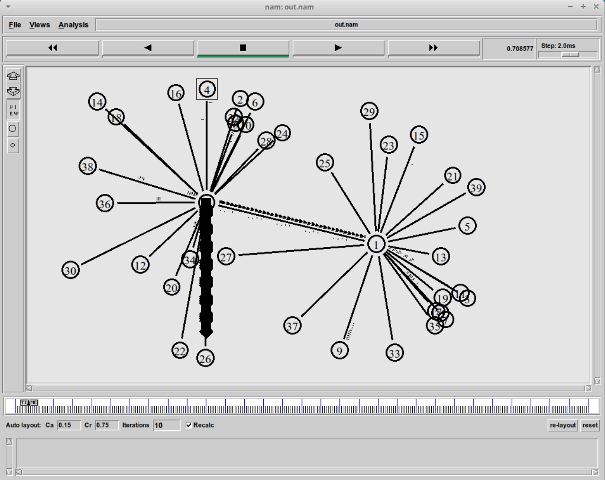
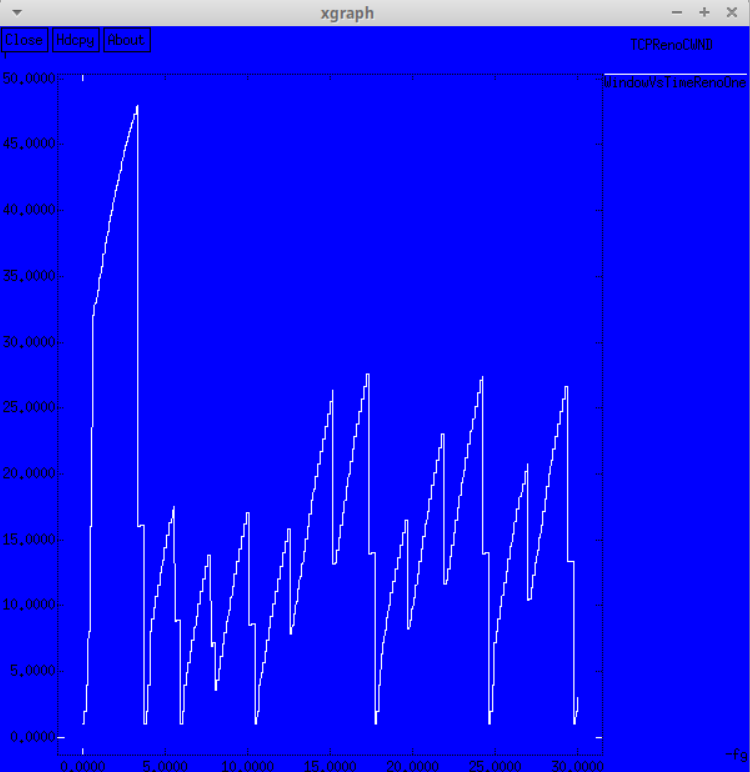
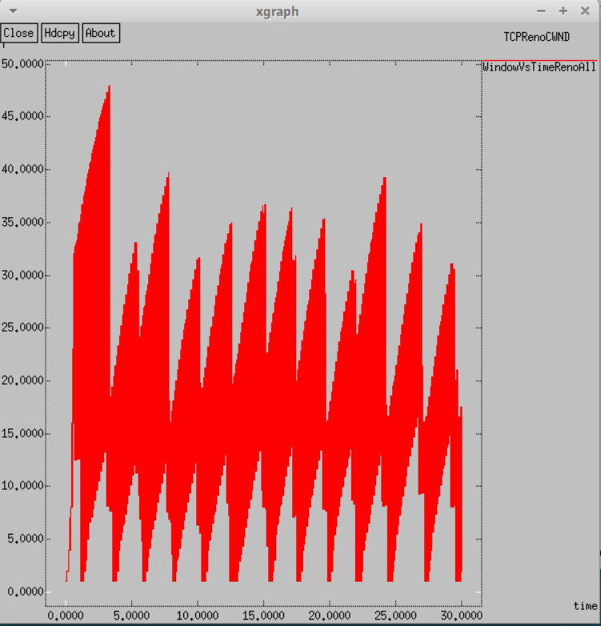
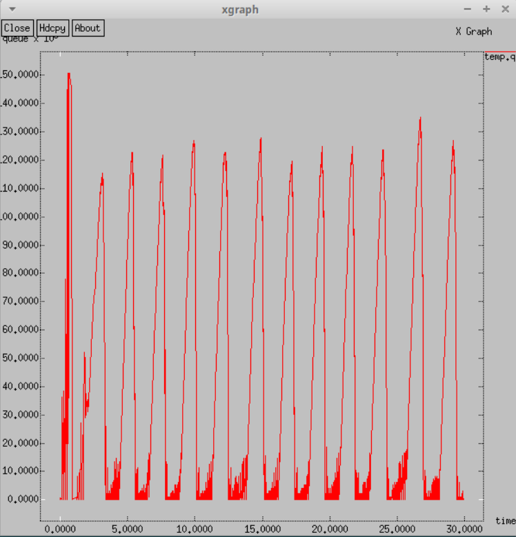
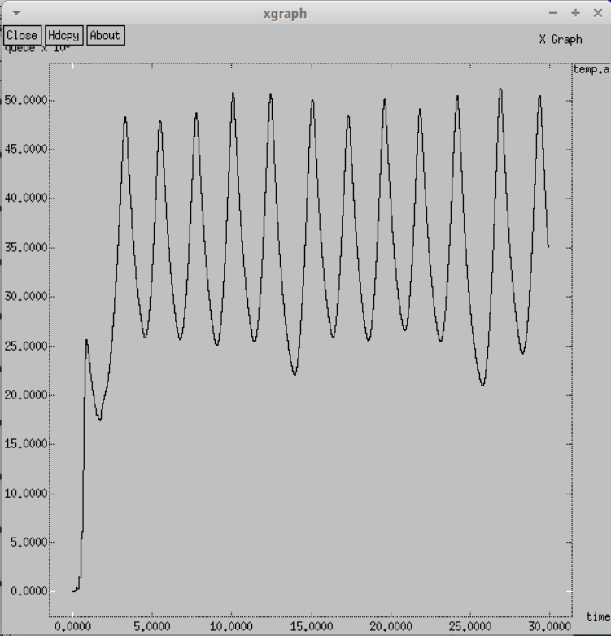

---
## Front matter
lang: ru-RU
title: Лабораторная работа №4
subtitle: Имитационное моделирование
author:
  - Александрова УВ
institute:
  - Российский университет дружбы народов, Москва, Россия
date: 19 февраля 2025

## i18n babel
babel-lang: russian
babel-otherlangs: english

## Formatting pdf
toc: false
toc-title: Содержание
slide_level: 2
aspectratio: 169
section-titles: true
theme: metropolis
header-includes:
 - \metroset{progressbar=frametitle,sectionpage=progressbar,numbering=fraction}
---

# Информация

## Докладчик

:::::::::::::: {.columns align=center}
::: {.column width="70%"}

  * Александрова Ульяна
  * студентка 3го курса
  * Факультет физико-математических и естественных наук
  * Российский университет дружбы народов
  * [1132226444@rudn.ru](mailto:1132226444@rudn.ru)

:::
::: {.column width="30%"}


:::
::::::::::::::

# Цель работы

##

Целью данной работы является применение уже освоенных навыков для решения задачи по моделированию сети.

# Задание

1. Для приведённой схемы разработать имитационную модель в пакете NS-2;
2. Построить график изменения размера окна TCP (в Xgraph и в GNUPlot);
3. Построить график изменения длины очереди и средней длины очереди на первом
маршрутизаторе;
4. Оформить отчёт о выполненной работе.

## Содержание моделируемой сети

- сеть состоит из N TCP-источников, N TCP-приёмников, двух маршрутизаторов
R1 и R2 между источниками и приёмниками (N — не менее 20);
- между TCP-источниками и первым маршрутизатором установлены дуплексные
соединения с пропускной способностью 100 Мбит/с и задержкой 20 мс очередью
типа DropTail;
- между TCP-приёмниками и вторым маршрутизатором установлены дуплексные
соединения с пропускной способностью 100 Мбит/с и задержкой 20 мс очередью
типа DropTail;
- между маршрутизаторами установлено симплексное соединение (R1–R2) с пропускной способностью 20 Мбит/с и задержкой 15 мс очередью типа RED, размером буфера 300 пакетов; в обратную сторону — симплексное соединение (R2–R1) с пропускной способностью 15 Мбит/с и задержкой 20 мс очередью типа DropTail;
- данные передаются по протоколу FTP поверх TCPReno;
- параметры алгоритма RED: $q_min = 75, q_max = 150, q_w = 0, 002, p_max = 0.1$;
- максимальный размер TCP-окна 32; размер передаваемого пакета 500 байт; время
моделирования — не менее 20 единиц модельного времени.

# Выполнение лабораторной работы

## Условия работы

Для выполнения этой работы, нам потребуются два листинга кода: в формате `lab1.tcl` для симулирования работы сети через NS-2 и исполняемый файл `graph_plot`, который будет строить графики.

## Работа с NS-2

Сначала я заполняю программу для симулятора, учитывая характеристики, указанные в задании:

```
Agent/TCP set window_ 32
Agent/TCP set pktSize_ 500

set n(r1) [$ns node]
set n(r2) [$ns node]

set N 20
for {set i 1} {$i < $N} {incr i} {
    set n1($i) [$ns node]
    $ns duplex-link $n1($i) $n(r1) 100Mb 20ms DropTail
    set n2($i) [$ns node]
    $ns duplex-link $n2($i) $n(r2) 100Mb 20ms DropTail

    set tcp($i) [$ns create-connection TCP/Reno $n1($i) TCPSink $n2($i) $i]
    set ftp($i) [$tcp($i) attach-source FTP]

}

```

## Код. Продолжение

```
$ns simplex-link $n(r1) $n(r2) 20Mb 15ms RED
$ns simplex-link $n(r2) $n(r1) 15Mb 20ms DropTail
$ns queue-limit $n(r1) $n(r2) 300

# Мониторинг размера окна TCP:
set windowVsTimeOne [open WindowVsTimeRenoOne w]
puts $windowVsTimeOne "0.Color: White"
set windowVsTimeAll [open WindowVsTimeRenoAll w]
puts $windowVsTimeAll "0.Color: Red"

set qmon [$ns monitor-queue $n(r1) $n(r2) [open qm.out w] 0.1];
[$ns link $n(r1) $n(r2)] queue-sample-timeout;
```

## Код. Продолжение

```
# Мониторинг очереди:
set redq [[$ns link $n(r1) $n(r2)] queue]
$redq set thresh_ 75
$redq set maxthresh_ 150
$redq set qweight_ 0.002 
$redq set linterm_ 10 

set tchan_ [open all.q w]
$redq trace curq_
$redq trace ave_
$redq attach $tchan_

for {set i 1} {$i < $N} {incr i} {
    $ns at 0.0 "$ftp($i) start"
    $ns at 0.0 "plotWindow $tcp($i) $windowVsTimeAll"
}
$ns at 0.0 "plotWindow $tcp(1) $windowVsTimeOne"
 ...
```

## Результат работы программы.

{#fig:001 width=70%} 

## Графики

{#fig:002 width=70%}

## Графики

{#fig:003 width=70%}

## Графики

{#fig:004 width=70%}

## Графики

{#fig:005 width=70%}

# Работа с GNU-plot

## Графики

{#fig:006 width=70%}

## Графики

{#fig:007 width=70%}

## Графики

{#fig:008 width=70%}

## Графики

{#fig:009 width=70%}

# Выводы

Мы самостоятельно построили модель сети по условиям задачи при помощи утилит NS-2 и GNU-Plot.

