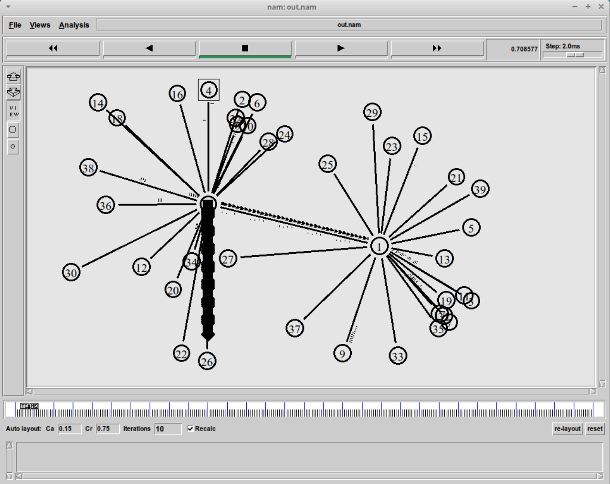
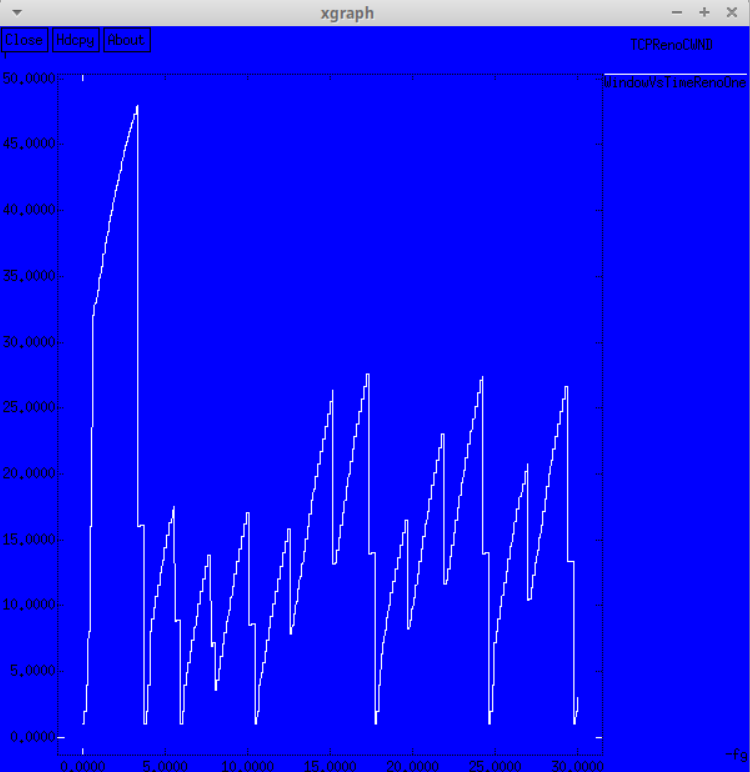
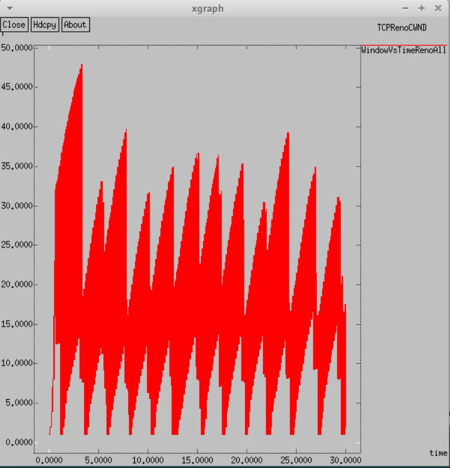
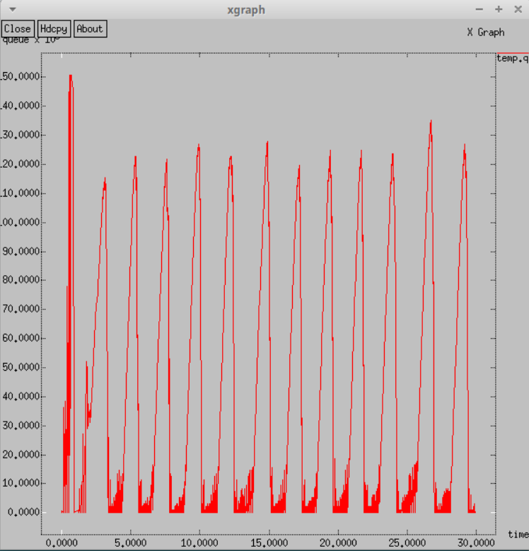
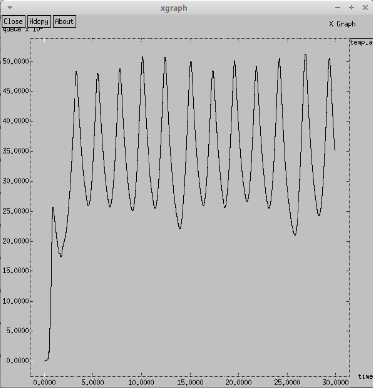

---
## Front matter
title: "Лабораторная работа №4"
subtitle: "Имитациионное моделирование"
author: "Александрова Ульяна Вадимовна"

## Generic otions
lang: ru-RU
toc-title: "Содержание"

## Bibliography
bibliography: bib/cite.bib
csl: pandoc/csl/gost-r-7-0-5-2008-numeric.csl

## Pdf output format
toc: true # Table of contents
toc-depth: 2
lof: true # List of figures
lot: true # List of tables
fontsize: 12pt
linestretch: 1.5
papersize: a4
documentclass: scrreprt
## I18n polyglossia
polyglossia-lang:
  name: russian
  options:
	- spelling=modern
	- babelshorthands=true
polyglossia-otherlangs:
  name: english
## I18n babel
babel-lang: russian
babel-otherlangs: english
## Fonts
mainfont: IBM Plex Serif
romanfont: IBM Plex Serif
sansfont: IBM Plex Sans
monofont: IBM Plex Mono
mathfont: STIX Two Math
mainfontoptions: Ligatures=Common,Ligatures=TeX,Scale=0.94
romanfontoptions: Ligatures=Common,Ligatures=TeX,Scale=0.94
sansfontoptions: Ligatures=Common,Ligatures=TeX,Scale=MatchLowercase,Scale=0.94
monofontoptions: Scale=MatchLowercase,Scale=0.94,FakeStretch=0.9
mathfontoptions:
## Biblatex
biblatex: true
biblio-style: "gost-numeric"
biblatexoptions:
  - parentracker=true
  - backend=biber
  - hyperref=auto
  - language=auto
  - autolang=other*
  - citestyle=gost-numeric
## Pandoc-crossref LaTeX customization
figureTitle: "Рис."
tableTitle: "Таблица"
listingTitle: "Листинг"
lofTitle: "Список иллюстраций"
lotTitle: "Список таблиц"
lolTitle: "Листинги"
## Misc options
indent: true
header-includes:
  - \usepackage{indentfirst}
  - \usepackage{float} # keep figures where there are in the text
  - \floatplacement{figure}{H} # keep figures where there are in the text
---

# Цель работы

Целью данной работы является применение уже освоенных навыков для решения задачи по моделированию сети.

# Задание

1. Для приведённой схемы разработать имитационную модель в пакете NS-2;
2. Построить график изменения размера окна TCP (в Xgraph и в GNUPlot);
3. Построить график изменения длины очереди и средней длины очереди на первом
маршрутизаторе;
4. Оформить отчёт о выполненной работе.

Содержание моделируемой сети:

- сеть состоит из N TCP-источников, N TCP-приёмников, двух маршрутизаторов
R1 и R2 между источниками и приёмниками (N — не менее 20);
- между TCP-источниками и первым маршрутизатором установлены дуплексные
соединения с пропускной способностью 100 Мбит/с и задержкой 20 мс очередью
типа DropTail;
- между TCP-приёмниками и вторым маршрутизатором установлены дуплексные
соединения с пропускной способностью 100 Мбит/с и задержкой 20 мс очередью
типа DropTail;
- между маршрутизаторами установлено симплексное соединение (R1–R2) с пропускной способностью 20 Мбит/с и задержкой 15 мс очередью типа RED, размером буфера 300 пакетов; в обратную сторону — симплексное соединение (R2–R1) с пропускной способностью 15 Мбит/с и задержкой 20 мс очередью типа DropTail;
- данные передаются по протоколу FTP поверх TCPReno;
- параметры алгоритма RED: $q_min = 75, q_max = 150, q_w = 0, 002, p_max = 0.1$;
- максимальный размер TCP-окна 32; размер передаваемого пакета 500 байт; время
моделирования — не менее 20 единиц модельного времени.

# Выполнение лабораторной работы

Для выполнения этой работы, нам потребуются два листинга кода: в формате `lab1.tcl` для симулирования работы сети через NS-2 и исполняемый файл `graph_plot`, который будет строить графики.

## Работа с NS-2

Сначала я заполняю программу для симулятора, учитывая характеристики, указанные в задании:

```
# создание объекта Simulator
set ns [new Simulator]

# открытие на запись файла out.nam для визуализатора nam
set nf [open out.nam w]

 # все результаты моделирования будут записаны в переменную nf
$ns namtrace-all $nf

# открытие на запись файла трассировки out.tr
 # для регистрации всех событий
set f [open out.tr w]
 # все регистрируемые события будут записаны в переменную f
$ns trace-all $f

Agent/TCP set window_ 32
Agent/TCP set pktSize_ 500


# Процедура finish:
proc finish {} {
    global tchan_

    # подключение кода AWK:
    set awkCode {
        {
            if ($1 == "Q" && NF>2) {
                print $2, $3 >> "temp.q";
                set end $2
            }
            else if ($1 == "a" && NF>2)
            print $2, $3 >> "temp.a";
        }
    }

    exec rm -f temp.q temp.a
    exec touch temp.a temp.q

    set f [open temp.q w]
    puts $f "0.Color: Red"
    close $f

    set f [open temp.a w]
    puts $f "0.Color: Black"
    close $f
  

  # выполнение кода AWK
    exec awk $awkCode all.q 


    set tempQueueContent [exec cat temp.q]
    puts "Содержимое temp.q: $tempQueueContent"

    # Запуск xgraph с графиками окна TCP и очереди:
    exec xgraph -bb -tk -x -fg pink -bg blue time -t "TCPRenoCWND" WindowVsTimeRenoOne &
    exec xgraph -bb -tk -x time -t "TCPRenoCWND" WindowVsTimeRenoAll &
    exec xgraph -bb -tk -x time -y queue temp.q &
    exec xgraph -bb -tk -x time -y queue temp.a &
    exec nam out.nam &
    exit 0
}


set n(r1) [$ns node]
set n(r2) [$ns node]

set N 20
for {set i 1} {$i < $N} {incr i} {
    set n1($i) [$ns node]
    $ns duplex-link $n1($i) $n(r1) 100Mb 20ms DropTail
    set n2($i) [$ns node]
    $ns duplex-link $n2($i) $n(r2) 100Mb 20ms DropTail

    set tcp($i) [$ns create-connection TCP/Reno $n1($i) TCPSink $n2($i) $i]
    set ftp($i) [$tcp($i) attach-source FTP]

}

$ns simplex-link $n(r1) $n(r2) 20Mb 15ms RED
$ns simplex-link $n(r2) $n(r1) 15Mb 20ms DropTail
$ns queue-limit $n(r1) $n(r2) 300

# Мониторинг размера окна TCP:
set windowVsTimeOne [open WindowVsTimeRenoOne w]
puts $windowVsTimeOne "0.Color: White"
set windowVsTimeAll [open WindowVsTimeRenoAll w]
puts $windowVsTimeAll "0.Color: Red"

set qmon [$ns monitor-queue $n(r1) $n(r2) [open qm.out w] 0.1];
[$ns link $n(r1) $n(r2)] queue-sample-timeout;

# Мониторинг очереди:
set redq [[$ns link $n(r1) $n(r2)] queue]
$redq set thresh_ 75
$redq set maxthresh_ 150
$redq set qweight_ 0.002 
$redq set linterm_ 10 

set tchan_ [open all.q w]
$redq trace curq_
$redq trace ave_
$redq attach $tchan_

for {set i 1} {$i < $N} {incr i} {
    $ns at 0.0 "$ftp($i) start"
    $ns at 0.0 "plotWindow $tcp($i) $windowVsTimeAll"
}
$ns at 0.0 "plotWindow $tcp(1) $windowVsTimeOne"

$ns at 30.0 "finish"

# Формирование файла с данными о размере окна TCP:
proc plotWindow {tcpSource file} {
    global ns
    set time 0.01
    set now [$ns now]
    set cwnd [$tcpSource set cwnd_]
    puts $file "$now $cwnd"
    $ns at [expr $now+$time] "plotWindow $tcpSource $file"
}

 # запуск 
$ns run
```

В результате получаем работающую модель (рис. [-@fig:001]).

{#fig:001 width=70%} 

А также мы получаем несколько графиков (рис. [-@fig:002]) (рис. [-@fig:003]) (рис. [-@fig:004]) (рис. [-@fig:005]).

{#fig:002 width=70%}

Из графика явно видно, что мы используем модель Reno, так как размер окна изменяется скачкообразно.

{#fig:003 width=70%}

Здесь похожая ситуация, однако скачки более стабильны и однообразны в своей тенденции.

{#fig:004 width=70%}

Изменение размера длины очереди также имеет цикличный мятниковообразный скачок без явного уменьшения амплитуды. Максималього значения (50) длина достигает в начале, во врмененном промежутке от 0.0 до 1.0.

{#fig:005 width=70%}

Средние значения колеблются между 25 и 50, что указвает на достаточно высокую среднюю длину.

## Работа с GNU-plot

Следующим этапом было построить графики через дополнительную утилиту.

Я создала листинг программы:

```
#!/usr/bin/gnuplot -persist
# задаём текстовую кодировку,
# тип терминала, тип и размер шрифта

set encoding utf8
set term pdfcairo font "Arial,9"

# задаём выходной файл графика

set out 'window_for_one.pdf'
S
# задаём название графика

set title "Изменение размера окна TCP на линке 1-го источника"

set xlabel "t[s]"
set ylabel "CWND [pkt]"

# задаём стиль линии

set style line 2

plot "WindowVsTimeRenoOne" using ($1):($2) with lines title "Размер окна"

set out 'window_for_all.pdf'
set title "Изменение размера окна TCP на линке на всех источниках"
set xlabel "t[s]"
set ylabel "CWND [pkt]"
set style line 2
plot "WindowVsTimeRenoAll" using ($1):($2) with lines title "Размер окна"


set out 'q.pdf'
set title "Изменение размера длины очереди на линке"
set xlabel "t[s]"
set ylabel "Queue lenght [pkt]"
set style line 2
plot "temp.q" using ($1):($2) with lines title "Длина очереди"

set out 'ave.pdf'
set title "Изменение размера средней длины очереди на линке"
set xlabel "t[s]"
set ylabel "Queue lenght [pkt]"
set style line 2
plot "temp.a" using ($1):($2) with lines title "Размер окна"
```

И получила на выходе 4 графика (рис. [-@fig:006]) (рис. [-@fig:007]) (рис. [-@fig:008]) (рис. [-@fig:009]):

{#fig:006 width=70%}

{#fig:007 width=70%}

{#fig:008 width=70%}

{#fig:009 width=70%}

# Выводы

Мы самостоятельно построили модель сети по условиям задачи при помощи утилит NS-2 и GNU-Plot.

