---
## Front matter
lang: ru-RU
title: Лабораторная работа №5
subtitle: Имитационное моделирование
author:
  - Александрова УВ
institute:
  - Российский университет дружбы народов, Москва, Россия
date: 25 февраля 2025

## i18n babel
babel-lang: russian
babel-otherlangs: english

## Formatting pdf
toc: false
toc-title: Содержание
slide_level: 2
aspectratio: 169
section-titles: true
theme: metropolis
header-includes:
 - \metroset{progressbar=frametitle,sectionpage=progressbar,numbering=fraction}
---

# Информация

## Докладчик

:::::::::::::: {.columns align=center}
::: {.column width="70%"}

  * Александрова Ульяна
  * студентка 3го курса
  * Факультет физико-математических и естественных наук
  * Российский университет дружбы народов
  * [1132226444@rudn.ru](mailto:1132226444@rudn.ru)

:::
::: {.column width="30%"}


:::
::::::::::::::


# Цель работы

## 

Целью данной работы является получение навыков создания модели эпидемии (SIR) при помощи утелит Sci-Lab и OpenModelica.

## Задание

1. Проделать пример из методического материала;
2. Проделать упражнение;
3. Выполнить задание для самостоятельной работы.


# Теоретическое введение

- S(susceptible, уязвимые) — здоровые особи, которые находятся в группе риска и могут подхватить инфекцию;
- I(infective, заражённые, распространяющие заболевание) — заразившиеся переносчики болезни;
- R(recovered/removed, вылечившиеся) — те, кто выздоровел и перестал распространять болезнь (в эту категорию относят, например, приобретших иммунитет или умерших).

$$
\begin{cases}
  \dot s = - \beta s(t)i(t); \\
  \dot i = \beta s(t)i(t) - \nu i(t);\\
  \dot r = \nu i(t),
\end{cases}
$$

где $\beta$ -- скорость заражения, $\nu$ -- скорость выздоровления.

# Выполнение лабораторной работы

## Реализация модели в xcos

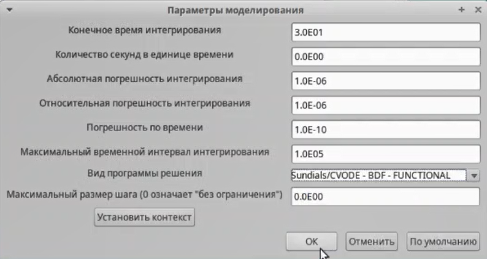{#fig:004 width=70%}

## Реализация модели в xcos

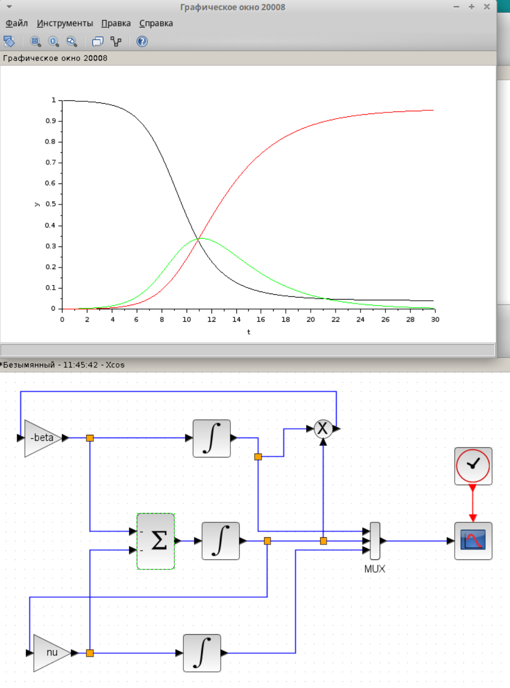{#fig:001 width=70%}

## Реализация модели с помощью блока Modelica в xcos

```
////automatically generated ////
 //input variables
 Real beta,nu;
 //output variables (комментируем, т.к.
 // начальные значения задаем в самом блоке):
 // Real s,i,r;
 
 ////do not modif above this line ////
 // Начальные значения:
 Real s(start=.999), i(start=.001), r(start=.0);
 // модель SIR:
 equation
 der(s)=-beta*s*i;
 der(i)=beta*s*i-nu*i;
 der(r)=nu*i;
 end generic;
```

## Реализация модели с помощью блока Modelica в xcos

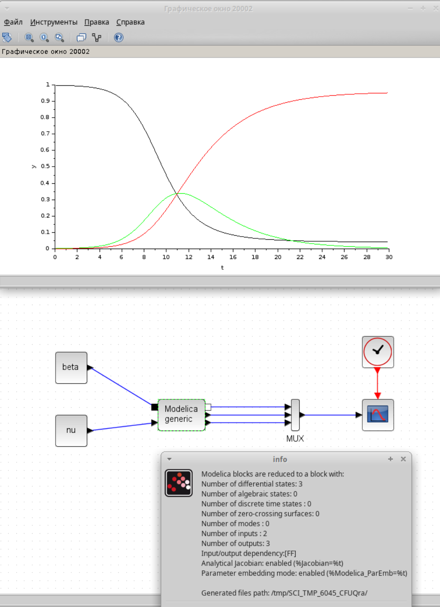{#fig:005 width=70%}

## Реализация модели SIR в OpenModelica

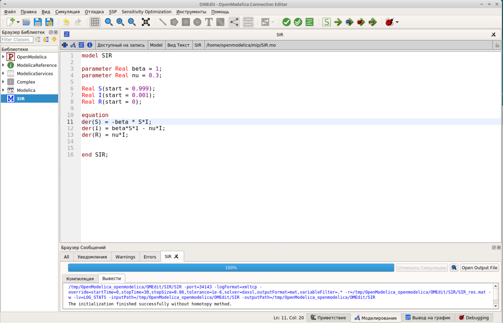{#fig:006 width=70%}

## Реализация модели SIR в OpenModelica

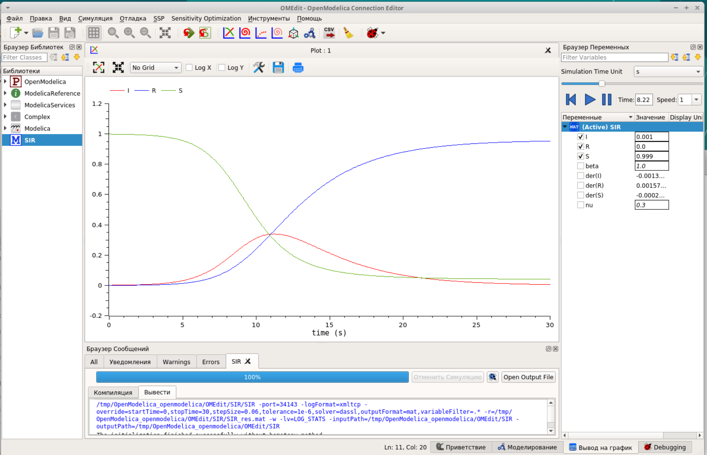{#fig:007 width=70%}

# Задание для самостоятельного выполнения

## Реализация модели в xcos

$$
\begin{cases}
  \dot s = - \beta s(t)i(t) + \mu (N - s(t)); \\
  \dot i = \beta s(t)i(t) - \nu i(t) - \mu i(t);\\
  \dot r = \nu i(t) - \mu r(t),
\end{cases}
$$

## Реализация модели в xcos

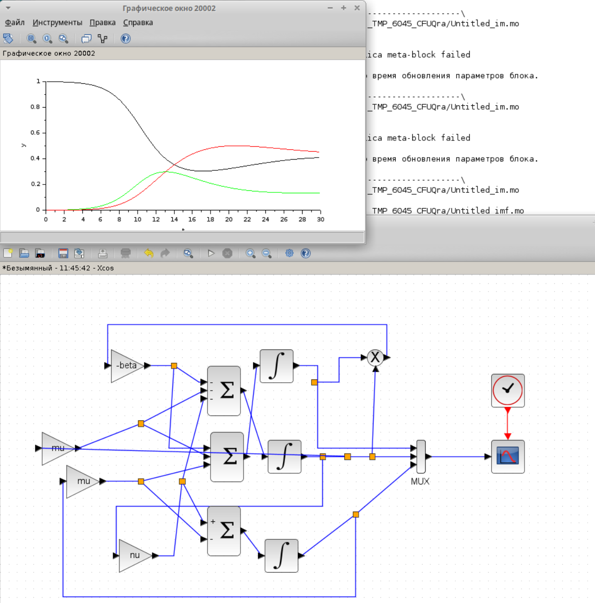{#fig:008 width=70%}

## Реализация модели в xcos

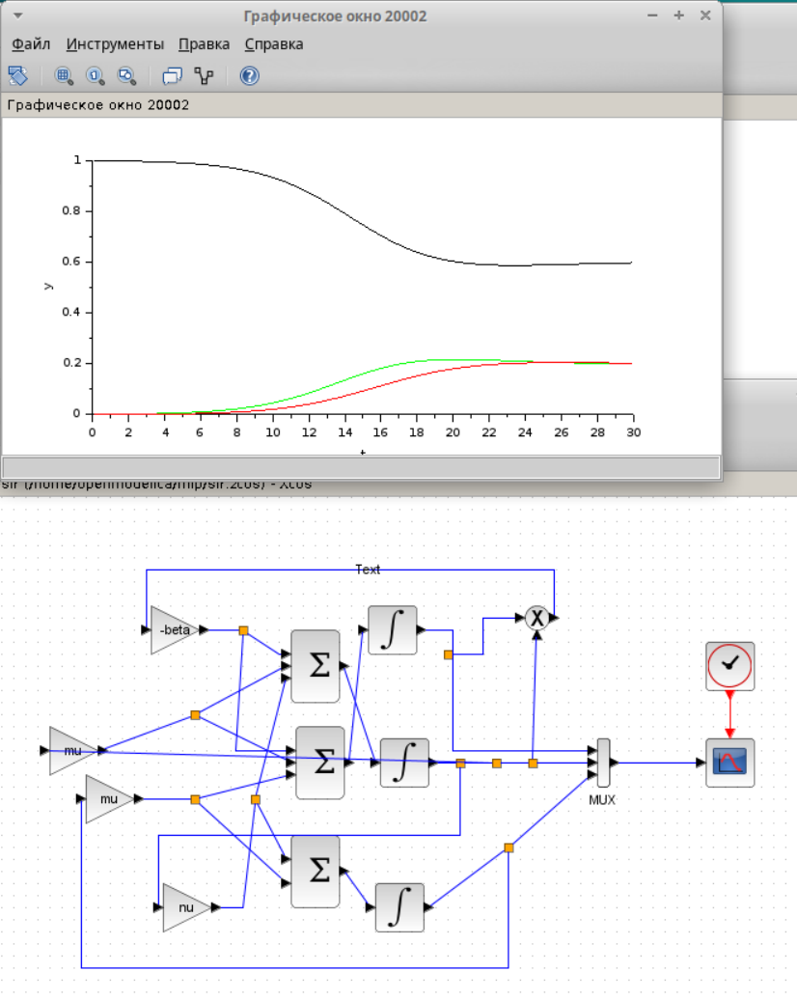{#fig:009 width=70%}

## Реализация модели в xcos

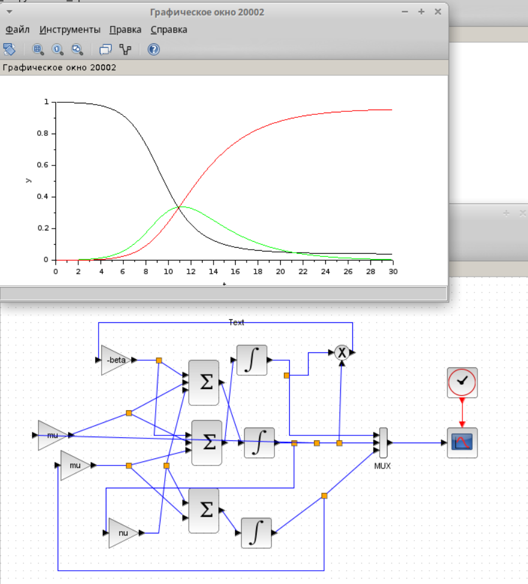{#fig:010 width=70%}

## Реализация модели с помощью блока Modelica в xcos

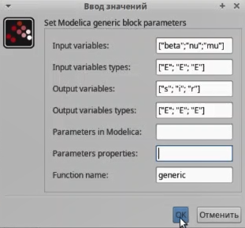{#fig:002 width=70%}

## Реализация модели с помощью блока Modelica в xcos

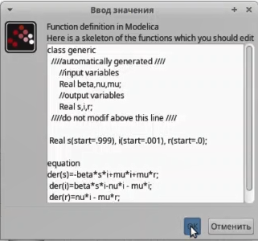{#fig:003 width=70%}

## Реализация модели с помощью блока Modelica в xcos

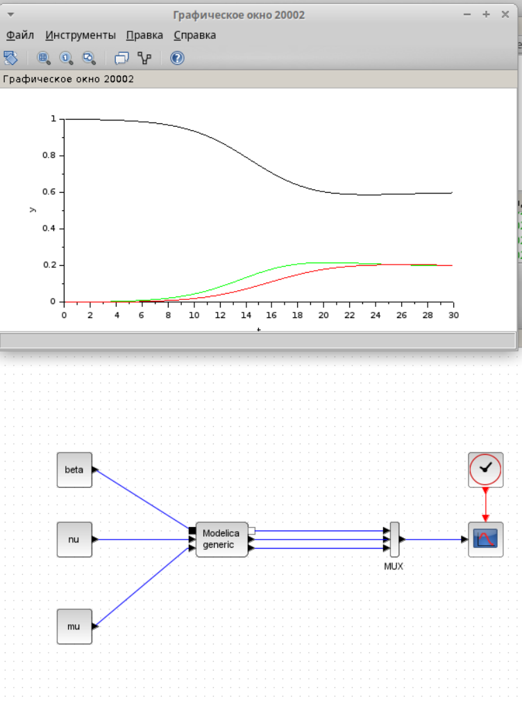{#fig:011 width=70%} 

## Реализация модели SIR в OpenModelica

```model SIR

parameter Real beta = 1;
parameter Real nu = 0.3;
parameter Real mu = 0.5;


Real s(start = 0.999);
Real i(start = 0.001);
Real r(start = 0);

equation
der(s)=-beta*s*i+mu*i+mu*r;
der(i)=beta*s*i-nu*i - mu*i;
der(r)=nu*i - mu*r;


end SIR;

```

## Реализация модели SIR в OpenModelica

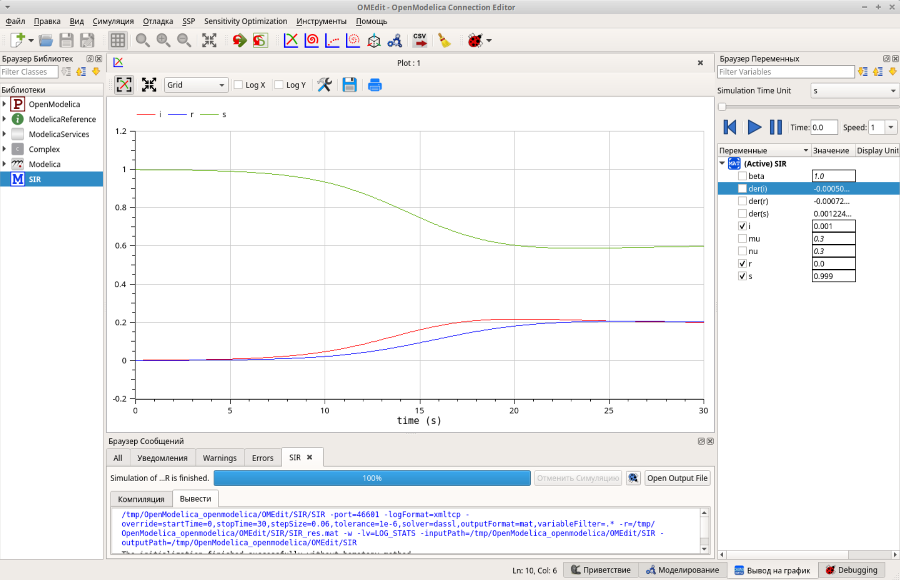{#fig:012 width=70%} 

# Выводы

## 

Я построила модель эпидемии, используя разные утилиты.

