---
## Front matter
title: "Лабораторная работа №5"
subtitle: "Имитационное моделирование"
author: "Александрова Ульяна Вадимовна"

## Generic otions
lang: ru-RU
toc-title: "Содержание"

## Bibliography
bibliography: bib/cite.bib
csl: pandoc/csl/gost-r-7-0-5-2008-numeric.csl

## Pdf output format
toc: true # Table of contents
toc-depth: 2
lof: true # List of figures
lot: true # List of tables
fontsize: 12pt
linestretch: 1.5
papersize: a4
documentclass: scrreprt
## I18n polyglossia
polyglossia-lang:
  name: russian
  options:
	- spelling=modern
	- babelshorthands=true
polyglossia-otherlangs:
  name: english
## I18n babel
babel-lang: russian
babel-otherlangs: english
## Fonts
mainfont: IBM Plex Serif
romanfont: IBM Plex Serif
sansfont: IBM Plex Sans
monofont: IBM Plex Mono
mathfont: STIX Two Math
mainfontoptions: Ligatures=Common,Ligatures=TeX,Scale=0.94
romanfontoptions: Ligatures=Common,Ligatures=TeX,Scale=0.94
sansfontoptions: Ligatures=Common,Ligatures=TeX,Scale=MatchLowercase,Scale=0.94
monofontoptions: Scale=MatchLowercase,Scale=0.94,FakeStretch=0.9
mathfontoptions:
## Biblatex
biblatex: true
biblio-style: "gost-numeric"
biblatexoptions:
  - parentracker=true
  - backend=biber
  - hyperref=auto
  - language=auto
  - autolang=other*
  - citestyle=gost-numeric
## Pandoc-crossref LaTeX customization
figureTitle: "Рис."
tableTitle: "Таблица"
listingTitle: "Листинг"
lofTitle: "Список иллюстраций"
lotTitle: "Список таблиц"
lolTitle: "Листинги"
## Misc options
indent: true
header-includes:
  - \usepackage{indentfirst}
  - \usepackage{float} # keep figures where there are in the text
  - \floatplacement{figure}{H} # keep figures where there are in the text
---

# Цель работы

Целью данной работы является получение навыков создания модели эпидемии (SIR) при помощи утелит Sci-Lab и OpenModelica.

# Задание

1. Проделать пример из методического материала;
2. Проделать упражнение;
3. Выполнить задание для самостоятельной работы.


# Теоретическое введение

Модель SIR предложена в 1927 г. (W. O. Kermack, A. G. McKendrick).

Предполагается, что особи популяции размера N могут находиться в трёх различных состояниях:

- S(susceptible, уязвимые) — здоровые особи, которые находятся в группе риска и могут подхватить инфекцию;
- I(infective, заражённые, распространяющие заболевание) — заразившиеся переносчики болезни;
- R(recovered/removed, вылечившиеся) — те, кто выздоровел и перестал распространять болезнь (в эту категорию относят, например, приобретших иммунитет или умерших).

Если предположить, что каждый член популяции может контактировать с каждым, то задача о распространении эпидемии описывается системой дифференциальных уравнений:

$$
\begin{cases}
  \dot s = - \beta s(t)i(t); \\
  \dot i = \beta s(t)i(t) - \nu i(t);\\
  \dot r = \nu i(t),
\end{cases}
$$

где $\beta$ -- скорость заражения, $\nu$ -- скорость выздоровления.

Первое уравнение описывает динамику численности уязвимых к болезни особей: заражённая особь с некоторой скоростью  заражает уязвимую особь.

Третье уравнение описывает динамику выздоровления заражённой особи: с некоторой скоростью инфицированная особь выздоравливает.

Второе уравнение описывает динамику численности заражённых особей: разность числа заражённых особей и числа выздоровевших особей.

# Выполнение лабораторной работы

## Реализация модели в xcos

Зафиксируем начальные данные: $\beta = 1, \, \nu = 0,3, s(0) = 0,999, \, i(0) = 0,001, \, r(0) = 0.$

В меню Моделирование, задаю переменные окружения. Для создания модели, используем следующие блоки:

- `CLOCK_c` -- запуск часов модельного времени;
- `CSCOPE` -- регистрирующее устройство для построения графика;
- `TEXT_f` -- задаёт текст примечаний;
- `MUX` -- мультиплексер, позволяющий в данном случае вывести на графике сразу
несколько кривых;
- `INTEGRAL_m` -- блок интегрирования;
- `GAINBLK_f` -- в данном случае позволяет задать значения коэффициентов $\beta$ и $\nu$ ;
- `SUMMATION` -- блок суммирования;
- `PROD_f` -- поэлементное произведение двух векторов на входе блока.

Перед моделированием, настроим параметры моделирования (рис. [-@fig:004]).

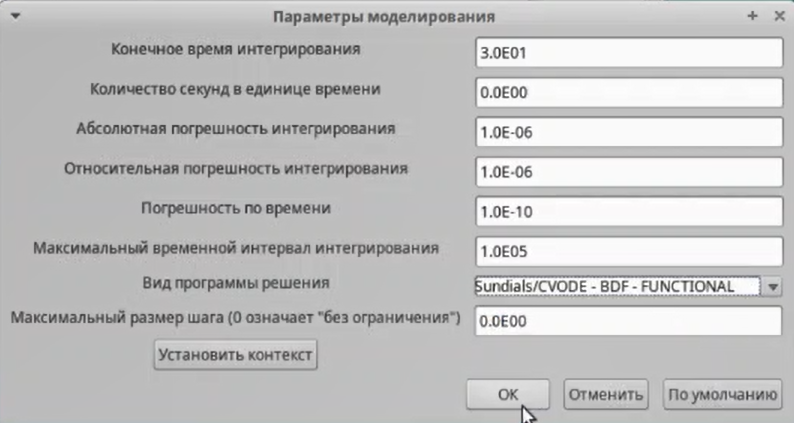{#fig:004 width=70%}

Готовая модель выглядит следующим образом (рис. [-@fig:001]).

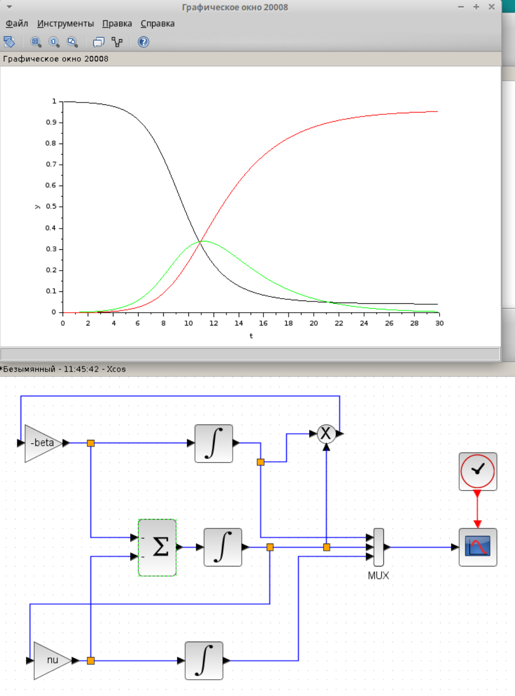{#fig:001 width=70%}

На этом графике красным цветом обозначена численность выздоровевших, зеленым - численность зараженных, а черным - уязвимых к болезни. Мы видим, что в какой-то момент времени все графики перескаются в одной точке - пике эпидемии, когда число зараженных макисмально. После прохождения этой точки, число выздоровевших многократно увеличивается.

## Реализация модели с помощью блока Modelica в xcos

Теперь составим эту же модель через блок Modelica. Настроим его и напишем код для блока:

```
////automatically generated ////
 //input variables
 Real beta,nu;
 //output variables (комментируем, т.к.
 // начальные значения задаем в самом блоке):
 // Real s,i,r;
 
 ////do not modif above this line ////
 // Начальные значения:
 Real s(start=.999), i(start=.001), r(start=.0);
 // модель SIR:
 equation
 der(s)=-beta*s*i;
 der(i)=beta*s*i-nu*i;
 der(r)=nu*i;
 end generic;
```

Готовая модель аналогична предыдущей (рис. [-@fig:005]).

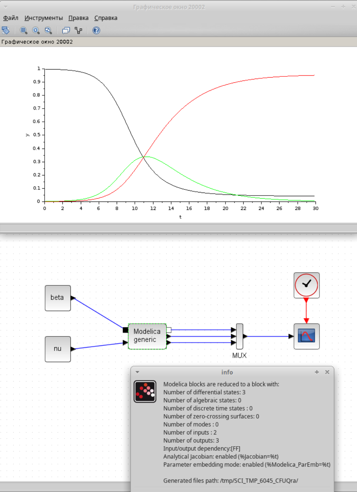{#fig:005 width=70%}

## Реализация модели SIR в OpenModelica

Открываю OMEdit и создаю новый файл SIR.mo для реализации модели. В окне "Вид текста", расписываю модель (рис. [-@fig:006]).

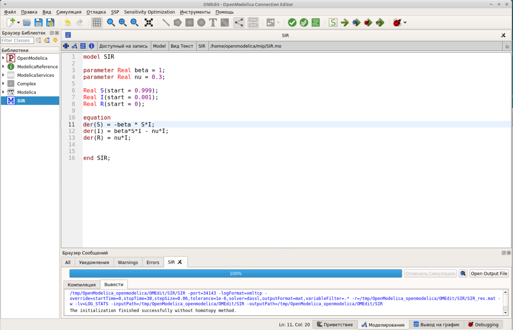{#fig:006 width=70%}

График модели идентичен предыдущим моделям (рис. [-@fig:007]).

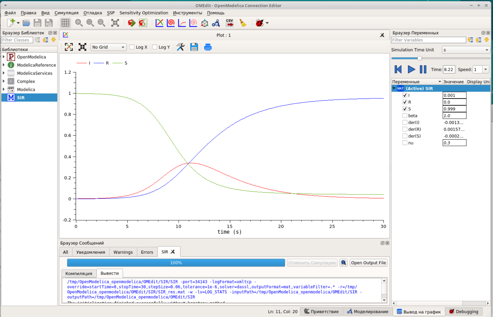{#fig:007 width=70%}

## Задание для самостоятельного выполнения

В дополнение к предположениям, которые были сделаны для модели SIR, предположим, что учитываются демографические процессы, в частности, что смертность в популяции полностью уравновешивает рождаемость, а все рожденные индивидуу
мыпоявляются на свет абсолютно здоровыми. Тогда получим следующую систему уравнений:

$$
\begin{cases}
  \dot s = - \beta s(t)i(t) + \mu (N - s(t)); \\
  \dot i = \beta s(t)i(t) - \nu i(t) - \mu i(t);\\
  \dot r = \nu i(t) - \mu r(t),
\end{cases}
$$

Сначала посмотрим систему в xcos при mu = 0.1 (рис. [-@fig:008]).

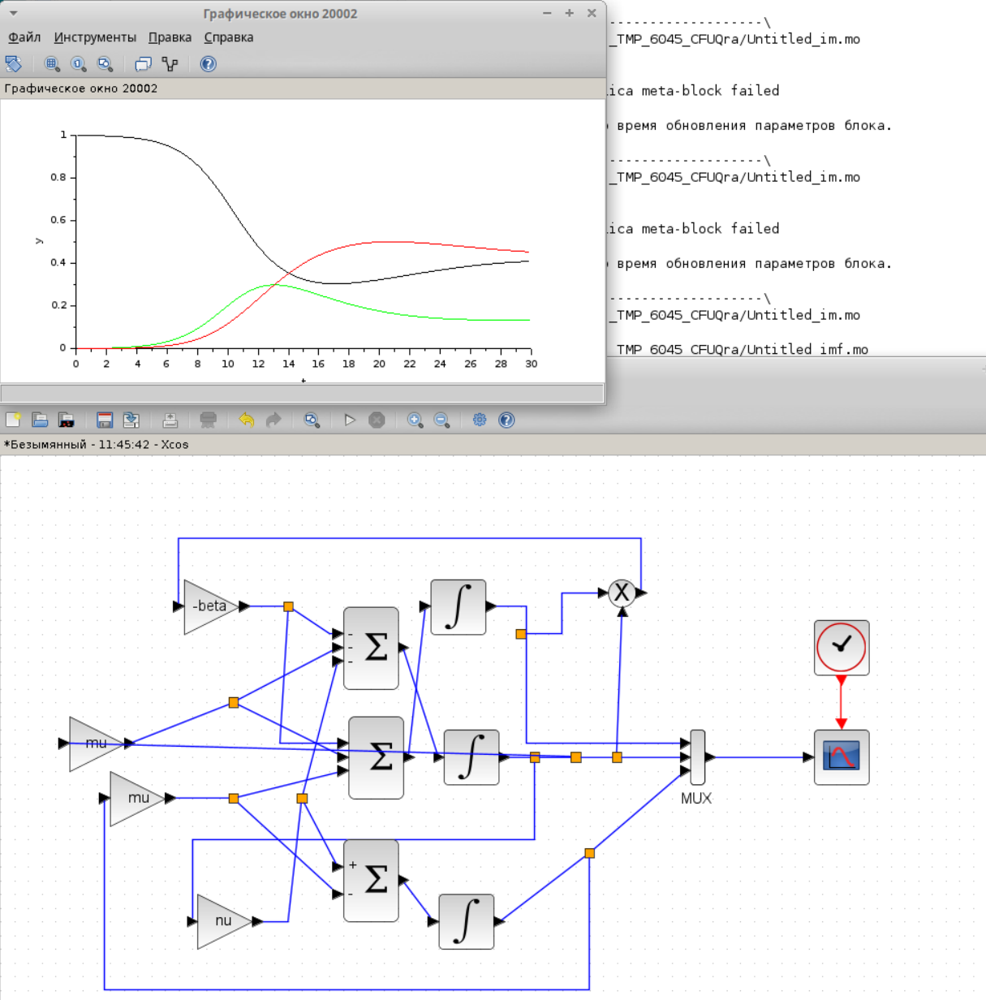{#fig:008 width=70%}

Мы можем заметить, что после пика эпидемии, число выздоровевших и уязвимых к болезни уравнивается.

Теперь положим, что mu = 0.3 (рис. [-@fig:009]).

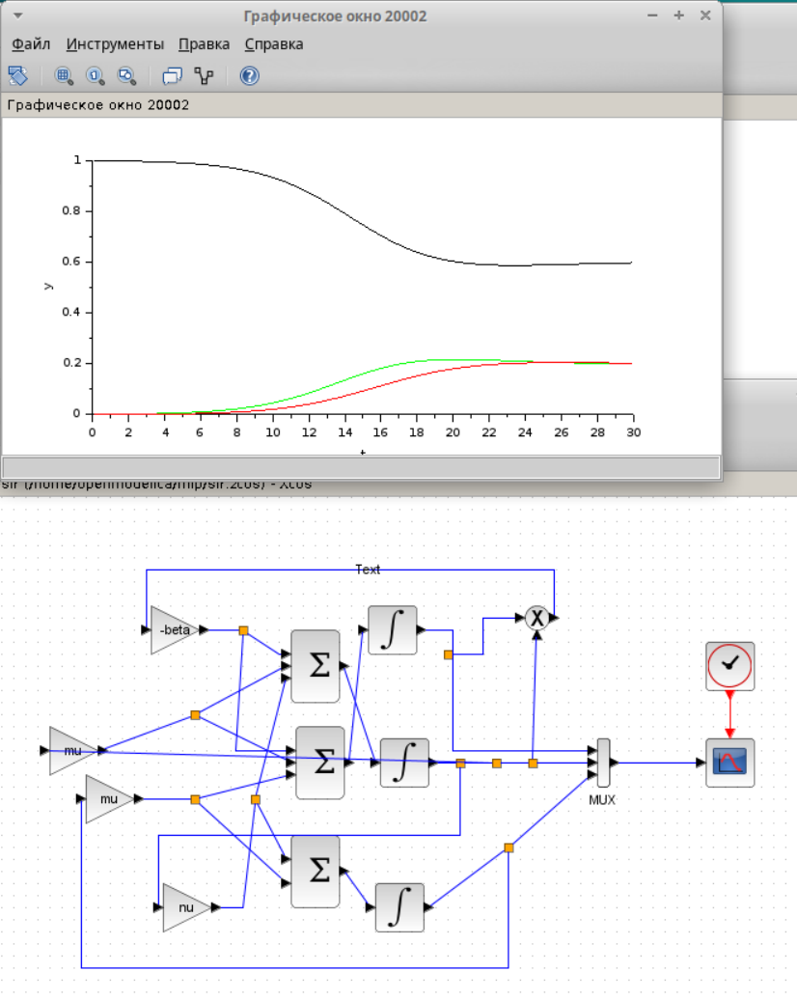{#fig:009 width=70%}

Мы можем наблюдать еще более сильное выравнивание всех показателей и сглаживание пика эпидемии.

Если mu = 0, то график не меняется в сравнении с нашей прошлой моделью (рис. [-@fig:010]).

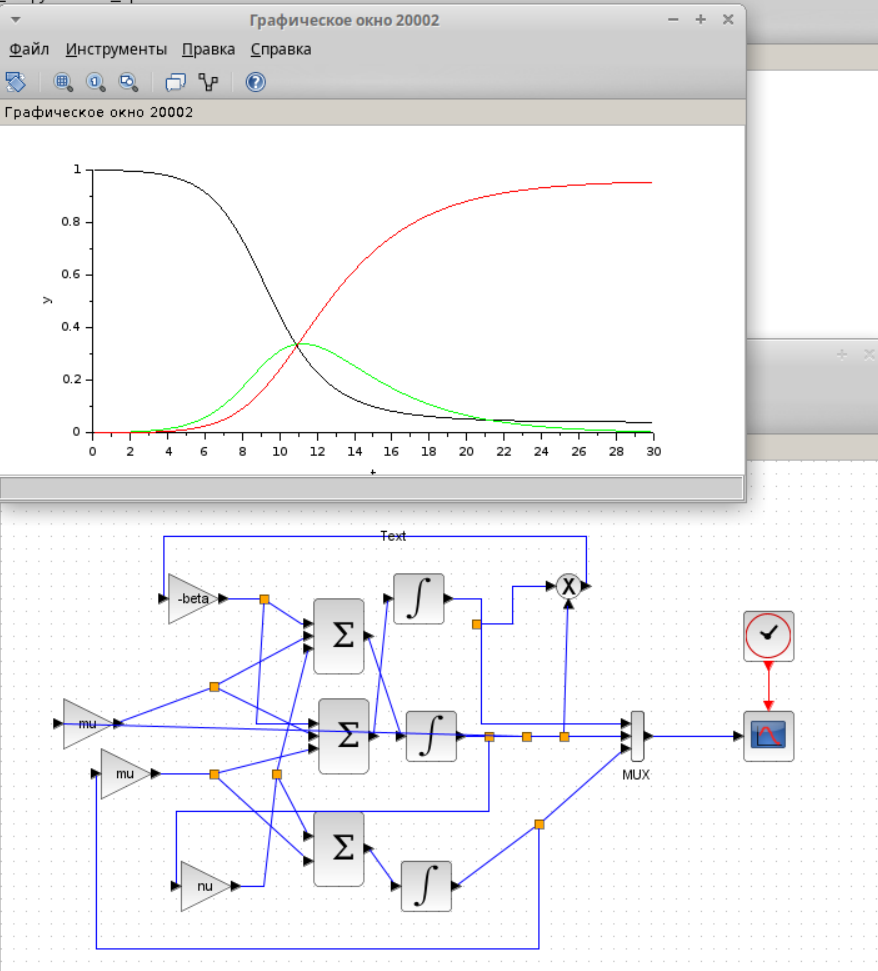{#fig:010 width=70%}

Теперь построим график через блок Modelica. Настроим показатели (рис. [-@fig:002]), (рис. [-@fig:003]).

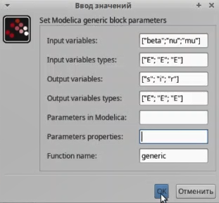{#fig:002 width=70%}

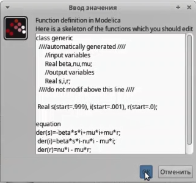{#fig:003 width=70%}

Симулируем график (рис. [-@fig:011]).

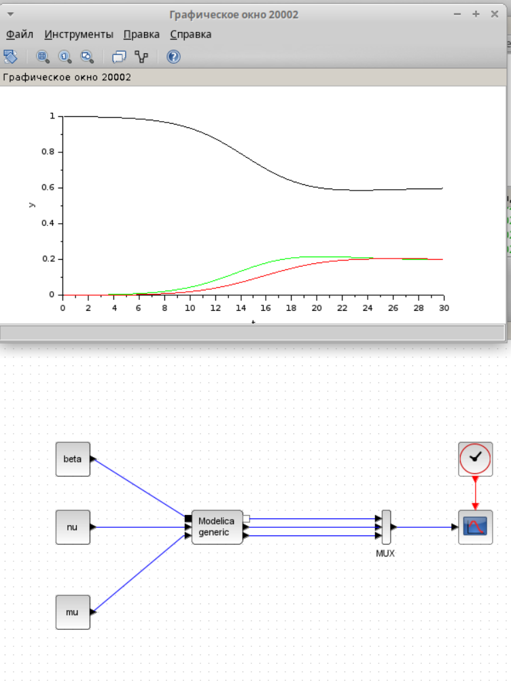{#fig:011 width=70%} 

Проделаем все те же шаги через OpenModelica. Напишу код:

```model SIR

parameter Real beta = 1;
parameter Real nu = 0.3;
parameter Real mu = 0.5;


Real s(start = 0.999);
Real i(start = 0.001);
Real r(start = 0);

equation
der(s)=-beta*s*i+mu*i+mu*r;
der(i)=beta*s*i-nu*i - mu*i;
der(r)=nu*i - mu*r;


end SIR;

```

Запустим симуляцию (рис. [-@fig:012]).

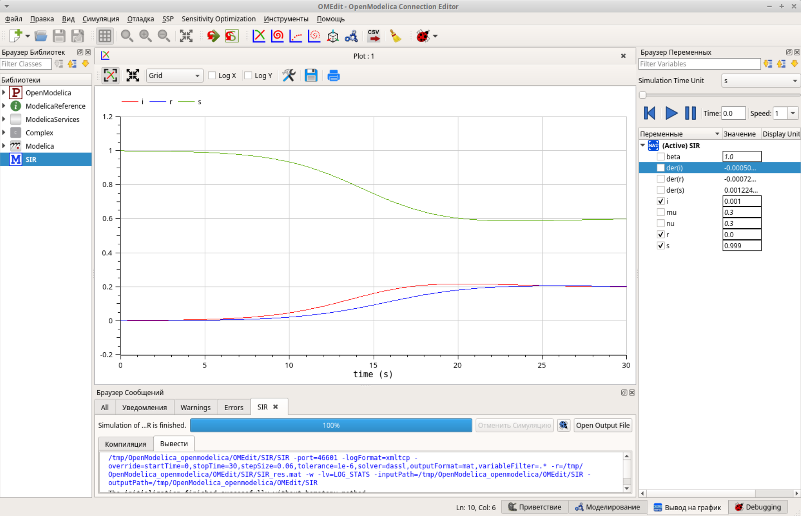{#fig:012 width=70%} 

# Выводы

Я построила модель эпидемии, используя разные утилиты.

