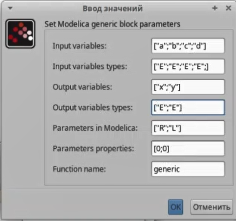
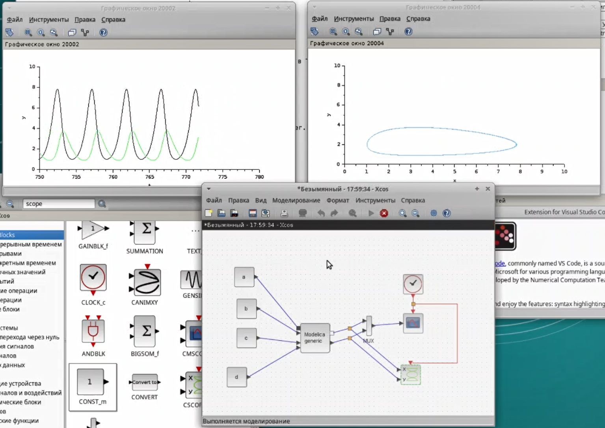
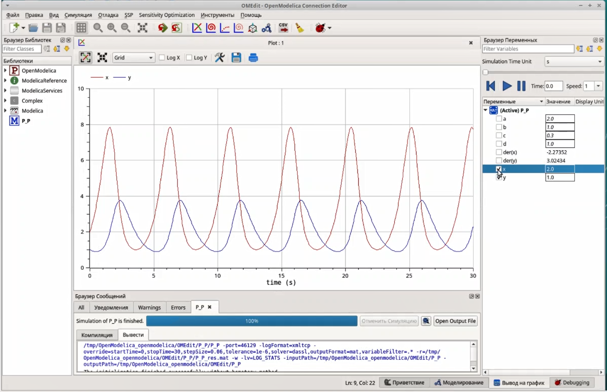
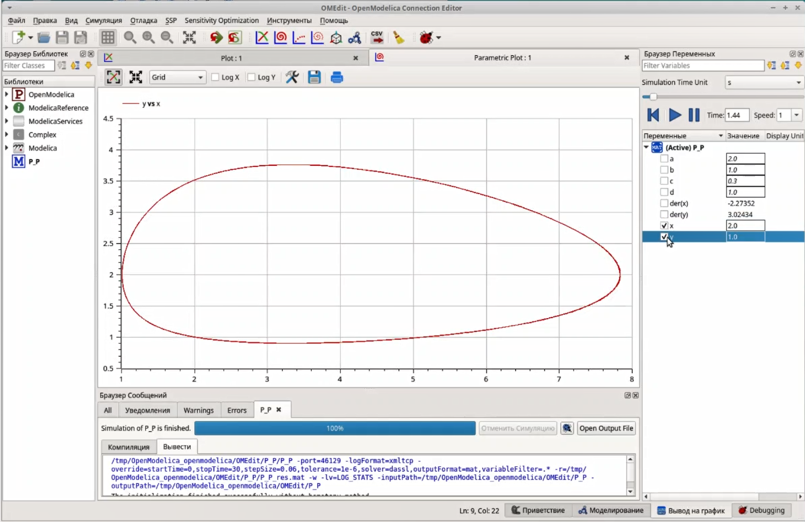

---
## Front matter
lang: ru-RU
title: Лабораторная работа №6
subtitle: Имитационное моделирование
author:
  - Александрова УВ
institute:
  - Российский университет дружбы народов, Москва, Россия
date: 27 февраля 2025

## i18n babel
babel-lang: russian
babel-otherlangs: english

## Formatting pdf
toc: false
toc-title: Содержание
slide_level: 2
aspectratio: 169
section-titles: true
theme: metropolis
header-includes:
 - \metroset{progressbar=frametitle,sectionpage=progressbar,numbering=fraction}
---

# Информация

## Докладчик

:::::::::::::: {.columns align=center}
::: {.column width="70%"}

  * Александрова Ульяна
  * студентка 3го курса
  * Факультет физико-математических и естественных наук
  * Российский университет дружбы народов
  * [1132226444@rudn.ru](mailto:1132226444@rudn.ru)

:::
::: {.column width="30%"}

:::
::::::::::::::

# Цель работы

## Цель работы

Целью этой работы является создание модели "Хищник-жертва" при помощи утилит Sci-lab и OpenModelica,

## Задание

1. Проделать пример в Sci-lab;
2. Выполнить упражнение в OpenModelica.

## Теоретическое введение

Модель «хищник–жертва» (модель Лотки — Вольтерры) представляет собой модель межвидовой конкуренции. В математической форме модель имеет вид:

$$
\begin{cases}
    \dot x = a * x - b * x * y; \\
    \dot y = c * x * y - d * y. \\
\end{cases}
$$

где x — количество жертв; y — количество хищников; a, b, c, d — коэффициенты, отражающие взаимодействия между видами: a — коэффициент рождаемости жертв; b — коэффициент убыли жертв; c — коэффициент рождения хищников; d — коэффициент убыли хищников.

# Выполнение лабораторной работы

## Реализация модели в xcos

{#fig:001 width=70%}

## Реализация модели с помощью блока Modelica в xcos

{#fig:002 width=70%}

## Реализация модели с помощью блока Modelica в xcos

{#fig:003 width=70%}

## Реализация модели с помощью блока Modelica в xcos

{#fig:004 width=70%}

## Модель «хищник– жертва» в OpenModelica

{#fig:005 width=70%}

## Модель «хищник– жертва» в OpenModelica

{#fig:006 width=70%}

## Модель «хищник– жертва» в OpenModelica

{#fig:007 width=70%}

# Выводы

Я построила модель хищник-жертва, используя различные утилиты.
