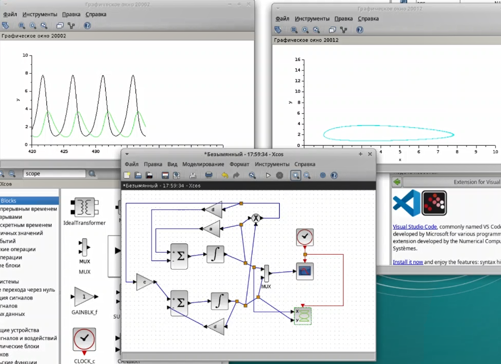
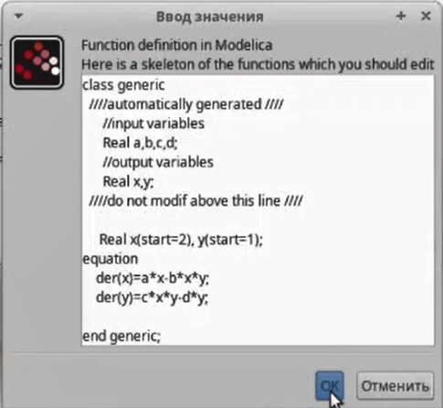
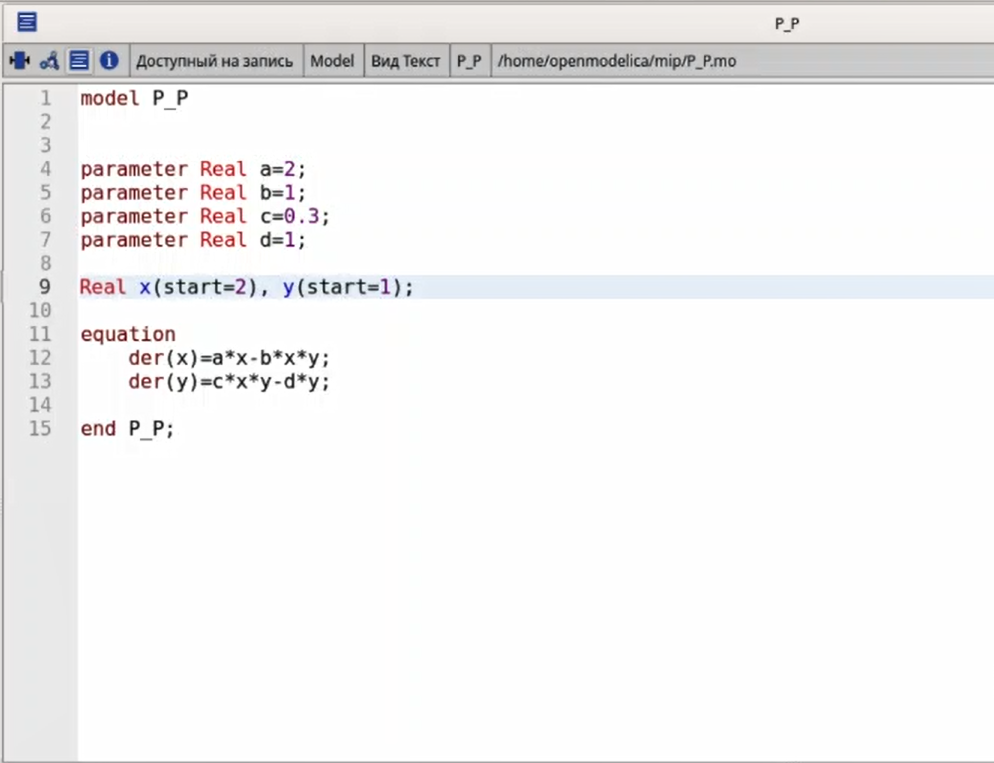

---
## Front matter
title: "Лабораторная работа №6"
subtitle: "Имитационное моделирование"
author: "Александрова Ульяна Ввадимовна"

## Generic otions
lang: ru-RU
toc-title: "Содержание"

## Bibliography
bibliography: bib/cite.bib
csl: pandoc/csl/gost-r-7-0-5-2008-numeric.csl

## Pdf output format
toc: true # Table of contents
toc-depth: 2
lof: true # List of figures
lot: true # List of tables
fontsize: 12pt
linestretch: 1.5
papersize: a4
documentclass: scrreprt
## I18n polyglossia
polyglossia-lang:
  name: russian
  options:
	- spelling=modern
	- babelshorthands=true
polyglossia-otherlangs:
  name: english
## I18n babel
babel-lang: russian
babel-otherlangs: english
## Fonts
mainfont: IBM Plex Serif
romanfont: IBM Plex Serif
sansfont: IBM Plex Sans
monofont: IBM Plex Mono
mathfont: STIX Two Math
mainfontoptions: Ligatures=Common,Ligatures=TeX,Scale=0.94
romanfontoptions: Ligatures=Common,Ligatures=TeX,Scale=0.94
sansfontoptions: Ligatures=Common,Ligatures=TeX,Scale=MatchLowercase,Scale=0.94
monofontoptions: Scale=MatchLowercase,Scale=0.94,FakeStretch=0.9
mathfontoptions:
## Biblatex
biblatex: true
biblio-style: "gost-numeric"
biblatexoptions:
  - parentracker=true
  - backend=biber
  - hyperref=auto
  - language=auto
  - autolang=other*
  - citestyle=gost-numeric
## Pandoc-crossref LaTeX customization
figureTitle: "Рис."
tableTitle: "Таблица"
listingTitle: "Листинг"
lofTitle: "Список иллюстраций"
lotTitle: "Список таблиц"
lolTitle: "Листинги"
## Misc options
indent: true
header-includes:
  - \usepackage{indentfirst}
  - \usepackage{float} # keep figures where there are in the text
  - \floatplacement{figure}{H} # keep figures where there are in the text
---

# Цель работы

Целью этой работы является создание модели "Хищник-жертва" при помощи утилит Sci-lab и OpenModelica,

# Задание

1. Проделать пример в Sci-lab;
2. Выполнить упражнение в OpenModelica.

# Теоретическое введение

Модель «хищник–жертва» (модель Лотки — Вольтерры) представляет собой модель межвидовой конкуренции. В математической форме модель имеет вид:

$$
\begin{cases}
    \dot x = a * x - b * x * y; \\
    \dot y = c * x * y - d * y. \\
\end{cases}
$$

где x — количество жертв; y — количество хищников; a, b, c, d — коэффициенты, отражающие взаимодействия между видами: a — коэффициент рождаемости жертв; b — коэффициент убыли жертв; c — коэффициент рождения хищников; d — коэффициент убыли хищников.

# Выполнение лабораторной работы

## Реализация модели в xcos

Для начала реализуем эту модель в xcos. Для этого составим блочную схему со следующими блоками:

- `CLOCK_c` -- запуск часов модельного времени;
- `CSCOPE` -- регистрирующее устройство для построения графика;
- `TEXT_f` -- задаёт текст примечаний;
- `MUX` -- мультиплексер, позволяющий в данном случае вывести на графике сразу
несколько кривых;
- `INTEGRAL_m` -- блок интегрирования;
- `GAINBLK_f` -- в данном случае позволяет задать значения коэффициентов $\beta$ и $\nu$ ;
- `SUMMATION` -- блок суммирования;
- `PROD_f` -- поэлементное произведение двух векторов на входе блока.

А также зададим константы: $a = 2, \, b = 1, \, c = 0.3, \, d = 1, \, x(0) = 2, \, y(0) = 1$.

Построим модель и в качестве результата получим два графика (рис. [-@fig:001]).

{#fig:001 width=70%}

На графике слева изображена динамика численности хищников (зеленым) и жертв (черным). Заметна синусиодеая тенденция изменения численности: когда еды (жертв) много, популяция хищников растет, но одновременно с этим падает популяция еды, так как ее съедает повышенная численность хищников. Таким образом, хищники и жертвы всегда находятся в циклообразном балансе численности, что не допускает превышение нормы численности населения и сохраняет баланс популяций в природе.

На графике справа изображен фазовый портрет. Фазовый портрет — графическое изображение системы на фазовой плоскости (или в многомерном пространстве), по координатным осям которого отложены значения величин переменных системы. Поведение переменных во времени при таком способе представления для каждой начальной точки описывается фазовой траек
торией.

Видно, что по x колебания более значительны, поскольку значительны и разбросы значений. Это подтверждается и графиком численноти: еолебание численности жертвы значительно выше, что обусловленно видовыми особенностями типичных представителей "жертв".

## Реализация модели с помощью блока Modelica в xcos

Создаю ту же модель, но с использование блока Modelica. Сначала задаю необходимые параметры (рис. [-@fig:002]) (рис. [-@fig:003]).

{#fig:002 width=70%}

{#fig:003 width=70%}

В результате получаю аналогичные графики, что доказывает, что блок работает исправно (рис. [-@fig:004]).

{#fig:004 width=70%}

## Vодель «хищник– жертва» в OpenModelica

Чтобы выполнить упражнения, перейдем в программу OMEdit. В новом файле P-P.mo (predator-prey) записываю код для симуляции (рис. [-@fig:005]).

{#fig:005 width=70%}

Сначала симулирую модель через стандартный режим посмтроения графиков (рис. [-@fig:006]).

{#fig:006 width=70%}

Далее перехожу в режим параметрических графиков, чтобы построить фазовый портрет (рис. [-@fig:007]).

{#fig:007 width=70%}

Программа работает исправно.

# Выводы

Я построила модель хищник-жертва, используя различные утилиты.
