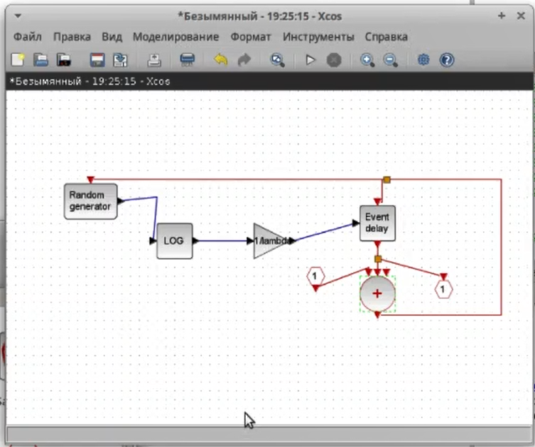
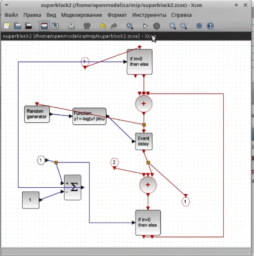
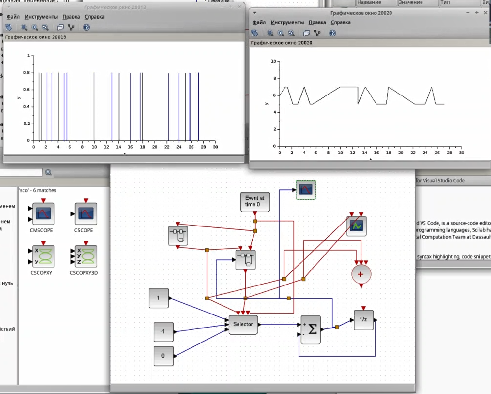

---
## Front matter
lang: ru-RU
title: Лабораторная работа №7
subtitle: Имитационное моделирование
author:
  - Александрова УВ
institute:
  - Российский университет дружбы народов, Москва, Россия
date: 1 марта 2025

## i18n babel
babel-lang: russian
babel-otherlangs: english

## Formatting pdf
toc: false
toc-title: Содержание
slide_level: 2
aspectratio: 169
section-titles: true
theme: metropolis
header-includes:
 - \metroset{progressbar=frametitle,sectionpage=progressbar,numbering=fraction}
---

# Информация

## Докладчик

:::::::::::::: {.columns align=center}
::: {.column width="70%"}

  * Александрова Ульяна
  * студентка 3го курса
  * Факультет физико-математических и естественных наук
  * Российский университет дружбы народов
  * [1132226444@rudn.ru](mailto:1132226444@rudn.ru)

:::
::: {.column width="30%"}

:::
::::::::::::::

# Цель работы

##

Целью данной работы является создание модели M | M | 1 | inf при помощи утилиты Sci-lab (xcos).

# Теоретическое введение

##

Модель \( M | M | 1 | inf \) относится к теории массового обслуживания и описывает систему с одним обслуживающим устройством, где:

- **M**: Входящий поток заявок (поток Пуассона).
- **M**: Время обслуживания заявок (экспоненциальное распределение).
- **1**: Одно обслуживающее устройство.
- **inf**: Неограниченная длина очереди.

Эта модель используется для анализа систем, где заявки поступают случайным образом и обслуживаются по принципу "первым пришел — первым обслужен".

# Выполнение лабораторной работы

##

{#fig:001 width=70%}

##

{#fig:002 width=70%}

##

{#fig:003 width=70%}

# Выводы

Я посмтроила СМО модель в Sci-Lab.

