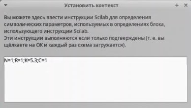
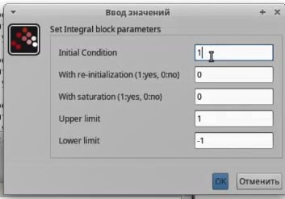
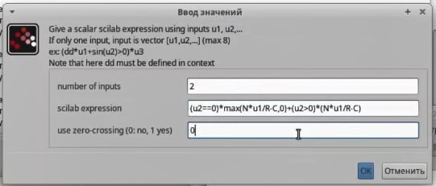
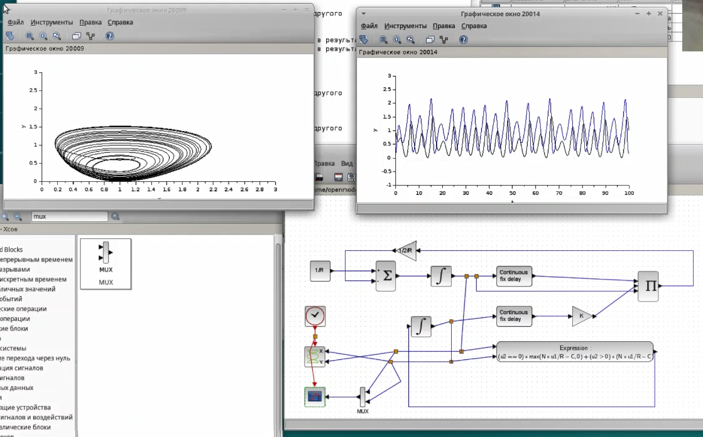
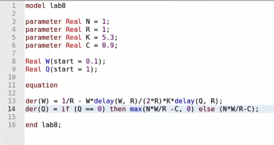

---
## Front matter
lang: ru-RU
title: Лабораторная работа №8
subtitle: Имитационное моделирование
author:
  - Александрова УВ
institute:
  - Российский университет дружбы народов, Москва, Россия
date: 5 марта 2025

## i18n babel
babel-lang: russian
babel-otherlangs: english

## Formatting pdf
toc: false
toc-title: Содержание
slide_level: 2
aspectratio: 169
section-titles: true
theme: metropolis
header-includes:
 - \metroset{progressbar=frametitle,sectionpage=progressbar,numbering=fraction}
---

# Информация

## Докладчик

:::::::::::::: {.columns align=center}
::: {.column width="70%"}

  * Александрова Ульяна
  * студентка 3го курса
  * Факультет физико-математических и естественных наук
  * Российский университет дружбы народов
  * [1132226444@rudn.ru](mailto:1132226444@rudn.ru)

:::
::: {.column width="30%"}

:::
::::::::::::::

# Цель работы

Целью работы было составить модель TCP/AQM при помощи утилит Sci-lab и OpenModelica.

# Выполнение лабораторной работы

## Sci-Lab

{#fig:001 width=70%}

##

{#fig:002 width=70%}

##

{#fig:003 width=70%}

##

{#fig:004 width=70%}

##

{#fig:005 width=70%}

##

{#fig:006 width=70%}

## OpenModelica

{#fig:007 width=70%}

##

{#fig:008 width=70%}

##

{#fig:009 width=70%}

# Выводы

Я построила модель TCP/AQM при помощи утилит Sci-lab и OpenModelica.
