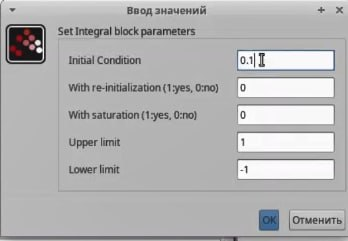
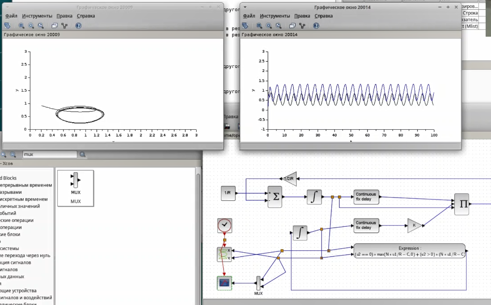
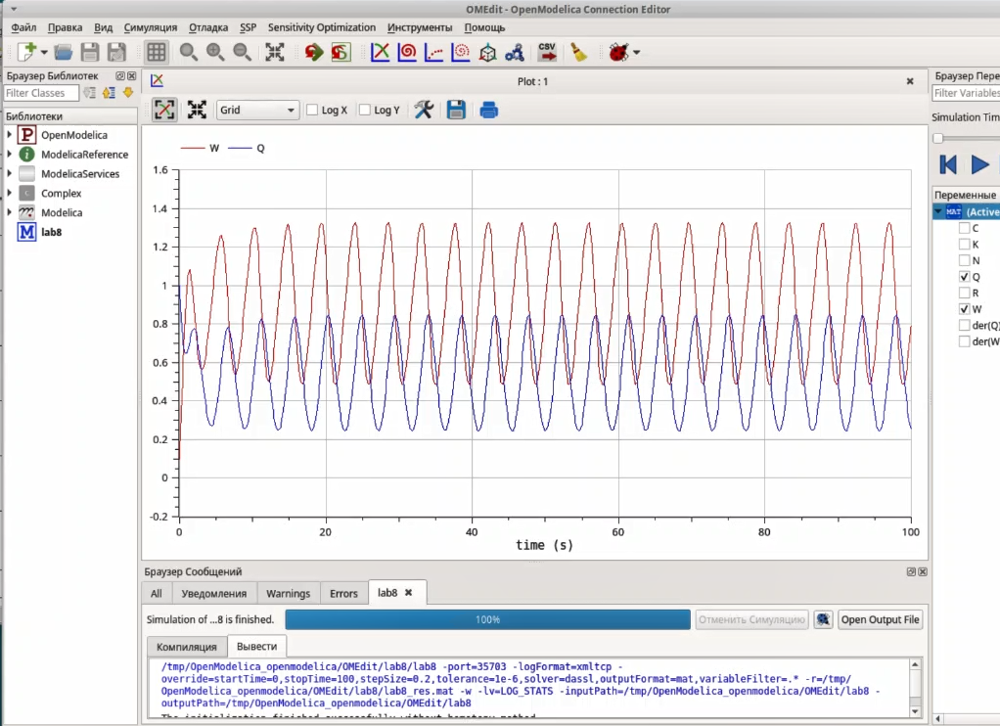
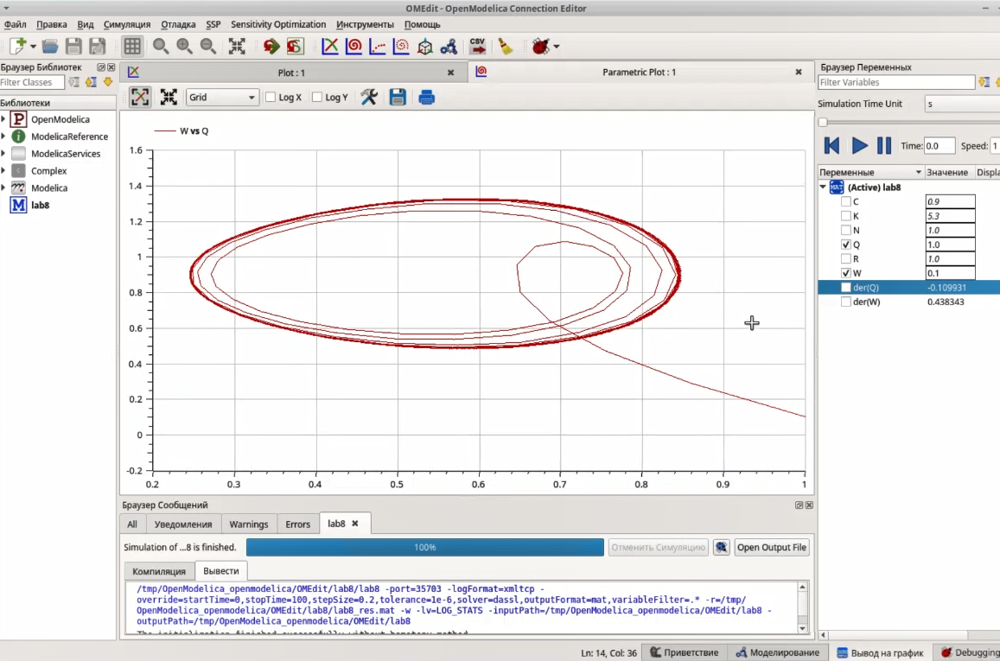

---
## Front matter
title: "Лабораторная работа №8"
subtitle: "Имитационное моделирование"
author: "Александрова Ульяна Вадимовна"

## Generic otions
lang: ru-RU
toc-title: "Содержание"

## Bibliography
bibliography: bib/cite.bib
csl: pandoc/csl/gost-r-7-0-5-2008-numeric.csl

## Pdf output format
toc: true # Table of contents
toc-depth: 2
lof: true # List of figures
lot: true # List of tables
fontsize: 12pt
linestretch: 1.5
papersize: a4
documentclass: scrreprt
## I18n polyglossia
polyglossia-lang:
  name: russian
  options:
	- spelling=modern
	- babelshorthands=true
polyglossia-otherlangs:
  name: english
## I18n babel
babel-lang: russian
babel-otherlangs: english
## Fonts
mainfont: IBM Plex Serif
romanfont: IBM Plex Serif
sansfont: IBM Plex Sans
monofont: IBM Plex Mono
mathfont: STIX Two Math
mainfontoptions: Ligatures=Common,Ligatures=TeX,Scale=0.94
romanfontoptions: Ligatures=Common,Ligatures=TeX,Scale=0.94
sansfontoptions: Ligatures=Common,Ligatures=TeX,Scale=MatchLowercase,Scale=0.94
monofontoptions: Scale=MatchLowercase,Scale=0.94,FakeStretch=0.9
mathfontoptions:
## Biblatex
biblatex: true
biblio-style: "gost-numeric"
biblatexoptions:
  - parentracker=true
  - backend=biber
  - hyperref=auto
  - language=auto
  - autolang=other*
  - citestyle=gost-numeric
## Pandoc-crossref LaTeX customization
figureTitle: "Рис."
tableTitle: "Таблица"
listingTitle: "Листинг"
lofTitle: "Список иллюстраций"
lotTitle: "Список таблиц"
lolTitle: "Листинги"
## Misc options
indent: true
header-includes:
  - \usepackage{indentfirst}
  - \usepackage{float} # keep figures where there are in the text
  - \floatplacement{figure}{H} # keep figures where there are in the text
---

# Цель работы

Целью работы было составить модель TCP/AQM при помощи утилит Sci-lab и OpenModelica.

# Выполнение лабораторной работы

## Sci-Lab

Для выполнения примера из методического материала, будем пользоваться модулем xcos утилиты sc-lab.

Сначала открываю редактор и вношу необходимые константы: число TCP-сессий, время двойного оборота, некая константа пропорциональности и скорость обработки пакетов в очереди соответственно (рис. [-@fig:001]).

{#fig:001 width=70%}

Далее устанавливаю значения для интегралов (рис. [-@fig:002]) (рис. [-@fig:003]).

{#fig:002 width=70%}

{#fig:003 width=70%}

Подключаю все блоки и настраиваю выржание (рис. [-@fig:004]).

{#fig:004 width=70%}

Запускаю модель и вывожу график изменения TCP-окна и фазовый портрет. Графики отображаются корректно (рис. [-@fig:005]).

{#fig:005 width=70%}

На графике справа мы отслеживаем динамику размера окна (синий) и размера очереди (черный). Заметно, что у графика достаточно большая амплитуда, что обусловлено высокой скоростью обработки пакетов (C=1). Также колебания происходят циклично, с явной закономерностью.

На графике слева изображен фазовый (параметрический) портрет. Также как и в графике справа, мы можем наблюдать цикличность. Причем здесь она имеет вращательный характер, то есть кружится вокруг точки.

Теперь снижаю скорость передачи данных до C= = 0.9 (рис. [-@fig:006]).

{#fig:006 width=70%}

В графика наблюдаем повышенную цикличность и значительно уменьшение амплитуды скачков, что и бдует обусловлено пониженной скоростью обработки пакетов.

## OpenModelica

Теперь выполняю то же задание, но на языке Modelica в OMEdit. Листинг программы будет иметь следующий вид (рис. [-@fig:007]).

{#fig:007 width=70%}

Запускаю симуляцию и вывожу график для Q и W. Как и ожидалось, графики совпадают с полученными ранее (рис. [-@fig:008]) (рис. [-@fig:009]).

{#fig:008 width=70%}

{#fig:009 width=70%}

# Выводы

Я построила модель TCP/AQM при помощи утилит Sci-lab и OpenModelica.
