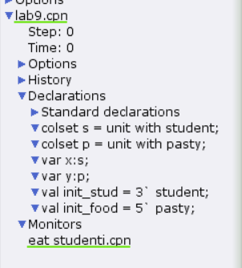
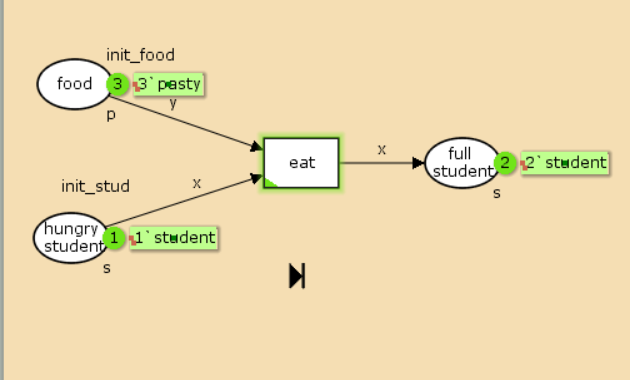
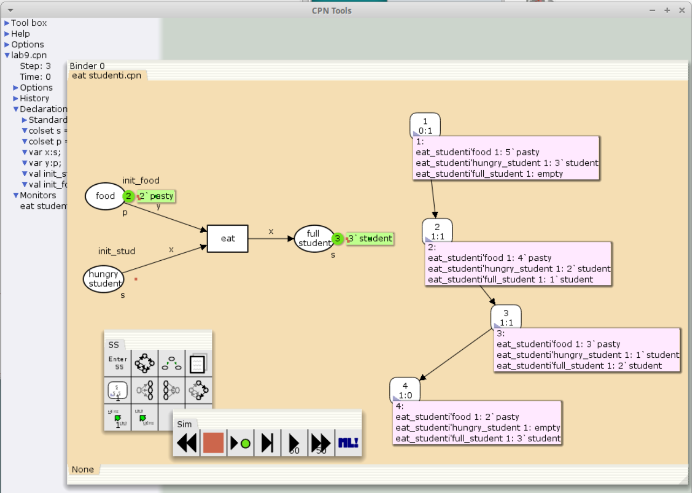

---
## Front matter
lang: ru-RU
title: Лабораторная работа №9
subtitle: Имитационное моделирование
author:
  - Александрова УВ
institute:
  - Российский университет дружбы народов, Москва, Россия
date: 7 марта 2025

## i18n babel
babel-lang: russian
babel-otherlangs: english

## Formatting pdf
toc: false
toc-title: Содержание
slide_level: 2
aspectratio: 169
section-titles: true
theme: metropolis
header-includes:
 - \metroset{progressbar=frametitle,sectionpage=progressbar,numbering=fraction}
---

# Информация

## Докладчик

:::::::::::::: {.columns align=center}
::: {.column width="70%"}

  * Александрова Ульяна
  * студентка 3го курса
  * Факультет физико-математических и естественных наук
  * Российский университет дружбы народов
  * [1132226444@rudn.ru](mailto:1132226444@rudn.ru)

:::
::: {.column width="30%"}


:::
::::::::::::::


# Цель работы

Целью данной лабораторной работы является построение модели "Накорми студентов" в утилите CPN Tools.

# Задание

1. Проделать пример из металического материала.  
2. Проделать упражнение: проанализировать пространство состояний.

# Теоретическое введение

CPN Tools — специальное программное средство, предназначенное для моделирования иерархических временных раскрашенных сетей Петри. Такие сети эквивалентны машине Тьюринга и составляют универсальную алгоритмическую систему, позволяющую описать произвольный объект.
 CPNTools позволяет визуализировать модель с помощью графа сети Петри и применить язык программирования CPN ML (Colored Petri Net Markup Language) для формализованного описания модели.
  
# Выполнение лабораторной работы

Рассмотрим пример студентов, обедающих пирогами. Голодный студент становится сытым после того, как съедает пирог.

{#fig:001 width=70%}

```
colset s=unit with student;
colset p=unit with pasty;
var x:s;
var y:p;
val init_stud = 3`student;
val init_food = 5`pasty;
```

##

{#fig:002 width=70%}

##

{#fig:003 width=70%}

##

{#fig:004 width=70%}

##

{#fig:005 width=70%}

##

```
CPN Tools state space report for:
/home/openmodelica/mip/lab9.cpn
Report generated: Fri Mar  7 13:38:31 2025


 Statistics
------------------------------------------------------------------------

  State Space
     Nodes:  4
     Arcs:   3
     Secs:   0
     Status: Full

  Scc Graph
     Nodes:  4
     Arcs:   3
     Secs:   0
```

##

```
 Boundedness Properties
------------------------------------------------------------------------

  Best Integer Bounds
                             Upper      Lower
     eat_studenti'food 1     5          2
     eat_studenti'full_student 1
                             3          0
     eat_studenti'hungry_student 1
                             3          0

  Best Upper Multi-set Bounds
     eat_studenti'food 1 5`pasty
     eat_studenti'full_student 1
                         3`student
     eat_studenti'hungry_student 1
                         3`student

  Best Lower Multi-set Bounds
     eat_studenti'food 1 2`pasty
     eat_studenti'full_student 1
                         empty
     eat_studenti'hungry_student 1
                         empty
```

##

```

 Home Properties
------------------------------------------------------------------------

  Home Markings
     [4]


 Liveness Properties
------------------------------------------------------------------------

  Dead Markings
     [4]

  Dead Transition Instances
     None

  Live Transition Instances
     None

```

##

{#fig:006 width=70%}

# Выводы

Я построила модель "Накорми студентов" при помощи утилиты CPNtools.

