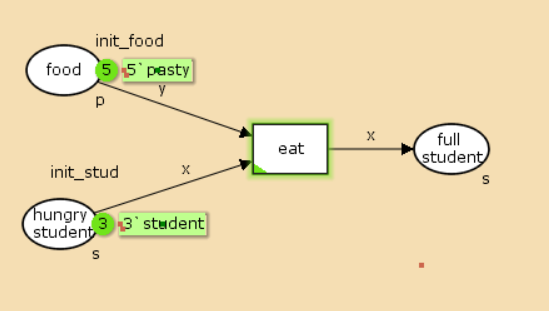
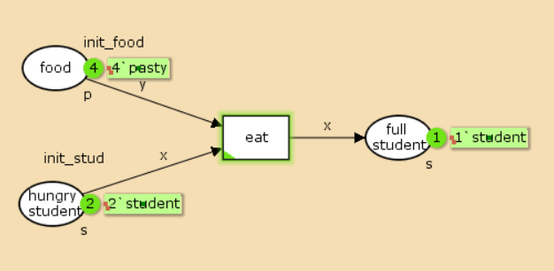
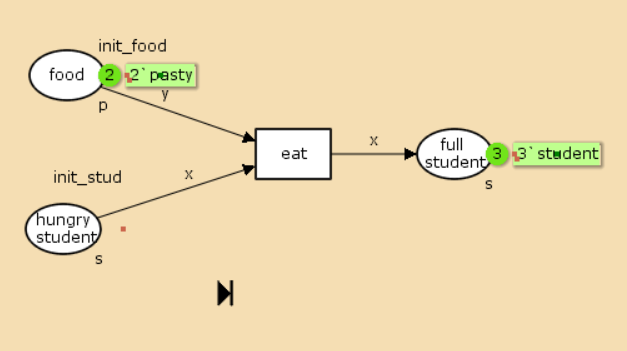

---
## Front matter
title: "Лабораторная работа №9"
subtitle: "Имитационное моделирование"
author: "Александрова Ульяна Вадимовна"

## Generic otions
lang: ru-RU
toc-title: "Содержание"

## Bibliography
bibliography: bib/cite.bib
csl: pandoc/csl/gost-r-7-0-5-2008-numeric.csl

## Pdf output format
toc: true # Table of contents
toc-depth: 2
lof: true # List of figures
lot: true # List of tables
fontsize: 12pt
linestretch: 1.5
papersize: a4
documentclass: scrreprt
## I18n polyglossia
polyglossia-lang:
  name: russian
  options:
	- spelling=modern
	- babelshorthands=true
polyglossia-otherlangs:
  name: english
## I18n babel
babel-lang: russian
babel-otherlangs: english
## Fonts
mainfont: IBM Plex Serif
romanfont: IBM Plex Serif
sansfont: IBM Plex Sans
monofont: IBM Plex Mono
mathfont: STIX Two Math
mainfontoptions: Ligatures=Common,Ligatures=TeX,Scale=0.94
romanfontoptions: Ligatures=Common,Ligatures=TeX,Scale=0.94
sansfontoptions: Ligatures=Common,Ligatures=TeX,Scale=MatchLowercase,Scale=0.94
monofontoptions: Scale=MatchLowercase,Scale=0.94,FakeStretch=0.9
mathfontoptions:
## Biblatex
biblatex: true
biblio-style: "gost-numeric"
biblatexoptions:
  - parentracker=true
  - backend=biber
  - hyperref=auto
  - language=auto
  - autolang=other*
  - citestyle=gost-numeric
## Pandoc-crossref LaTeX customization
figureTitle: "Рис."
tableTitle: "Таблица"
listingTitle: "Листинг"
lofTitle: "Список иллюстраций"
lotTitle: "Список таблиц"
lolTitle: "Листинги"
## Misc options
indent: true
header-includes:
  - \usepackage{indentfirst}
  - \usepackage{float} # keep figures where there are in the text
  - \floatplacement{figure}{H} # keep figures where there are in the text
---

# Цель работы

Целью данной лабораторной работы является построение модели "Накорми студентов" в утилите CPN Tools.

# Задание

1. Проделать пример из металического материала.  
2. Проделать упражнение: проанализировать пространство состояний.

# Теоретическое введение

CPN Tools — специальное программное средство, предназначенное для моделирования иерархических временных раскрашенных сетей Петри. Такие сети эквивалентны машине Тьюринга и составляют универсальную алгоритмическую систему, позволяющую описать произвольный объект.
 CPNTools позволяет визуализировать модель с помощью графа сети Петри и применить язык программирования CPN ML (Colored Petri Net Markup Language) для формализованного описания модели.
 
Назначение CPN Tools:  
- разработка сложных объектов и моделирование процессов в различных прикладных областях, в том числе:  
    - моделирование производственных и бизнес-процессов;  
- моделирование систем управления производственными системами и роботами;  
- спецификация и верификация протоколов, оценка пропускной способности сетей и качества обслуживания, проектированиетелекоммуникационных устройств и сетей.


Основные функции CPN Tools:  
- создание (редактирование) моделей;  
- анализ поведения моделей с помощью имитации динамики сети Петри;  
- построение и анализ пространства состояний модели.
  
# Выполнение лабораторной работы


Рассмотрим пример студентов, обедающих пирогами. Голодный студент становится сытым после того, как съедает пирог.

Таким образом, имеем:  
- два типа фишек: «пироги» и «студенты»;  
- три позиции: «голодный студент», «пирожки», «сытый студент»;  
- один переход: «съесть пирожок».  

1. Рисуем граф сети. Для этого с помощью контекстного меню создаём новую
сеть, добавляем позиции, переход и дуги.

2. В меню задаём новые декларации модели: типы фишек, начальные значения позиций, выражения для дуг. После этого задаем тип s фишкам, относящимся к студентам, тип p — фишкам, относящимся к пирогам, задаём значения переменных x и y для дуг и начальные
значения мультимножеств init_stud и init_food (рис. [-@fig:001]).

{#fig:001 width=70%}

```
colset s=unit with student;
colset p=unit with pasty;
var x:s;
var y:p;
val init_stud = 3`student;
val init_food = 5`pasty;
```

В результате получаем работающую модель (рис. [-@fig:002]).

{#fig:002 width=70%}

После запуска фишки типа «пирожки» из позиции «еда» и фишки типа «студен-
ты» из позиции «голодный студент», пройдя через переход «кушать», попадают
в позицию «сытый студент» и преобразуются в тип «студенты» (рис. [-@fig:003]), (рис. [-@fig:004]), (рис. [-@fig:005]).

{#fig:003 width=70%}

{#fig:004 width=70%}

{#fig:005 width=70%}

Вычисляю пространство состояний. Формирую код пространства состояний через утилиты SS и отчет:

```
CPN Tools state space report for:
/home/openmodelica/mip/lab9.cpn
Report generated: Fri Mar  7 13:38:31 2025


 Statistics
------------------------------------------------------------------------

  State Space
     Nodes:  4
     Arcs:   3
     Secs:   0
     Status: Full

  Scc Graph
     Nodes:  4
     Arcs:   3
     Secs:   0


 Boundedness Properties
------------------------------------------------------------------------

  Best Integer Bounds
                             Upper      Lower
     eat_studenti'food 1     5          2
     eat_studenti'full_student 1
                             3          0
     eat_studenti'hungry_student 1
                             3          0

  Best Upper Multi-set Bounds
     eat_studenti'food 1 5`pasty
     eat_studenti'full_student 1
                         3`student
     eat_studenti'hungry_student 1
                         3`student

  Best Lower Multi-set Bounds
     eat_studenti'food 1 2`pasty
     eat_studenti'full_student 1
                         empty
     eat_studenti'hungry_student 1
                         empty


 Home Properties
------------------------------------------------------------------------

  Home Markings
     [4]


 Liveness Properties
------------------------------------------------------------------------

  Dead Markings
     [4]

  Dead Transition Instances
     None

  Live Transition Instances
     None


 Fairness Properties
------------------------------------------------------------------------
     No infinite occurrence sequences.

```

Видим, что в нашей сети 4 узла и 3 линии, то же самое относится к  графу пространства. В *Boundedness Properties* можем отследить работу модели и каждый шаг (количество пирожков, голодных и сытых студентов на каждом шаге). Также *Home Markings* равно 4, так же как и *Dead Markings*.

Строю граф пространства состояний (рис. [-@fig:006]).

{#fig:006 width=70%}

В графе более наглядно видно изменение системы на каждом шаге.

# Выводы

Я построила модель "Накорми студентов" при помощи утилиты CPNtools.
