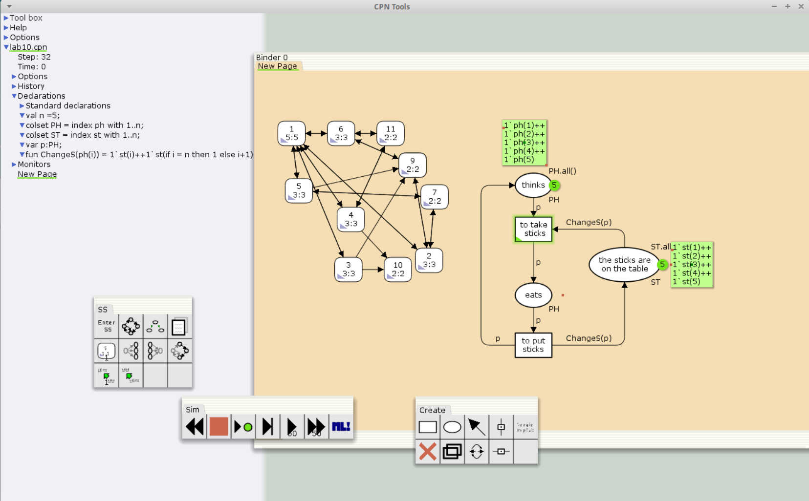

---
## Front matter
lang: ru-RU
title: Лабораторная работа №10
subtitle: Имитационное моделирование
author:
  - Александрова УВ
institute:
  - Российский университет дружбы народов, Москва, Россия
date: 7 марта 2025

## i18n babel
babel-lang: russian
babel-otherlangs: english

## Formatting pdf
toc: false
toc-title: Содержание
slide_level: 2
aspectratio: 169
section-titles: true
theme: metropolis
header-includes:
 - \metroset{progressbar=frametitle,sectionpage=progressbar,numbering=fraction}
---

# Информация

## Докладчик

:::::::::::::: {.columns align=center}
::: {.column width="70%"}

  * Александрова Ульяна
  * студентка 3го курса
  * Факультет физико-математических и естественных наук
  * Российский университет дружбы народов
  * [1132226444@rudn.ru](mailto:1132226444@rudn.ru)

:::
::: {.column width="30%"}


:::
::::::::::::::


# Цель работы

Целью данной лабораторной работы является решение задачи об обедающих мудрецах в утилите CPN Tools.

# Задание

Пять мудрецов сидят за круглым столом и могут пребывать в двух состояниях —
думать и есть. Между соседями лежит одна палочка для еды. Для приёма пищи
необходимы две палочки. Палочки — пересекающийся ресурс. Необходимо синхро-
низировать процесс еды так, чтобы мудрецы не умерли с голода.

# Теоретическое введение
 
Назначение CPN Tools:  
- разработка сложных объектов и моделирование процессов в различных прикладных областях, в том числе:  
    - моделирование производственных и бизнес-процессов;  
- моделирование систем управления производственными системами и роботами;  
- спецификация и верификация протоколов, оценка пропускной способности сетей и качества обслуживания, проектированиетелекоммуникационных устройств и сетей.

# Выполнение лабораторной работы

## Пример

1. Рисуем граф сети. Для этого с помощью контекстного меню создаём новую сеть, добавляем позиции, переходы и дуги.

Начальные данные:  
- позиции: мудрец размышляет (philosopher thinks), мудрец ест (philosopher eats),
палочки находятся на столе (sticks on the table)  
- переходы: взять палочки (take sticks), положить палочки (put sticks)

## Пример

{#fig:001 width=70%}

## Пример

{#fig:002 width=70%}

## Пример

{#fig:003 width=70%}

## Упражнение

```
 Statistics
------------------------------------------------------------------------

  State Space
     Nodes:  11
     Arcs:   30
     Secs:   0
     Status: Full

  Scc Graph
     Nodes:  1
     Arcs:   0
     Secs:   0
```

## Упражнение

```
 Boundedness Properties
------------------------------------------------------------------------

  Best Integer Bounds
                             Upper      Lower
     New_Page'eats 1         2          0
     New_Page'the_sticks_are_on_the_table 1
                             5          1
     New_Page'thinks 1       5          3

  Best Upper Multi-set Bounds
     New_Page'eats 1     1`ph(1)++
1`ph(2)++
1`ph(3)++
1`ph(4)++
1`ph(5)
     New_Page'the_sticks_are_on_the_table 1
                         1`st(1)++
1`st(2)++
1`st(3)++
1`st(4)++
1`st(5)
     New_Page'thinks 1   1`ph(1)++
1`ph(2)++
1`ph(3)++
1`ph(4)++
1`ph(5)

```
## Упражнение

{#fig:004 width=70%}

# Выводы

Я решила задачу об обедающий мудрецах при помощи утилиты CPNtools.

