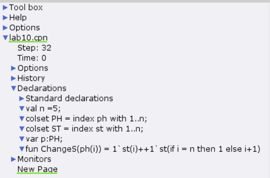
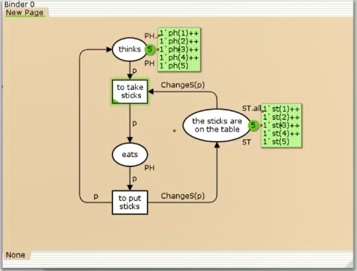
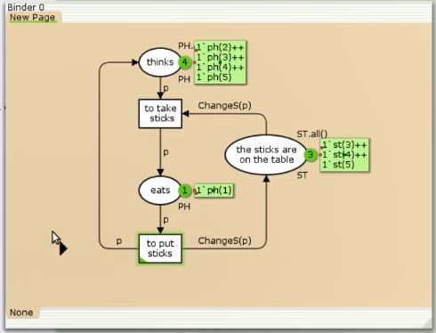

---
## Front matter
title: "Лабораторная работа №10"
subtitle: "Имитационное моделирование"
author: "Александрова Ульяна Вадимовна"

## Generic otions
lang: ru-RU
toc-title: "Содержание"

## Bibliography
bibliography: bib/cite.bib
csl: pandoc/csl/gost-r-7-0-5-2008-numeric.csl

## Pdf output format
toc: true # Table of contents
toc-depth: 2
lof: true # List of figures
lot: true # List of tables
fontsize: 12pt
linestretch: 1.5
papersize: a4
documentclass: scrreprt
## I18n polyglossia
polyglossia-lang:
  name: russian
  options:
	- spelling=modern
	- babelshorthands=true
polyglossia-otherlangs:
  name: english
## I18n babel
babel-lang: russian
babel-otherlangs: english
## Fonts
mainfont: IBM Plex Serif
romanfont: IBM Plex Serif
sansfont: IBM Plex Sans
monofont: IBM Plex Mono
mathfont: STIX Two Math
mainfontoptions: Ligatures=Common,Ligatures=TeX,Scale=0.94
romanfontoptions: Ligatures=Common,Ligatures=TeX,Scale=0.94
sansfontoptions: Ligatures=Common,Ligatures=TeX,Scale=MatchLowercase,Scale=0.94
monofontoptions: Scale=MatchLowercase,Scale=0.94,FakeStretch=0.9
mathfontoptions:
## Biblatex
biblatex: true
biblio-style: "gost-numeric"
biblatexoptions:
  - parentracker=true
  - backend=biber
  - hyperref=auto
  - language=auto
  - autolang=other*
  - citestyle=gost-numeric
## Pandoc-crossref LaTeX customization
figureTitle: "Рис."
tableTitle: "Таблица"
listingTitle: "Листинг"
lofTitle: "Список иллюстраций"
lotTitle: "Список таблиц"
lolTitle: "Листинги"
## Misc options
indent: true
header-includes:
  - \usepackage{indentfirst}
  - \usepackage{float} # keep figures where there are in the text
  - \floatplacement{figure}{H} # keep figures where there are in the text
---

# Цель работы

Целью данной лабораторной работы является решение задачи об обедающих мудрецах в утилите CPN Tools.

# Задание

Пять мудрецов сидят за круглым столом и могут пребывать в двух состояниях —
думать и есть. Между соседями лежит одна палочка для еды. Для приёма пищи
необходимы две палочки. Палочки — пересекающийся ресурс. Необходимо синхро-
низировать процесс еды так, чтобы мудрецы не умерли с голода.

# Теоретическое введение

CPN Tools — специальное программное средство, предназначенное для моделирования иерархических временных раскрашенных сетей Петри. Такие сети эквивалентны машине Тьюринга и составляют универсальную алгоритмическую систему, позволяющую описать произвольный объект.

CPNTools позволяет визуализировать модель с помощью графа сети Петри и применить язык программирования CPN ML (Colored Petri Net Markup Language) для формализованного описания модели.
 
Назначение CPN Tools:  
- разработка сложных объектов и моделирование процессов в различных прикладных областях, в том числе:  
    - моделирование производственных и бизнес-процессов;  
- моделирование систем управления производственными системами и роботами;  
- спецификация и верификация протоколов, оценка пропускной способности сетей и качества обслуживания, проектированиетелекоммуникационных устройств и сетей.


Основные функции CPN Tools:  
- создание (редактирование) моделей;  
- анализ поведения моделей с помощью имитации динамики сети Петри;  
- построение и анализ пространства состояний модели.

# Выполнение лабораторной работы

## Пример

1. Рисуем граф сети. Для этого с помощью контекстного меню создаём новую сеть, добавляем позиции, переходы и дуги.

Начальные данные:  
- позиции: мудрец размышляет (philosopher thinks), мудрец ест (philosopher eats),
палочки находятся на столе (sticks on the table)
- переходы: взять палочки (take sticks), положить палочки (put sticks)

2. В меню задаём новые декларации модели: типы фишек, начальные значения позиций, выражения для дуг (рис. [-@fig:001]):

{#fig:001 width=70%}

- n — число мудрецов и палочек (n = 5);  
- p — фишки, обозначающие мудрецов, имеют перечисляемый тип PH от 1 до n;  
- s — фишки, обозначающие палочки, имеют перечисляемый тип ST от 1 до n;  
- функция ChangeS(p) ставит в соответствие мудрецам палочки (возвращает номера палочек, используемых мудрецами); по условию задачи мудрецы сидят покругу и мудрец p(i) может взять i и i + 1 палочки, поэтому функция ChangeS(p)
определяется следующим образом:

```
fun ChangeS (ph(i))=
1`st(i)++st(if = n then 1 else i+1)
```

В результате получаем работающую модель (рис. [-@fig:002]).

{#fig:002 width=70%}

После запуска модели наблюдаем, что одновременно палочками могут воспользоваться только два из пяти мудрецов (рис. [-@fig:003]).

{#fig:003 width=70%}

## Упражнение

Вычисляем пространство состояний. Формирую отчёт о пространстве состояний:

```
CPN Tools state space report for:
/home/openmodelica/mip/lab10.cpn
Report generated: Fri Mar  7 18:00:43 2025


 Statistics
------------------------------------------------------------------------

  State Space
     Nodes:  11
     Arcs:   30
     Secs:   0
     Status: Full

  Scc Graph
     Nodes:  1
     Arcs:   0
     Secs:   0


 Boundedness Properties
------------------------------------------------------------------------

  Best Integer Bounds
                             Upper      Lower
     New_Page'eats 1         2          0
     New_Page'the_sticks_are_on_the_table 1
                             5          1
     New_Page'thinks 1       5          3

  Best Upper Multi-set Bounds
     New_Page'eats 1     1`ph(1)++
1`ph(2)++
1`ph(3)++
1`ph(4)++
1`ph(5)
     New_Page'the_sticks_are_on_the_table 1
                         1`st(1)++
1`st(2)++
1`st(3)++
1`st(4)++
1`st(5)
     New_Page'thinks 1   1`ph(1)++
1`ph(2)++
1`ph(3)++
1`ph(4)++
1`ph(5)

  Best Lower Multi-set Bounds
     New_Page'eats 1     empty
     New_Page'the_sticks_are_on_the_table 1
                         empty
     New_Page'thinks 1   empty


 Home Properties
------------------------------------------------------------------------

  Home Markings
     All


 Liveness Properties
------------------------------------------------------------------------

  Dead Markings
     None

  Dead Transition Instances
     None

  Live Transition Instances
     All


 Fairness Properties
------------------------------------------------------------------------
       New_Page'to_put_sticks 1
                         Impartial
       New_Page'to_take_sticks 1
                         Impartial


```

В этой задаче количество узлов значительно больше "теоретиечских" - тех, что задавали мы вручную. Это следует из цикличности нашей модели. Связей тоже теперь 30. Из строки *New_Page'eats 1 : 2 0* мы можем сделать вывод, что максимальное число мудрецов, которые могут есть одновременно - 2.

Построю граф пространства состояний (рис. [-@fig:004]).

{#fig:004 width=70%}

# Выводы

Я решила задачу об обедающий мудрецах при помощи утилиты CPNtools.

