---
## Front matter
title: "Лабораторная работа №11"
subtitle: "Имитационное моделирование"
author: "Александрова Ульяна Вадимовна"

## Generic otions
lang: ru-RU
toc-title: "Содержание"

## Bibliography
bibliography: bib/cite.bib
csl: pandoc/csl/gost-r-7-0-5-2008-numeric.csl

## Pdf output format
toc: true # Table of contents
toc-depth: 2
lof: true # List of figures
lot: true # List of tables
fontsize: 12pt
linestretch: 1.5
papersize: a4
documentclass: scrreprt
## I18n polyglossia
polyglossia-lang:
  name: russian
  options:
	- spelling=modern
	- babelshorthands=true
polyglossia-otherlangs:
  name: english
## I18n babel
babel-lang: russian
babel-otherlangs: english
## Fonts
mainfont: IBM Plex Serif
romanfont: IBM Plex Serif
sansfont: IBM Plex Sans
monofont: IBM Plex Mono
mathfont: STIX Two Math
mainfontoptions: Ligatures=Common,Ligatures=TeX,Scale=0.94
romanfontoptions: Ligatures=Common,Ligatures=TeX,Scale=0.94
sansfontoptions: Ligatures=Common,Ligatures=TeX,Scale=MatchLowercase,Scale=0.94
monofontoptions: Scale=MatchLowercase,Scale=0.94,FakeStretch=0.9
mathfontoptions:
## Biblatex
biblatex: true
biblio-style: "gost-numeric"
biblatexoptions:
  - parentracker=true
  - backend=biber
  - hyperref=auto
  - language=auto
  - autolang=other*
  - citestyle=gost-numeric
## Pandoc-crossref LaTeX customization
figureTitle: "Рис."
tableTitle: "Таблица"
listingTitle: "Листинг"
lofTitle: "Список иллюстраций"
lotTitle: "Список таблиц"
lolTitle: "Листинги"
## Misc options
indent: true
header-includes:
  - \usepackage{indentfirst}
  - \usepackage{float} # keep figures where there are in the text
  - \floatplacement{figure}{H} # keep figures where there are in the text
---

# Цель работы

Целью данной лабораторной работы является создание модели системы массового обслуживания M|M|1 при помощи утилиты CPNTools.

# Теоретическое введение

В систему поступает поток заявок двух типов, распределённый по пуассоновскому закону. Заявки поступают в очередь сервера на обработку. Дисциплина очереди FIFO. Если сервер находится в режиме ожидания (нет заявок на сервере), то заявка поступает на обработку сервером.

# Выполнение лабораторной работы

## Построение модели с помощью CPNTools

Будем использовать три отдельных листа: на первом листе опишем граф системы, на втором — генератор заявок, на третьем — сервер обработки заявок.

### 1.1. 

Сеть имеет 2 позиции (очередь — Queue, обслуженные заявки — Complited) и два перехода (генерировать заявку — Arrivals, передать заявку на обработку серверу — Server). Переходы имеют сложную иерархическую структуру, задаваемую
на отдельных листах модели (с помощью соответствующего инструмента меню — Hierarchy) (рис. [-@fig:001]).

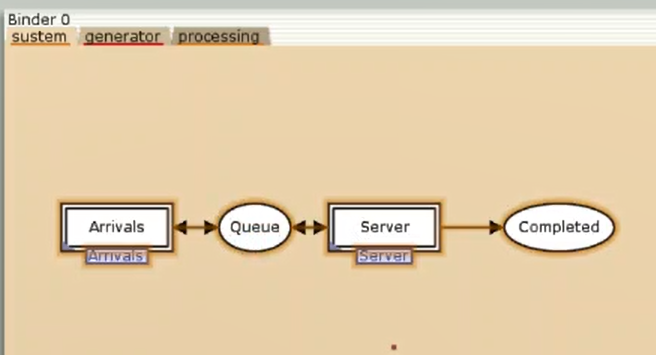{#fig:001 width=70%}

### 1.2. 

Граф генератора заявок имеет 3 позиции (текущая заявка — Init, следующая заявка — Next, очередь — Queue из листа System) и 2 перехода (Init — определяет распределение поступления заявок по экспоненциальному закону с интенсивностью
100 заявок в единицу времени, Arrive — определяет поступление заявок в очередь) (рис. [-@fig:002]).

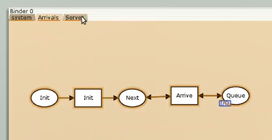{#fig:002 width=70%}

### 1.3. 

Граф процесса обработки заявок на сервере имеет 4 позиции (Busy — сервер занят, Idle — сервер в режиме ожидания, Queue и Complited из листа System) и 2 перехода (Start — начать обработку заявки, Stop — закончить обработку заявки) (рис. [-@fig:003]).

{#fig:003 width=70%}

### Зададим декларации системы

Определим множества цветов системы (colorset) (рис. [-@fig:019]):

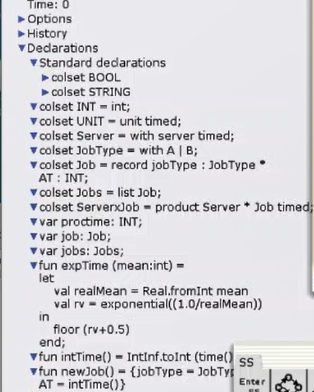{#fig:019 width=70%}

- фишки типа UNIT определяют моменты времени;  
- фишки типа INT определяют моменты поступления заявок в систему.  
- фишки типа JobType определяют 2 типа заявок — A и B;  
- кортеж Job имеет 2 поля: jobType определяет тип работы (соответственно имеет тип JobType, поле AT имеет тип INT и используется для хранения времени нахождения заявки в системе;  
- фишки Jobs — список заявок;  
- фишки типа ServerxJob — определяют состояние сервера, занятого обработкой заявок.

```
colset UNIT = unit timed;  
colset INT = int;  
colset Server = with server timed;
colset JobType = with A | B;
colset Job = record jobType : JobType *
AT : INT;
colset Jobs = list Job;
colset ServerxJob = product Server * Job timed;
```

Переменные модели: 

– proctime — определяет время обработки заявки;  
– job — определяет тип заявки;   
– jobs — определяет поступление заявок в очередь.  

```
var proctime : INT;
var job: Job;
var jobs: Jobs;
```

Определим функции системы:

- функция expTime описывает генерацию целочисленных значений через интервалы времени, распределённые по экспоненциальному закону;  
- функция intTime преобразует текущее модельное время в целое число;  
- функция newJob возвращает значение из набора Job — случайный выбор типа заявки (A или B).  

```
fun expTime (mean: int) =
let
val realMean = Real.fromInt mean
val rv = exponential((1.0/realMean))
in
floor (rv+0.5)
end;
fun intTime() = IntInf.toInt (time());
fun newJob() = {jobType = JobType.ran(),
AT
= intTime()}
```

### Зададим параметры модели на графах сети.

- у позиции Queue множество цветов фишек — Jobs; начальная маркировка 1`[] определяет, что изначально очередь пуста.  
- у позиции Completed множество цветов фишек — Job (рис. [-@fig:005]).

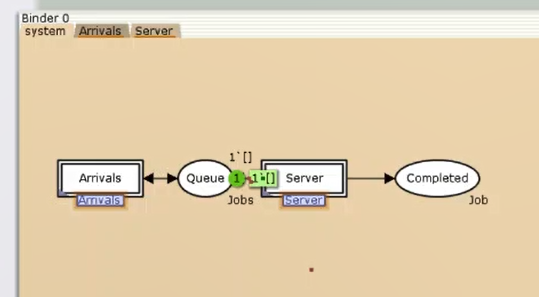{#fig:005 width=70%}


- у позиции Init: множество цветов фишек — UNIT; начальная маркировка 1`()@0 определяет, что поступление заявок в систему начинается с нулевого момента времени;  
- у позиции Next: множество цветов фишек — UNIT;  
- на дуге от позиции Init к переходу Init выражение () задаёт генерацию заявок;  
- на дуге от переходов Init и Arrive к позиции Next выражение ()@+expTime(100) задаёт экспоненциальное распределение времени между поступлениями заявок;  
- на дуге от позиции Next к переходу Arrive выражение () задаёт перемещение фишки;  
- на дуге от перехода Arrive к позиции Queue выражение jobs^^[job] задает поступление заявки в очередь;   
- на дуге от позиции Queue к переходу Arrive выражение jobs задаёт обратную связь (рис. [-@fig:006]).

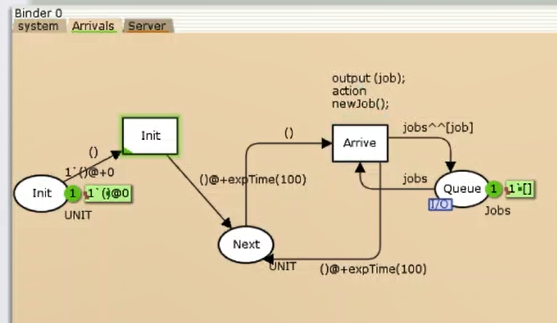{#fig:006 width=70%}

- у позиции Busy: множество цветов фишек — Server, начальное значение маркировки — 1`server@0 определяет, что изначально на сервере нет заявок на обслуживание;  
- у позиции Idle: множество цветов фишек — ServerxJob;  
- переход Start имеет сегмент кода output (proctime); action expTime(90); определяющий, что время обслуживания заявки распределено по экспоненциальному закону со средним временем обработки в 90 единиц времени;  
- на дуге от позиции Queue к переходу Start выражение job::jobs определяет, что сервер может начать обработку заявки, если в очереди есть хотя бы одна заявка;  
- на дуге от перехода Start к позиции Busy выражение (server,job)@+proctime запускает функцию расчёта времени обработки заяв-
ки на сервере;  
- на дуге от позиции Busy к переходу Stop выражение (server,job) говорит о завершении обработки заявки на сервере;  
- на дуге от перехода Stop к позиции Completed выражение job показывает, что заявка считается обслуженной;  
- выражение server на дугах от и к позиции Idle определяет изменение состояние сервера (обрабатывает заявки или ожидает);  
- на дуге от перехода Start к позиции Queue выражение jobs задаёт обратную связь (рис. [-@fig:007]).

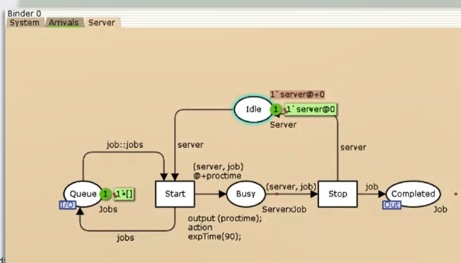{#fig:007 width=70%}

## Мониторинг параметров моделируемой системы

Потребуется палитра Monitoring. Выбираем Break Point (точка останова) и устанавливаем её на переход Start. После этого в разделе меню Monitor появится новый подраздел, который назовём Ostanovka. В этом подразделе необходимо внести изменения в функцию Predicate, которая будет выполняться при запуске монитора (рис. [-@fig:008]).

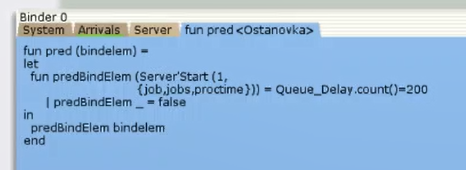{#fig:008 width=70%}

```
fun pred (bindelem) =
let
fun predBindElem (Server'Start (1, {job,jobs,proctime}))
= Queue_Delay.count()=200
| predBindElem _ = false
in
predBindElem bindelem
end
```

Необходимо определить конструкцию Queue_Delay.count(). С помощью палитры Monitoring выбираем Data Call и устанавливаем на переходе Start.

Появившийся в меню монитор называем Queue Delay (без подчеркивания) (рис. [-@fig:011]).

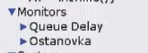{#fig:011 width=70%}

Функция Observer выполняется тогда, когда функция предикатора выдаёт значение true. Изменим её так, чтобы получить значение задержки в очереди (рис. [-@fig:009]).

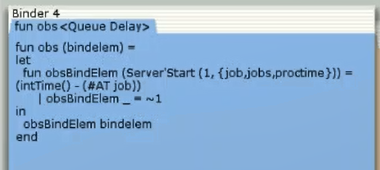{#fig:009 width=70%}

```
fun obs (bindelem) =
let
fun obsBindElem (Server'Start (1, {job, jobs, proctime}))
= (intTime() - (#AT job))
| obsBindElem _ = ~1
in
obsBindElem bindelem
end
```

После запуска программы на выполнение в каталоге с кодом программы появился файл Queue_Delay.log, содержащий в первой колонке — значение задержки очереди, во второй — счётчик, в третьей — шаг, в четвёртой — время (рис. [-@fig:010]).

{#fig:010 width=70%}

Преобразую данные в график через GNUplot (рис. [-@fig:012]) (рис. [-@fig:013]).

{#fig:012 width=70%}

{#fig:013 width=70%}

Посчитаем задержку в действительных значениях. С помощью палитры Monitoring выбираем Data Call и устанавливаем на переходе Start. Появившийся в меню монитор называем Queue Delay Real.

Функцию Observer изменим следующим образом (рис. [-@fig:014]):

{#fig:014 width=70%}

```
fun obs (bindelem) =
let
fun obsBindElem (Server'Start (1, {job, jobs, proctime}))
= Real.fromInt(intTime() - (#AT job))
| obsBindElem _ = ~1.0
in
obsBindElem bindelem
end
```

По сравнению с предыдущим описанием функции добавлено преобразование значения функции из целого в действительное, при этом obsBindElem _ принимает значение ~1.0.

После запуска программы на выполнение в каталоге с кодом программы появится файл Queue_Delay_Real.log с содержимым, аналогичным содержимому файла Queue_Delay.log, но значения задержки имеют действительный тип (рис. [-@fig:015]).

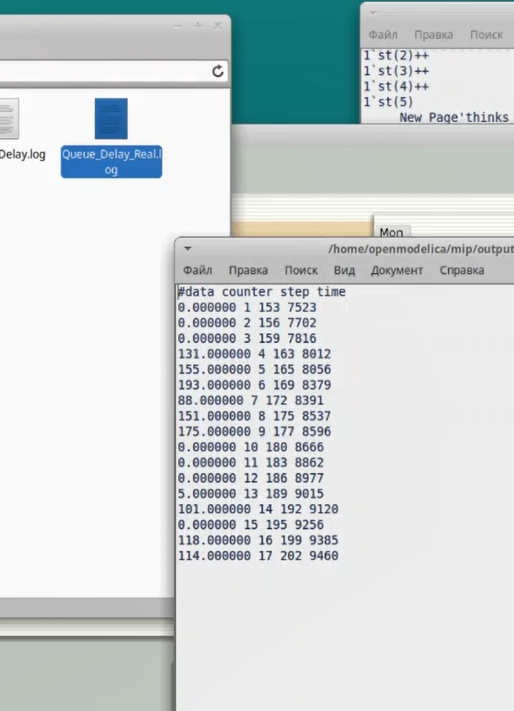{#fig:015 width=70%}

Посчитаем, сколько раз задержка превысила заданное значение. С помощью палитры Monitoring выбираем Data Call и устанавливаем на переходе Start. Монитор называем Long Delay Time.

Функцию Observer изменим следующим образом (рис. [-@fig:016]):

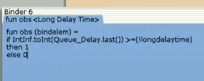{#fig:016 width=70%}

```
fun obs (bindelem) =
if IntInf.tiInt(Queue_Delay.last())>=(!longdelaytime)
then 1
else 0
```

Если значение монитора Queue Delay превысит некоторое заданное значение, то функция выдаст 1, в противном случае — 0. Восклицательный знак означает разыменование ссылки.
При этом необходимо в декларациях (рис. 11.13) задать глобальную переменную (в форме ссылки на число 200) (рис. [-@fig:017]):

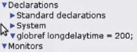{#fig:017 width=70%}

```longdelaytime:
globref longdelaytime = 200;
```

Строю график (рис. [-@fig:018]).

{#fig:018 width=70%}

# Выводы

В ходе выполнения данной лабораторной работы я построила модель системы массового обслуживания M|M|1 при помощи утилиты CPNTools.

