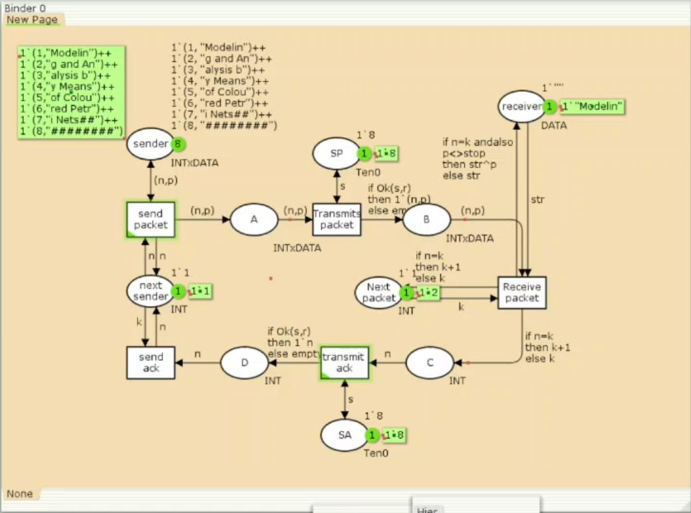
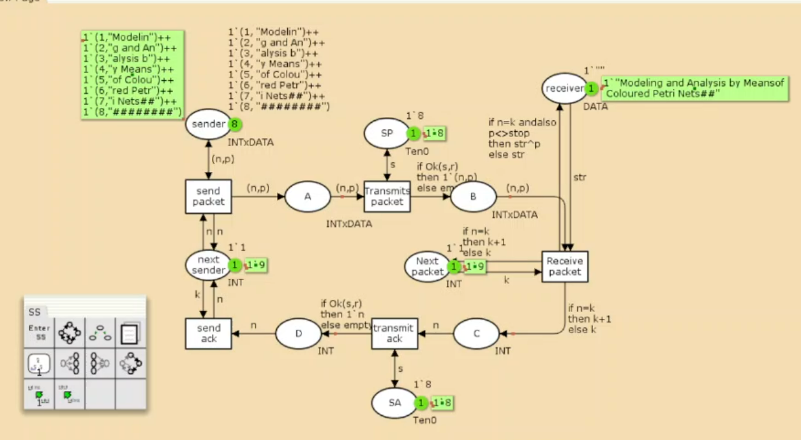

---
## Front matter
lang: ru-RU
title: Лабораторная работа №12
subtitle: Имитационное моделирование
author:
  - Александрова УВ
institute:
  - Российский университет дружбы народов, Москва, Россия
date: 24 марта 2025

## i18n babel
babel-lang: russian
babel-otherlangs: english

## Formatting pdf
toc: false
toc-title: Содержание
slide_level: 2
aspectratio: 169
section-titles: true
theme: metropolis
header-includes:
 - \metroset{progressbar=frametitle,sectionpage=progressbar,numbering=fraction}
---

# Информация

## Докладчик

:::::::::::::: {.columns align=center}
::: {.column width="70%"}

  * Александрова Ульяна
  * студентка 3го курса
  * Факультет физико-математических и естественных наук
  * Российский университет дружбы народов
  * [1132226444@rudn.ru](mailto:1132226444@rudn.ru)

:::
::: {.column width="30%"}


:::
::::::::::::::

# Цель работы

Целью данной лабораторной работы является построение модели простого протокола передачи данных на утилите CPNtools.

# Выполнение лабораторной работы

## Декларации

:::::::::::::: {.columns align=center}
::: {.column width="60%"}


:::
::: {.column width="40%"}

```
colset INT = int;
colset DATA = string;
colset INTxDATA = product INT * DATA;
var n, k: INT;
var p, str: DATA;
val stop = "########";
colset Ten0 = int with 0..10;
colset Ten1 = int with 0..10;
var s: Ten0;
var r: Ten1;
fun Ok(s:Ten0, r:Ten1)=(r<=s);
```

:::
::::::::::::::

## Построение модели

{width=80%}

## Готовая модель

:::::::::::::: {.columns align=center}
::: {.column width="50%"}

Состояние Send, переход Send Packet -> состояние A, с некоторой вероятностью переход Transmit Packet -> состояние B, попадает на переход Receive Packet, где проверяется номер пакета и если нет совпадения, то пакет направляется в состояние Received, а номер пакета передаётся последовательно в состояние C -> с некоторой вероятностью в переход Transmit ACK -> далее в состояние D, переход Receive ACK -> состояние NextSend (увеличивая на 1 номер следующего пакета), переход Send Packet. 

:::
::: {.column width="50%"}



:::
::::::::::::::

## Упражнение

Вычислим пространство состояний. Сформируем отчёт о пространстве состояний и проанализируем его. Построим граф пространства состояний.

```
 Statistics
------------------------------------------------------------------------

  State Space
     Nodes:  19959
     Arcs:   319463
     Secs:   300
     Status: Partial

  Scc Graph
     Nodes:  10485
     Arcs:   266520
     Secs:   12

```

## Граф состояний


# Выводы

В этой лабораторной работе я смогла построить модель простого протокола передачи данных, а также сделала отчет его пространства состояний.

# Список литературы{.unnumbered}

[Л. 12. Пример моделирования простого протокола передачи данныхFile ](https://esystem.rudn.ru/mod/resource/view.php?id=1223370)

