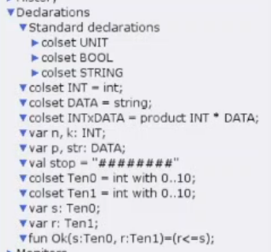
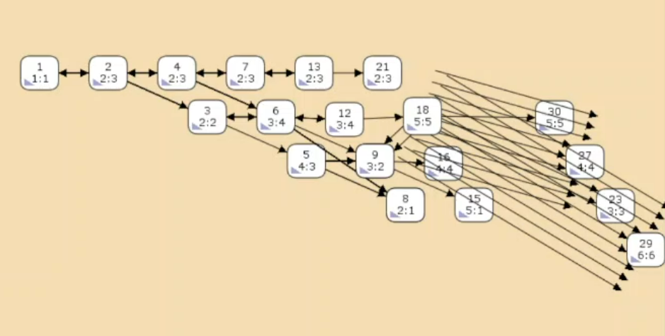

---
## Front matter
title: "Лабораторная работа №12"
subtitle: "Имитационное моделирование"
author: "Александрова Ульяна Вадимовна"

## Generic otions
lang: ru-RU
toc-title: "Содержание"

## Bibliography
bibliography: bib/cite.bib
csl: pandoc/csl/gost-r-7-0-5-2008-numeric.csl

## Pdf output format
toc: true # Table of contents
toc-depth: 2
lof: true # List of figures
fontsize: 12pt
linestretch: 1.5
papersize: a4
documentclass: scrreprt
## I18n polyglossia
polyglossia-lang:
  name: russian
  options:
	- spelling=modern
	- babelshorthands=true
polyglossia-otherlangs:
  name: english
## I18n babel
babel-lang: russian
babel-otherlangs: english
## Fonts
mainfont: IBM Plex Serif
romanfont: IBM Plex Serif
sansfont: IBM Plex Sans
monofont: IBM Plex Mono
mathfont: STIX Two Math
mainfontoptions: Ligatures=Common,Ligatures=TeX,Scale=0.94
romanfontoptions: Ligatures=Common,Ligatures=TeX,Scale=0.94
sansfontoptions: Ligatures=Common,Ligatures=TeX,Scale=MatchLowercase,Scale=0.94
monofontoptions: Scale=MatchLowercase,Scale=0.94,FakeStretch=0.9
mathfontoptions:
## Biblatex
biblatex: true
biblio-style: "gost-numeric"
biblatexoptions:
  - parentracker=true
  - backend=biber
  - hyperref=auto
  - language=auto
  - autolang=other*
  - citestyle=gost-numeric
## Pandoc-crossref LaTeX customization
figureTitle: "Рис."
tableTitle: "Таблица"
listingTitle: "Листинг"
lofTitle: "Список иллюстраций"
lolTitle: "Листинги"
## Misc options
indent: true
header-includes:
  - \usepackage{indentfirst}
  - \usepackage{float} # keep figures where there are in the text
  - \floatplacement{figure}{H} # keep figures where there are in the text
---

# Цель работы

Целью данной лабораторной работы является построение модели простого протокола передачи данных на утилите CPNtools.

# Теоретическое введение

Описанная в лабораторной работе, представляет собой систему, в которой данные передаются от источника к получателю через ненадежную сеть.

Основные состояния: источник (Send), получатель (Receiver).  
Действия (переходы): отправить пакет (Send Packet), отправить подтверждение (Send ACK).  
Промежуточное состояние: следующий посылаемый пакет (NextSend), A и B, C и D.  

Декларации модели:
```
colset INT = int;
colset DATA = string;
colset INTxDATA = product INT * DATA;
var n, k: INT;
var p, str: DATA;
val stop = "########";
colset Ten0 = int with 0..10;
colset Ten1 = int with 0..10;
var s: Ten0;
var r: Ten1;
fun Ok(s:Ten0, r:Ten1)=(r<=s);
```

## Задача

- Вычислить пространство состояний модели;

- Сформировать отчет о пространстве состояний и проанализировать его;

- Построить граф пространства состояний.

# Выполнение лабораторной работы

Рассмотрим модель на CPNTools.
Перед отправкой очередной порции данных источник должен получить от получателя подтверждение о доставке предыдущей порции данных. Зададим декларацию (рис. [-@fig:003]).

{#fig:003 width=70%}

Считаем, что пакет состоит из номера пакета и строковых данных. Передавать будем сообщение `«Modelling and Analysis by Means of Coloured Petry Nets»`, разбитое по 8 символов.

Состояние `Receiver` имеет тип `DATA` и начальное значение 1'"" (т.е. пустая строка, поскольку состояние собирает данные и номер пакета его не интересует). Состояние `NextSend` имеет тип `INT` и начальное значение 1`1. Поскольку пакеты представляют собой кортеж, состоящий из номера пакета и стрки, то выражение у двусторонней дуги будет иметь значение (n,p).

Переход `Send Packet` соединяем с состоянием `NextSend` двумя дугами с выражениями n. От перехода `Send Packet` к состоянию `NextSend` дуга с выражением n, обратно — k.

Зададим промежуточные состояния (`A, B` с типом `INTxDATA`, `C, D` с типом `INTxDATA`) для переходов.

От состояния `Receiver` идёт дуга к переходу `Receive Packet` со значением той строки (str), которая находится в состоянии `Receiver`. Обратно: проверяем, что номер пакета новый и строка не равна стоп-биту. Если это так, то строку добавляем к полученным данным.

Кроме того, необходимо знать, каким будет номер следующего пакета. Для этого добавляем состояние `NextRec` с типом `INT` и начальным значением 1'1, связываем его дугами с переходом `Receive Packet`. Причём к переходу идёт дуга с выражением k, от перехода — 

```
if n=k 
then k+1 
else k.
```

Связываем состояния `B и C` с переходом `Receive Packet`. От состояния `B` к переходу `Receive Packet` — выражение (n,p), от перехода `Receive Packet` к состоянию `C` — выражение 

```
if n=k 
then k+1 
else k
```

От перехода Receive Packet к состоянию Receiver:

```
if n=k andalso 
p<>stop then str^p 
else str
```
На переходах `Transmit Packet` и `Transmit ACK` зададим потерю пакетов. Для этого на интервале от 0 до 10 зададим пороговое значение и, если передаваемое значение превысит этот порог, то считаем, что произошла потеря пакета, если нет, то передаём пакет дальше. Для этого задаём вспомогательные состояния `SP` и `SA` с типом `Ten0` и начальным значением 1'8, соединяем с соответствующими переходами.

Задаём выражение от перехода `Transmit Packet` к состоянию `B`:

```
if Ok(s,r) 
then 1`(n,p) 
else empty
```

Задаём выражение от перехода `Transmit ACK` к состоянию `D`:

```
if Ok(s,r) 
then 1`n 
else empty
```

Таким образом, получим модель простого протокола передачи данных (рис. [-@fig:001]).

{#fig:001 width=70%}


Пакет последовательно проходит: 

Состояние Send, переход Send Packet -> состояние A, с некоторой вероятностью переход Transmit Packet -> состояние B, попадает на переход Receive Packet, где проверяется номер пакета и если нет совпадения, то пакет направляется в состояние Received, а номер пакета передаётся последовательно в состояние C -> с некоторой вероятностью в переход Transmit ACK -> далее в состояние D, переход Receive ACK -> состояние NextSend (увеличивая на 1 номер следующего пакета), переход Send Packet. 

Так продолжается до тех пор, пока не будут переданы все части сообщения. Последней будет передана стоп последовательность (рис. [-@fig:002]).

{#fig:002 width=70%}

## Упражнение

Вычислим пространство состояний. Сформируем отчёт о пространстве состояний и проанализируем его. Построим граф пространства состояний.

```
CPN Tools state space report for:
/home/openmodelica/mip/lab12.cpn
Report generated: Sun Mar 23 22:49:35 2025


 Statistics
------------------------------------------------------------------------

  State Space
     Nodes:  19959
     Arcs:   319463
     Secs:   300
     Status: Partial

  Scc Graph
     Nodes:  10485
     Arcs:   266520
     Secs:   12


 Boundedness Properties
------------------------------------------------------------------------

  Best Integer Bounds
                             Upper      Lower
     New_Page'A 1            20         0
     New_Page'B 1            10         0
     New_Page'C 1            6          0
     New_Page'D 1            5          0
     New_Page'Next_packet 1  1          1
     New_Page'SA 1           1          1
     New_Page'SP 1           1          1
     New_Page'next_sender 1  1          1
     New_Page'receiver 1     1          1
     New_Page'sender 1       8          8

  Best Upper Multi-set Bounds
     New_Page'A 1        20`(1,"Modelin")++
16`(2,"g and An")++
11`(3,"alysis b")++
6`(4,"y Means")++
1`(5,"of Colou")
     New_Page'B 1        10`(1,"Modelin")++
8`(2,"g and An")++
5`(3,"alysis b")++
3`(4,"y Means")
     New_Page'C 1        6`2++
5`3++
3`4++
2`5
     New_Page'D 1        5`2++
4`3++
2`4++
1`5
     New_Page'Next_packet 1
                         1`1++
1`2++
1`3++
1`4++
1`5
     New_Page'SA 1       1`8
     New_Page'SP 1       1`8
     New_Page'next_sender 1
                         1`1++
1`2++
1`3++
1`4++
1`5
     New_Page'receiver 1 1`""++
1`"Modelin"++
1`"Modeling and An"++
1`"Modeling and Analysis b"++
1`"Modeling and Analysis by Means"
     New_Page'sender 1   1`(1,"Modelin")++
1`(2,"g and An")++
1`(3,"alysis b")++
1`(4,"y Means")++
1`(5,"of Colou")++
1`(6,"red Petr")++
1`(7,"i Nets##")++
1`(8,"########")

  Best Lower Multi-set Bounds
     New_Page'A 1        empty
     New_Page'B 1        empty
     New_Page'C 1        empty
     New_Page'D 1        empty
     New_Page'Next_packet 1
                         empty
     New_Page'SA 1       1`8
     New_Page'SP 1       1`8
     New_Page'next_sender 1
                         empty
     New_Page'receiver 1 empty
     New_Page'sender 1   1`(1,"Modelin")++
1`(2,"g and An")++
1`(3,"alysis b")++
1`(4,"y Means")++
1`(5,"of Colou")++
1`(6,"red Petr")++
1`(7,"i Nets##")++
1`(8,"########")


 Home Properties
------------------------------------------------------------------------

  Home Markings
     None


 Liveness Properties
------------------------------------------------------------------------

  Dead Markings
     7042 [19959,19958,19957,19956,19955,...]

  Dead Transition Instances
     None

  Live Transition Instances
     None


 Fairness Properties
------------------------------------------------------------------------
       New_Page'Receive_packet 1
                         No Fairness
       New_Page'Transmits_packet 1
                         Impartial
       New_Page'send_ack 1    No Fairness
       New_Page'send_packet 1 Impartial
       New_Page'transmit_ack 1
                         No Fairness

```


Из отчета можем видеть, что в нашей модели 19959 узлов и 319463 переходов. Мы видим все переходы и состояния, а также то, как проходила работа модели.

Построим частичный граф пространства состояний (рис. [-@fig:004]).

{#fig:004 width=70%}

# Выводы

В этой лабораторной работе я смогла построить модель простого протокола передачи данных, а также сделала отчет его пространства состояний.

# Список литературы{.unnumbered}

[Л. 12. Пример моделирования простого протокола передачи данныхFile ](https://esystem.rudn.ru/mod/resource/view.php?id=1223370)

