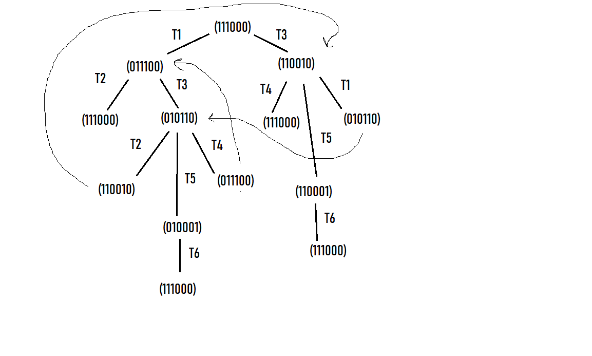
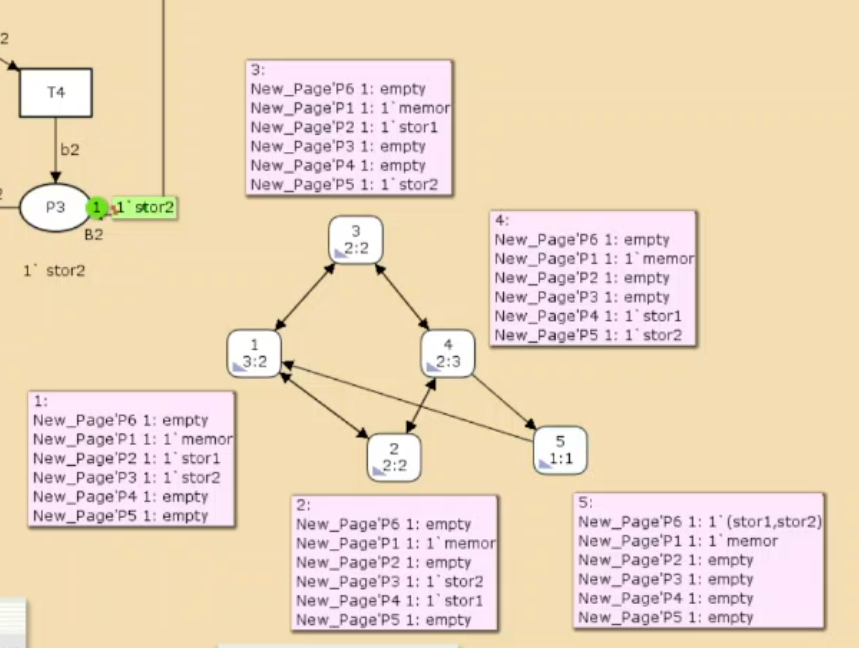

---
## Front matter
lang: ru-RU
title: Лабораторная работа №13
subtitle: Имитационное моделирование
author:
  - Александрова УВ
institute:
  - Российский университет дружбы народов, Москва, Россия
date: 27 марта 2025

## i18n babel
babel-lang: russian
babel-otherlangs: english

## Formatting pdf
toc: false
toc-title: Содержание
slide_level: 2
aspectratio: 169
section-titles: true
theme: metropolis
header-includes:
 - \metroset{progressbar=frametitle,sectionpage=progressbar,numbering=fraction}
---

# Информация

## Докладчик

:::::::::::::: {.columns align=center}
::: {.column width="70%"}

  * Александрова Ульяна
  * студентка 3го курса
  * Факультет физико-математических и естественных наук
  * Российский университет дружбы народов
  * [1132226444@rudn.ru](mailto:1132226444@rudn.ru)

:::
::: {.column width="30%"}


:::
::::::::::::::

# Цель работы

Целью данной лабораторной работы является построение модели сети Петри на утилите CPNtools.

# Выполнение лабораторной работы

## Декларации


## Построение модели

:::::::::::::: {.columns align=center}
::: {.column width="50%"}

- P1 — состояние оперативной памяти (свободна / занята);
- P2 — состояние внешнего запоминающего устройства B1 (свободно / занято);
- P3 — состояние внешнего запоминающего устройства B2 (свободно / занято);
- P4 — работа на ОП и B1 закончена;
- P5 — работа на ОП и B2 закончена;
- P6 — работа на ОП, B1 и B2 закончена;

:::
::: {.column width="50%"}


:::
::::::::::::::

## Готовая модель


## Дерево достижимости

:::::::::::::: {.columns align=center}
::: {.column width="50%"}



:::
::: {.column width="50%"}

По этому дереву мы видим, что сеть 

- безопасна (так как число фишек в каждой позиции не превышает 1), 
- ограниченна (так как существует такое целое k, что число фишек в каждой границе не может превысить), 
- сохраняющая (лишь передвигает фишки),
- не имеет тупиков [4].

:::
::::::::::::::

## Пространство состояний

Вычислим пространство состояний. Сформируем отчёт о пространстве состояний и проанализируем его. Построим граф пространства состояний.

```
 Statistics
------------------------------------------------------------------------

  State Space
     Nodes:  5
     Arcs:   10
     Secs:   0
     Status: Full
```

## Граф состояний

{width=70%}

# Выводы

В этой лабораторной работе я смогла построить модель простого протокола передачи данных, а также сделала отчет его пространства состояний.

# Список литературы{.unnumbered}

1. [Л.13. Задание для самостоятельного выполнения](https://esystem.rudn.ru/mod/resource/view.php?id=1223373)
2. [Слайды: Сети Петри. Основные понятия и определения ](https://esystem.rudn.ru/mod/resource/view.php?id=1223374)
3. [Сети Петри и конечные автоматы](https://esystem.rudn.ru/mod/resource/view.php?id=1223375)
4. [Слайды: Методы анализа сетей Петри](https://esystem.rudn.ru/mod/resource/view.php?id=1223376)

