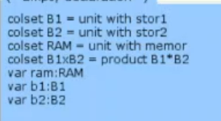
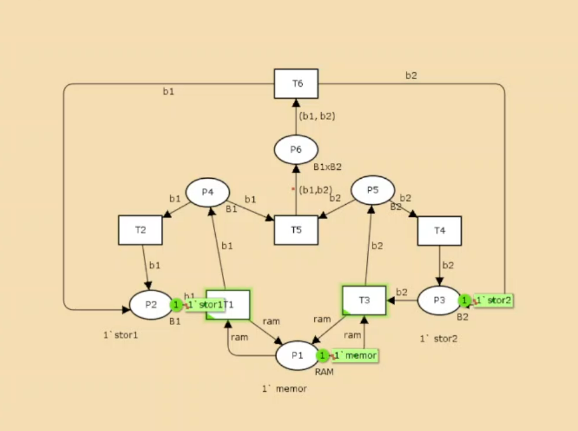
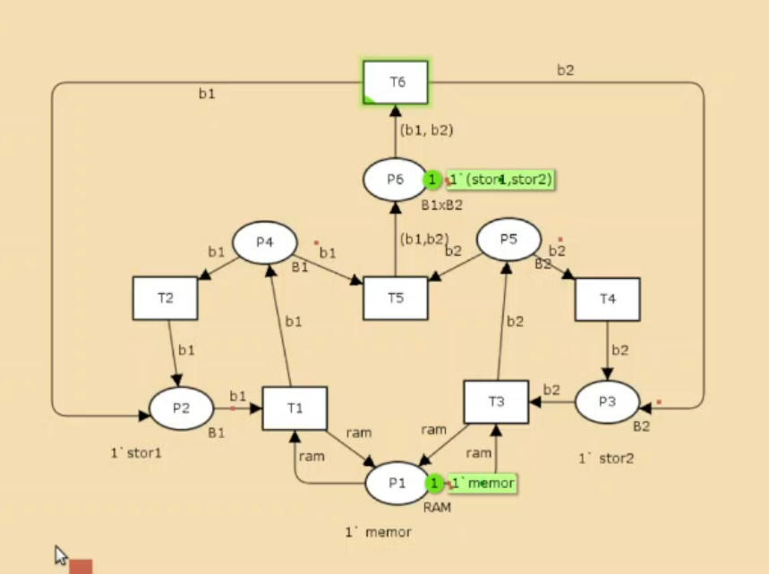

---
## Front matter
title: "Лабораторная работа №13"
subtitle: "Имитационное моделирование"
author: "Александрова Ульяна Вадимовна"

## Generic otions
lang: ru-RU
toc-title: "Содержание"

## Bibliography
bibliography: bib/cite.bib
csl: pandoc/csl/gost-r-7-0-5-2008-numeric.csl

## Pdf output format
toc: true # Table of contents
toc-depth: 2
lof: true # List of figures
fontsize: 12pt
linestretch: 1.5
papersize: a4
documentclass: scrreprt
## I18n polyglossia
polyglossia-lang:
  name: russian
  options:
	- spelling=modern
	- babelshorthands=true
polyglossia-otherlangs:
  name: english
## I18n babel
babel-lang: russian
babel-otherlangs: english
## Fonts
mainfont: IBM Plex Serif
romanfont: IBM Plex Serif
sansfont: IBM Plex Sans
monofont: IBM Plex Mono
mathfont: STIX Two Math
mainfontoptions: Ligatures=Common,Ligatures=TeX,Scale=0.94
romanfontoptions: Ligatures=Common,Ligatures=TeX,Scale=0.94
sansfontoptions: Ligatures=Common,Ligatures=TeX,Scale=MatchLowercase,Scale=0.94
monofontoptions: Scale=MatchLowercase,Scale=0.94,FakeStretch=0.9
mathfontoptions:
## Biblatex
biblatex: true
biblio-style: "gost-numeric"
biblatexoptions:
  - parentracker=true
  - backend=biber
  - hyperref=auto
  - language=auto
  - autolang=other*
  - citestyle=gost-numeric
## Pandoc-crossref LaTeX customization
figureTitle: "Рис."
tableTitle: "Таблица"
listingTitle: "Листинг"
lofTitle: "Список иллюстраций"
lolTitle: "Листинги"
## Misc options
indent: true
header-includes:
  - \usepackage{indentfirst}
  - \usepackage{float} # keep figures where there are in the text
  - \floatplacement{figure}{H} # keep figures where there are in the text
---

# Цель работы

Целью данной лабораторной работы является построение модели сети Петри на утилите CPNtools.

# Теоретическое введение

Заявка (команды программы, операнды) поступает в оперативную память (ОП), затем передается на прибор (центральный процессор, ЦП) для обработки. После этого заявка может равновероятно обратиться к оперативной памяти или к одному из двух внешних запоминающих устройств (B1 и B2). 

Прежде чем записать информацию на внешний накопитель, необходимо вторично обратиться к центральному процессору, определяющему состояние накопителя и выдающему необходимую управляющую информацию. Накопители (B1 и B2) могут работать в 3-х режимах:

```
B1 — занят, B2 — свободен;
B2 — свободен, B1 — занят;
B1 — занят, B2 — занят.
```

На схеме:

```
src — источник заявок;
B1 и B2 — накопители для хранения заявок;
RAM — оперативная память;
CPU — центральный процессор;
B1, B1 — внешние запоминающие устройства.
```

# Задачи

- Используя теоретические методы анализа сетей Петри, проведите анализ сетис помощью построения дерева достижимости. Определите, является ли сеть безопасной, ограниченной, сохраняющей, имеются ли тупики.
- Промоделируйте сеть Петри с помощью CPNTools.
- Вычислите пространство состояний. Сформируйте отчёт о пространстве состояний и проанализируйте его. Постройте граф пространства состояний.

# Выполнение лабораторной работы

Напишем декларации для нашей моедли (рис. [-@fig:001]).

{#fig:001 width=70%}

Готовая сеть Петри моделируемой системы представлена на (рис. [-@fig:002]).

{#fig:002 width=70%}

Множество позиций:

- P1 — состояние оперативной памяти (свободна / занята);
- P2 — состояние внешнего запоминающего устройства B1 (свободно / занято);
- P3 — состояние внешнего запоминающего устройства B2 (свободно / занято);
- P4 — работа на ОП и B1 закончена;
- P5 — работа на ОП и B2 закончена;
- P6 — работа на ОП, B1 и B2 закончена;

Множество переходов:

- T1 — ЦП работает только с RAM и B1;
- T2 — обрабатываются данные из RAM и с B1 переходят на устройство вывода;
- T3 — CPU работает только с RAM и B2;
- T4 — обрабатываются данные из RAM и с B2 переходят на устройство вывода;
- T5 — CPU работает только с RAM и с B1, B2;
- T6 — обрабатываются данные из RAM, B1, B2 и переходят на устройство вывода.

Функционирование сети Петри можно рассматривать как срабатывание переходов, в ходе которого происходит перемещение маркеров по позициям:

- работа CPU с RAM и B1 отображается запуском перехода T1 (удаление маркеров из P1, P2 и появление в P1, P4), что влечет за собой срабатывание перехода T2, т.е. передачу данных с RAM и B1 на устройство вывода;
- работа CPU с RAM и B2 отображается запуском перехода T3 (удаление маркеров из P1 и P3 и появление в P1 и P5), что влечет за собой срабатывание перехода T4, т.е. передачу данных с RAM и B2 на устройство вывода;
- работа CPU с RAM, B1 и B2 отображается запуском перехода T5 (удаление маркеров из P4 и P5 и появление в P6), далее срабатывание перехода T6, и данные из RAM, B1 и B2 передаются на устройство вывода;
- состояние устройств восстанавливается при срабатывании: RAM — переходов T1 или T2; B1 — переходов T2 или T6; B2 — переходов T4 или T6. [1]

Запустим модель (рис. [-@fig:003]).

{#fig:003 width=70%}

## Анализ модели

Построим дерево достижимости (рис. [-@fig:004]).

{#fig:004 width=70%}

По этому дереву мы видим, что сеть безопасна (так как число фишек в каждой позиции не превышает 1), ограниченна (так как существует такое целое k, что число фишек в каждой границе не может превысить), созраняющей (лишь передвигает фишки) и не имеет тупиков [4].

Вычислим пространство состояний. Сформируем отчёт о пространстве состояний и проанализируем его. Построим граф пространства состояний.

```
CPN Tools state space report for:
/home/openmodelica/mip/lab13.cpn
Report generated: Thu Mar 27 16:11:21 2025


 Statistics
------------------------------------------------------------------------

  State Space
     Nodes:  5
     Arcs:   10
     Secs:   0
     Status: Full

  Scc Graph
     Nodes:  1
     Arcs:   0
     Secs:   0


 Boundedness Properties
------------------------------------------------------------------------

  Best Integer Bounds
                             Upper      Lower
     New_Page'P1 1           1          1
     New_Page'P2 1           1          0
     New_Page'P3 1           1          0
     New_Page'P4 1           1          0
     New_Page'P5 1           1          0
     New_Page'P6 1           1          0

  Best Upper Multi-set Bounds
     New_Page'P1 1       1`memor
     New_Page'P2 1       1`stor1
     New_Page'P3 1       1`stor2
     New_Page'P4 1       1`stor1
     New_Page'P5 1       1`stor2
     New_Page'P6 1       1`(stor1,stor2)

  Best Lower Multi-set Bounds
     New_Page'P1 1       1`memor
     New_Page'P2 1       empty
     New_Page'P3 1       empty
     New_Page'P4 1       empty
     New_Page'P5 1       empty
     New_Page'P6 1       empty


 Home Properties
------------------------------------------------------------------------

  Home Markings
     All


 Liveness Properties
------------------------------------------------------------------------

  Dead Markings
     None

  Dead Transition Instances
     None

  Live Transition Instances
     All


 Fairness Properties
------------------------------------------------------------------------
       New_Page'T1 1          No Fairness
       New_Page'T2 1          No Fairness
       New_Page'T3 1          No Fairness
       New_Page'T4 1          No Fairness
       New_Page'T5 1          Just
       New_Page'T6 1          Fair

```

Из отчета можем видеть, что в нашей модели лишь 5 узлов и 10 переходов. Мы видим все переходы и состояния, а также то, как проходила работа модели.

Построим  граф пространства состояний (рис. [-@fig:005]).

{#fig:005 width=70%}

# Выводы

В этой лабораторной работе я смогла построить модель простого протокола передачи данных, а также сделала отчет его пространства состояний.

# Список литературы{.unnumbered}

1. [Л.13. Задание для самостоятельного выполнения](https://esystem.rudn.ru/mod/resource/view.php?id=1223373)
2. [Слайды: Сети Петри. Основные понятия и определения ](https://esystem.rudn.ru/mod/resource/view.php?id=1223374)
3. [Сети Петри и конечные автоматы](https://esystem.rudn.ru/mod/resource/view.php?id=1223375)
4. [Слайды: Методы анализа сетей Петри](https://esystem.rudn.ru/mod/resource/view.php?id=1223376)
