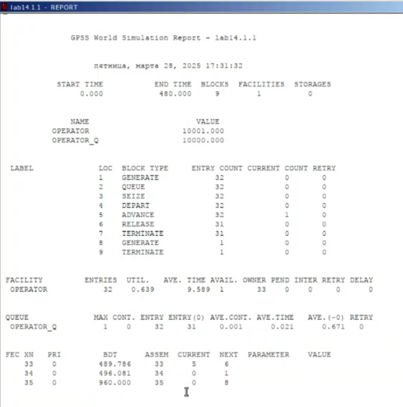
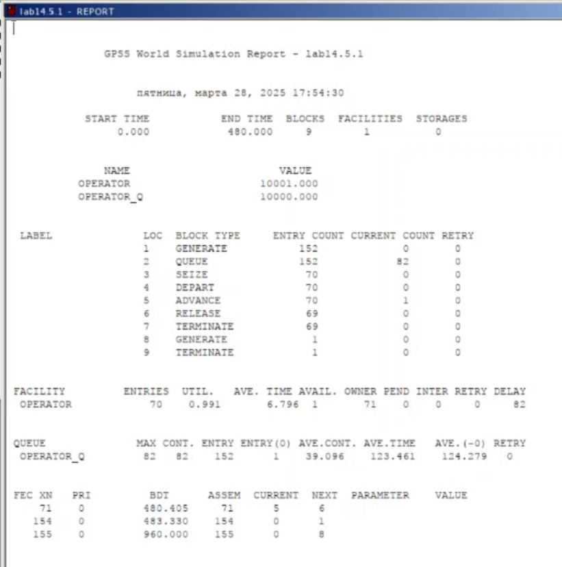
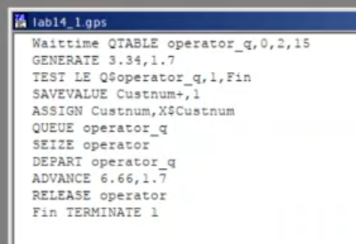
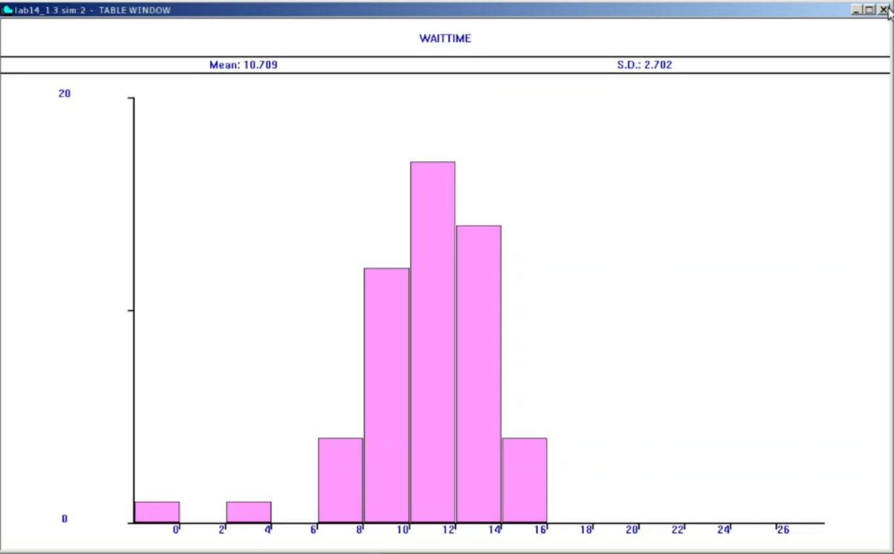
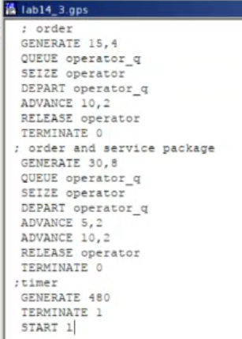
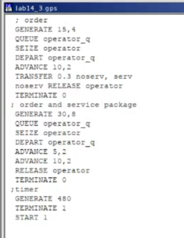
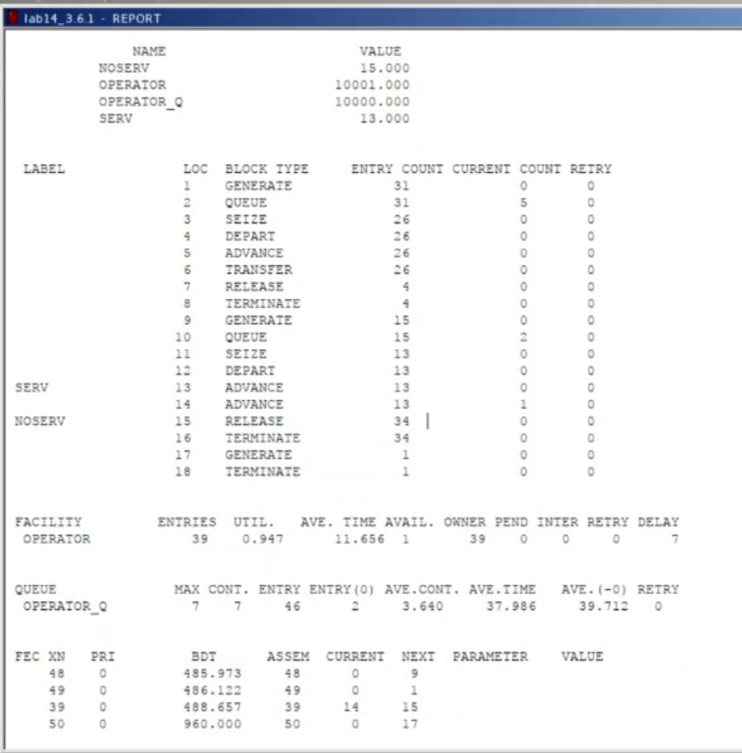
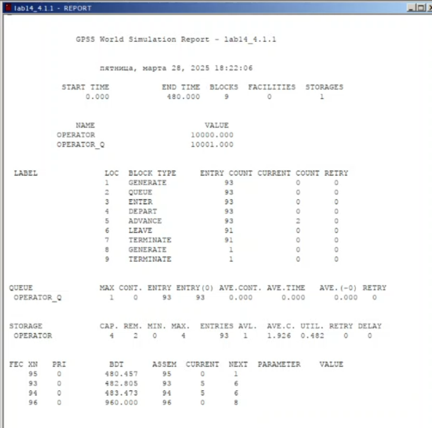
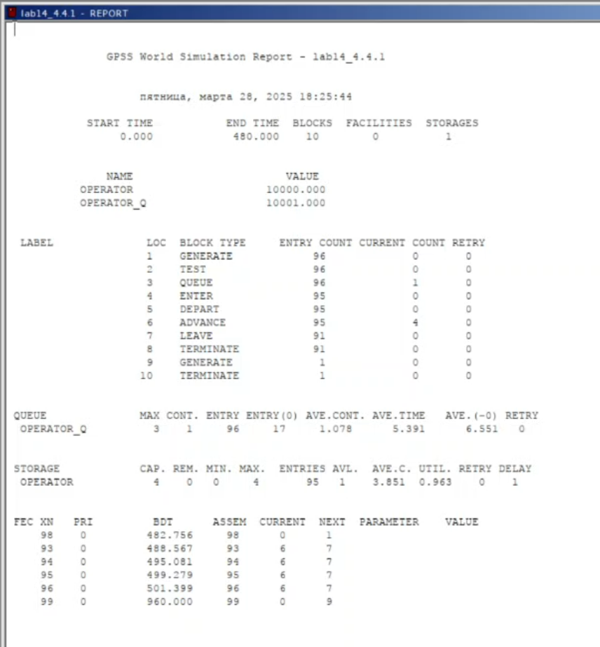

---
## Front matter
lang: ru-RU
title: Лабораторная работа №14
subtitle: Имитационное моделирование
author:
  - Александрова УВ
institute:
  - Российский университет дружбы народов, Москва, Россия
date: 29 марта 2025

## i18n babel
babel-lang: russian
babel-otherlangs: english

## Formatting pdf
toc: false
toc-title: Содержание
slide_level: 2
aspectratio: 169
section-titles: true
theme: metropolis
header-includes:
 - \metroset{progressbar=frametitle,sectionpage=progressbar,numbering=fraction}
---

# Информация

## Докладчик

:::::::::::::: {.columns align=center}
::: {.column width="70%"}

  * Александрова Ульяна
  * студентка 3го курса
  * Факультет физико-математических и естественных наук
  * Российский университет дружбы народов
  * [1132226444@rudn.ru](mailto:1132226444@rudn.ru)

:::
::: {.column width="30%"}

:::
::::::::::::::

# Цель работы

Целью данной лабораторной работы является построении модели обработки заказов на утилите GPSS.

# Теоретическое введение

Пакет GPSS(General Purpose Simulation System — система моделирования общего  назначения) предназначен для имитационного моделирования дискретных систем.
 
**Имитационная модель в GPSS** представляет собой последовательность текстовых строк, каждая из которых определяет правила создания, перемещения, задержки и удаления транзактов.
 
**Транзакт** — динамический объект, отождествляемый с заявкой на обслуживание, который перемещается между элементами системы.

# Задачи

- Модель оформления заказов клиентов одним оператором;
- Упражнение с другими входными данными;
- Построение гистограммы распределения заявок в очереди;
- Упражнение на анализ;
- Модель обслуживания двух типов заказов от клиентов в интернет-магазине;
- Упражнение с скорректированными условиями;
- Модель оформления заказов несколькими операторами;
- Задание.

# Выполнение лабораторной работы

##  Модель оформления заказов клиентов одним оператором. Постановка задачи

В интернет-магазине заказы принимает один оператор. Интервалы поступления заказов распределены равномерно с интервалом 15 ± 4 мин. Время оформления заказа также распределено равномерно на интервале 10 ± 2 мин. Обработка поступивших заказов происходит в порядке очереди (FIFO). Требуется разработать модель обработки заказов в течение 8 часов.

## Построение модели

:::::::::::::: {.columns align=center}
::: {.column width="60%"}

Порядок блоков в модели соответствует порядку фаз обработки заказа в реальной системе:

1. клиент оставляет заявку на заказ в интернет-магазине;
2. если необходимо, заявка от клиента ожидает в очереди освобождения оператора для оформления заказа;
3. заявка от клиента принимается оператором для оформления заказа;
4. оператор оформляет заказ;
5. клиент получает подтверждение об оформлении заказа (покидает систему).

:::
::: {.column width="50%"}

:::
::::::::::::::

##

:::::::::::::: {.columns align=center}
::: {.column width="50%"}

{width=70%}

:::
::: {.column width="70%"}

- QUEUE=operator_q — имя объекта типа «очередь»;
- MAX=1 — в очереди находилось не более одной ожидающей заявки от клиента;
- CONT=0 — на момент завершения моделирования очередь была пуста;
- ENTRIES=32 — общее число заявок от клиентов, прошедших через очередь в течение периода моделирования;
- ENTRIES(O)=31 — число заявок от клиентов, попавших к оператору без ожидания в очереди;
- AVE.CONT=0, 001 заявок от клиентов в среднем были в очереди;
- AVE.TIME=0.021 минут в среднем заявки от клиентов провели в очереди (с учётом всех входов в очередь);
- AVE.(–0)=0, 671 минут в среднем заявки от клиентов провели в очереди (без учета «нулевых» входов в очередь).

:::
::::::::::::::

## Упражнение. Задание

Скорректирую модель в соответствии с изменениями входных данных: интервалы поступления заказов распределены равномерно с интервалом 3.14 ± 1.7 мин; время оформления заказа также распределено равномерно на интервале 6.66 ± 1.7 мин. 

## Упражнение. Выполнение.

{width=70%}

##

:::::::::::::: {.columns align=center}
::: {.column width="70%"}

- QUEUE=operator_q — имя объекта типа «очередь»;
- MAX=82 — в очереди находилос82 запроса;
- CONT=82 — на момент завершения моделирования в очереди было 82 запроса;
- ENTRIES=152 — общее число заявок от клиентов, прошедших через очередь в течение периода моделирования;
- ENTRIES(O)=1 — число заявок от клиентов, попавших к оператору без ожидания в очереди;
- AVE.CONT=39,096 заявок от клиентов в среднем были в очереди;
- AVE.TIME=123,461 минут в среднем заявки от клиентов провели в очереди (с учётом всех входов в очередь);
- AVE.(–0)=124,279 минут в среднем заявки от клиентов провели в очереди (без учета «нулевых» входов в очередь).

:::
::: {.column width="50%"}

{width=70%}

:::
::::::::::::::

## Построение гистограммы распределения заявок в очереди. Постановка задачи

Требуется построить гистограмму распределения заявок, ожидающих обработки в очереди в примере из предыдущего упражнения. Для построения гистограммы необходимо сформировать таблицу значений заявок в очереди, записываемых в неё с определённой частотой.

## Построение модели

{width=70%}

##

:::::::::::::: {.columns align=center}
::: {.column width="50%"}

{width=70%}

:::
::: {.column width="50%"}

Информация об одноканальном устройстве FACILITY (оператор, оформляющий заказ), откуда видим, что к оператору попало 98 заказ от клиентов (значение поля OWNER=98), но 44 заявок оператор не успел принять в обработку до окончания рабочего времени (значение поля ENTRIES=54). Полезность работы оператора составила 0,987. При этом среднее время занятости оператора составило 6,470 мин.

:::
::::::::::::::

## Гистограмма

{ width=70%}

##

Гистограмма имеет следующий вид (рис. [-@fig:008]):

{#fig:008 width=70%}

## Модель обслуживания двух типов заказов от клиентов в интернет-магазине. Постановка задачи

В интернет-магазин к одному оператору поступают два типа заявок от клиентов — обычный заказ и заказ с оформление дополнительного пакета услуг. Заявки первого типа поступают каждые 15 ± 4 мин. Заявки второго типа — каждые 30 ± 8 мин.

Оператор обрабатывает заявки по принципу FIFO («первым пришел — первым обслужился»). Время, затраченное на оформление обычного заказа, составляет 10 ± 2 мин, а на оформление дополнительного пакета услуг — 5 ± 2 мин.

Требуется разработать модель обработки заказов в течение 8 часов, обеспечив сбор данных об
очереди заявок от клиентов.

## Построение модели

{width=70%}

##

:::::::::::::: {.columns align=center}
::: {.column width="50%"}

- QUEUE=operator_q — имя объекта типа «очередь»;
- MAX=8;
- CONT70;
- ENTRIES=47;
- ENTRIES(O)=2;
- AVE.CONT=3,355;
- AVE.TIME=34,261;
- AVE.(–0)=35,784.

:::
::: {.column width="50%"}

:::
::::::::::::::

## Упражнение со скорректированными условиями

:::::::::::::: {.columns align=center}
::: {.column width="50%"}

:::
::: {.column width="50%"}

Скорректирую модель так, чтобы учитывалось условие, что число заказов с дополнительным пакетом услуг составляет 30% от общего числа заказов. Использую оператор TRANSFER.

:::
::::::::::::::

##

{#fig:012 width=70%}

## Модель оформления заказов несколькими операторами. Постановка задачи

В интернет-магазине заказы принимают 4 оператора. Интервалы поступления заказов распределены равномерно с интервалом 5 ± 2 мин. Время оформления заказа каждым оператором также распределено равномерно на интервале 10 ± 2 мин. Обработка поступивших заказов происходит в порядке очереди (FIFO). Требуется определить характеристики очереди заявок на оформление заказов при условии, что заявка может обрабатываться одним из 4-х операторов в течение восьмичасового рабочего дня.

##

##

## Задание

Изменим модель: требуется учесть в ней возможные отказы клиентов от заказа — когда при подаче заявки на заказ клиент видит в очереди более двух других заявок, он отказывается от подачи заявки, то есть отказывается от обслуживания (используем блок TEST и стандартный числовой атрибут Qj текущей длины очереди j).

##

:::::::::::::: {.columns align=center}
::: {.column width="50%"}

Используем блок TEST `LE Q$operator_q,2`? оператор типа if else, который проверяет длину очереди. Также увеличиваю время обработки заказов `ADVANCE` до 10, так как иначе изменения не будут видимы.

:::
::: {.column width="50%"}

:::
::::::::::::::

##

:::::::::::::: {.columns align=center}
::: {.column width="50%"}

:::
::: {.column width="70%"}

- модельное время в начале моделирования: START TIME=0.0;
- абсолютное время или момент, когда счетчик завершений принял значение 0: END TIME=480.0;
- количество блоков, использованных в текущей модели, к моменту завершения моделирования: BLOCKS=10;
- количество одноканальных устройств, использованных в модели к моменту завершения моделирования: FACILITIES=0;
- количество многоканальных устройств, использованных в текущей модели к моменту завершения моделирования: STORAGES=1.

:::
::::::::::::::

# Выводы

В этой лабораторной работе я смогла построить несколько моделей обработки заказов на GPSS.

# Список литературы{.unnumbered}

1. [Теоретические сведения](https://esystem.rudn.ru/mod/resource/view.php?id=1223379)
2. [Л.14. Модели обработки заказов](https://esystem.rudn.ru/mod/resource/view.php?id=1223380)
3. [Видео-пояснение: GPSS — простейший пример](https://esystem.rudn.ru/mod/page/view.php?id=1223381)
4. [Видео-пояснение: GPSS — два типа заявок](https://esystem.rudn.ru/mod/page/view.php?id=1223382)
