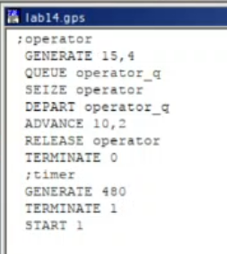
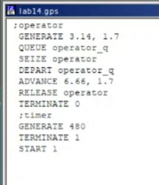
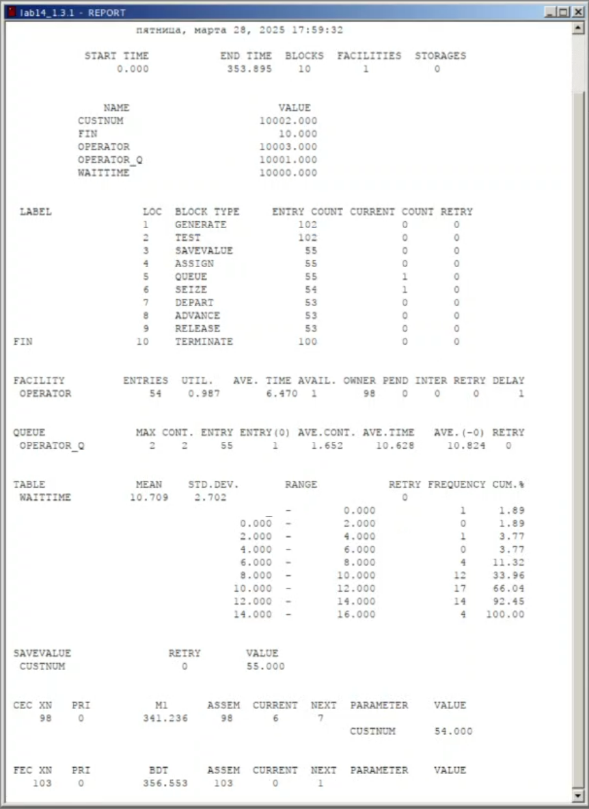
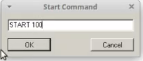
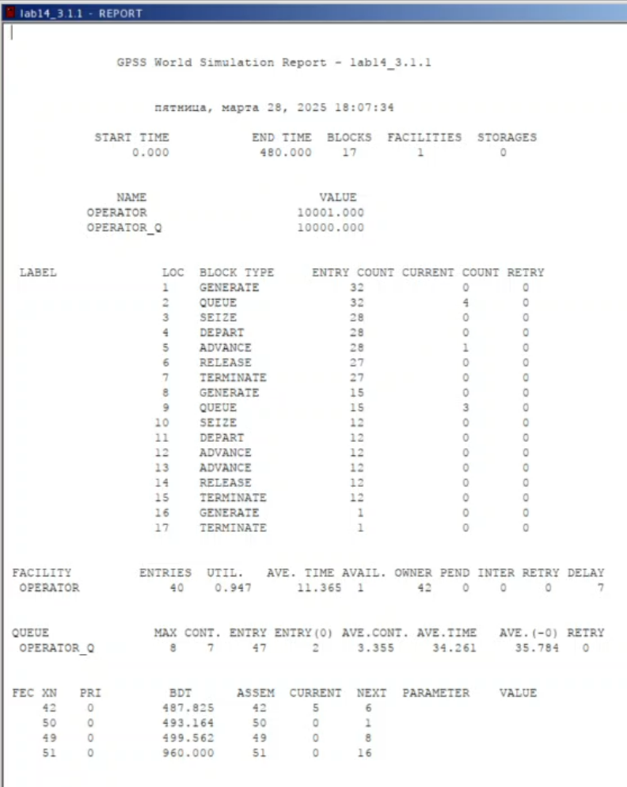
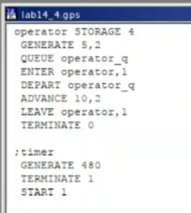
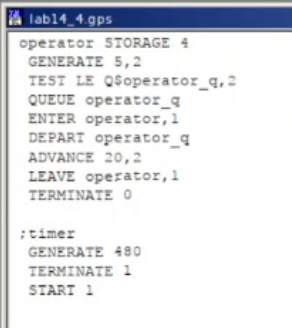

---
## Front matter
title: "Лабораторная работа №14"
subtitle: "Имитационное моделирование"
author: "Александрова Ульяна Вадимовна"

## Generic otions
lang: ru-RU
toc-title: "Содержание"

## Bibliography
bibliography: bib/cite.bib
csl: pandoc/csl/gost-r-7-0-5-2008-numeric.csl

## Pdf output format
toc: true # Table of contents
toc-depth: 2
lof: true # List of figures
fontsize: 12pt
linestretch: 1.5
papersize: a4
documentclass: scrreprt
## I18n polyglossia
polyglossia-lang:
  name: russian
  options:
	- spelling=modern
	- babelshorthands=true
polyglossia-otherlangs:
  name: english
## I18n babel
babel-lang: russian
babel-otherlangs: english
## Fonts
mainfont: IBM Plex Serif
romanfont: IBM Plex Serif
sansfont: IBM Plex Sans
monofont: IBM Plex Mono
mathfont: STIX Two Math
mainfontoptions: Ligatures=Common,Ligatures=TeX,Scale=0.94
romanfontoptions: Ligatures=Common,Ligatures=TeX,Scale=0.94
sansfontoptions: Ligatures=Common,Ligatures=TeX,Scale=MatchLowercase,Scale=0.94
monofontoptions: Scale=MatchLowercase,Scale=0.94,FakeStretch=0.9
mathfontoptions:
## Biblatex
biblatex: true
biblio-style: "gost-numeric"
biblatexoptions:
  - parentracker=true
  - backend=biber
  - hyperref=auto
  - language=auto
  - autolang=other*
  - citestyle=gost-numeric
## Pandoc-crossref LaTeX customization
figureTitle: "Рис."
tableTitle: "Таблица"
listingTitle: "Листинг"
lofTitle: "Список иллюстраций"
lolTitle: "Листинги"
## Misc options
indent: true
header-includes:
  - \usepackage{indentfirst}
  - \usepackage{float} # keep figures where there are in the text
  - \floatplacement{figure}{H} # keep figures where there are in the text
---

# Цель работы

Целью данной лабораторной работы является построении модели обработки заказов на утилите GPSS.

# Теоретическое введение

Пакет GPSS(General Purpose Simulation System — система моделирования общего  назначения) предназначен для имитационного моделирования дискретных систем.
 
**Имитационная модель в GPSS** представляет собой последовательность текстовых строк, каждая из которых определяет правила создания, перемещения, задержки и удаления транзактов.
 
**Транзакт** — динамический объект, отождествляемый с заявкой на обслуживание, который перемещается между элементами системы.

### **Типы объектов в GPSS**

- **Транзакты**: Динамические элементы, такие как заявки, пакеты, требования на обслуживание.
- **Блоки**: Определяют логику функционирования имитационной модели и пути движения транзактов.
- **Одноканальные устройства (Facility)**: Могут обрабатывать только один транзакт в любой момент времени.
- **Многоканальные устройства (Storage)**: Могут использоваться несколькими транзактами одновременно.
- **Логические ключи**: Используются для блокировки или изменения направления движения транзактов в зависимости от событий.
- **Арифметические и логические переменные**: Используются для вычислений и проверки условий.
- **Очереди**: Сбор статистики о времени задержки транзактов из-за недоступности или занятости устройств.
- **Таблицы и ячейки**: Хранение статистической информации и числовых данных.

# Задачи

- Модель оформления заказов клиентов одним оператором;
- Упражнение с другими входными данными;
- Построение гистограммы распределения заявок в очереди;
- Упражнение на анализ;
- Модель обслуживания двух типов заказов от клиентов в интернет-магазине;
- Упражнение с скорректированными условиями;
- Модель оформления заказов несколькими операторами;
- Задание.

# Выполнение лабораторной работы

## Модель оформления заказов клиентов одним оператором

### Постановка задачи

В интернет-магазине заказы принимает один оператор. Интервалы поступления заказов распределены равномерно с интервалом 15 ± 4 мин. Время оформления заказа также распределено равномерно на интервале 10 ± 2 мин. Обработка поступивших заказов происходит в порядке очереди (FIFO). Требуется разработать модель обработки заказов в течение 8 часов.

### Построение модели

Порядок блоков в модели соответствует порядку фаз обработки заказа в реальной системе:

1. клиент оставляет заявку на заказ в интернет-магазине;
2. если необходимо, заявка от клиента ожидает в очереди освобождения оператора для оформления заказа;
3. заявка от клиента принимается оператором для оформления заказа;
4. оператор оформляет заказ;
5. клиент получает подтверждение об оформлении заказа (покидает систему).

Модель будет состоять из двух частей: моделирование обработки заказов в интернет-магазине и задание времени моделирования.

Для задания равномерного распределения поступления заказов используем блок GENERATE, для задания равномерного времени обслуживания (задержки в системе) ADVANCE. Для моделирования ожидания заявок клиентов в очереди используем
блоки QUEUE и DEPART, в которых в качестве имени очереди укажем operator_q.

Для моделирования поступления заявок для оформления заказов к оператору используем блоки SEIZE и RELEASE с параметром operator — имени «устройства обслуживания».

Таким образом, имеем (рис. [-@fig:001]):

{#fig:001 width=70%}

Результаты работы модели (рис. [-@fig:002]):

{#fig:002 width=70%}

- модельное время в начале моделирования: START TIME=0.0;
- абсолютное время или момент, когда счетчик завершений принял значение 0: END TIME=480.0;
- количество блоков, использованных в текущей модели, к моменту завершения моделирования: BLOCKS=9;
- количество одноканальных устройств, использованных в модели к моменту завершения моделирования: FACILITIES=1;
- количество многоканальных устройств, использованных в текущей модели к моменту завершения моделирования: STORAGES=0.

Имена, используемые в программе модели: operator, operator_q.
Далее идёт информация о блоках текущей модели, в частности, ENTRY COUNT — количество транзактов, вошедших в блок с начала процедуры моделирования.

Затем идёт информация об одноканальном устройстве FACILITY (оператор, оформляющий заказ), откуда видим, что к оператору попало 33 заказа от клиентов (значение поля OWNER=33), но одну заявку оператор не успел принять в обработку до окончания рабочего времени (значение поля ENTRIES=32). Полезность работы оператора составила 0, 639. При этом среднее время занятости оператора составило 9, 589 мин.

Далее информация об очереди:

- QUEUE=operator_q — имя объекта типа «очередь»;
- MAX=1 — в очереди находилось не более одной ожидающей заявки от клиента;
- CONT=0 — на момент завершения моделирования очередь была пуста;
- ENTRIES=32 — общее число заявок от клиентов, прошедших через очередь в течение периода моделирования;
- ENTRIES(O)=31 — число заявок от клиентов, попавших к оператору без ожидания в очереди;
- AVE.CONT=0, 001 заявок от клиентов в среднем были в очереди;
- AVE.TIME=0.021 минут в среднем заявки от клиентов провели в очереди (с учётом всех входов в очередь);
- AVE.(–0)=0, 671 минут в среднем заявки от клиентов провели в очереди (без учета «нулевых» входов в очередь).

В конце отчёта идёт информация о будущих событиях:

- XN=33 — порядковый номер заявки от клиента, ожидающей поступления для оформления заказа у оператора;
- PRI=0 — все клиенты (из заявки) равноправны;
- BDT=489, 786 — время назначенного события, связанного с данным транзактом;
- ASSEM=33 — номер семейства транзактов;
- CURRENT=5 — номер блока, в котором находится транзакт;
- NEXT=6 — номер блока, в который должен войти транзакт.

## Упражнение

Скорректирую модель в соответствии с изменениями входных данных: интервалы поступления заказов распределены равномерно с интервалом 3.14 ± 1.7 мин; время оформления заказа также распределено равномерно на интервале 6.66 ± 1.7 мин. 

Поменяю значения интервалов (рис. [-@fig:003]):

{#fig:003 width=70%}

Составлю отчет (рис. [-@fig:004]):

{#fig:004 width=70%}

Затем идёт информация об одноканальном устройстве FACILITY (оператор, оформляющий заказ), откуда видим, что к оператору попало 71 заказ от клиентов (значение поля OWNER=71), но одну заявку оператор не успел принять в обработку до окончания рабочего времени (значение поля ENTRIES=70). Полезность работы оператора составила 0,991. При этом среднее время занятости оператора составило 6,796 мин.

Далее информация об очереди:

- QUEUE=operator_q — имя объекта типа «очередь»;
- MAX=82 — в очереди находилос82 запроса;
- CONT=82 — на момент завершения моделирования в очереди было 82 запроса;
- ENTRIES=152 — общее число заявок от клиентов, прошедших через очередь в течение периода моделирования;
- ENTRIES(O)=1 — число заявок от клиентов, попавших к оператору без ожидания в очереди;
- AVE.CONT=39,096 заявок от клиентов в среднем были в очереди;
- AVE.TIME=123,461 минут в среднем заявки от клиентов провели в очереди (с учётом всех входов в очередь);
- AVE.(–0)=124,279 минут в среднем заявки от клиентов провели в очереди (без учета «нулевых» входов в очередь).

В конце отчёта идёт информация о будущих событиях.

## Построение гистограммы распределения заявок в очереди

### Постановка задачи

Требуется построить гистограмму распределения заявок, ожидающих обработки в очереди в примере из предыдущего упражнения. Для построения гистограммы необходимо сформировать таблицу значений заявок в очереди, записываемых в неё с определённой частотой.

### Построение модели

Команда описания таблицы QTABLE имеет следующий формат (рис. [-@fig:005]):

{#fig:005 width=70%}

Здесь Waittime — метка оператора таблицы очередей QTABLE, в данном случае название таблицы очереди заявок на заказы. Строка с оператором TEST по смыслу аналогично действиям оператора IF и означает, что если в очереди 0 или 1 заявка, то осуществляется переход к следующему оператору, в данном случае к оператору SAVEVALUE, в противном случае (в очереди более одной заявки) происходит переход к оператору с меткой Fin, то есть заявка удаляется из системы, не попадая на обслуживание.

Строка с оператором SAVEVALUE с помощью операнда Custnum подсчитывает число заявок на заказ, попавших в очередь. Далее оператору ASSIGN присваивается значение СЧА оператора Custnum.

Отчет по модели (рис. [-@fig:006]):

{#fig:006 width=70%}

Информация об одноканальном устройстве FACILITY (оператор, оформляющий заказ), откуда видим, что к оператору попало 98 заказ от клиентов (значение поля OWNER=98), но 44 заявок оператор не успел принять в обработку до окончания рабочего времени (значение поля ENTRIES=54). Полезность работы оператора составила 0,987. При этом среднее время занятости оператора составило 6,470 мин.

Далее информация об очереди:

- QUEUE=operator_q — имя объекта типа «очередь»;
- MAX=2 — в очереди находилос 2 запроса;
- CONT=2 — на момент завершения моделирования в очереди было 2 запроса;
- ENTRIES=55 — общее число заявок от клиентов, прошедших через очередь в течение периода моделирования;
- ENTRIES(O)=1 — число заявок от клиентов, попавших к оператору без ожидания в очереди;
- AVE.CONT=1,652 заявок от клиентов в среднем были в очереди;
- AVE.TIME=10,628 минут в среднем заявки от клиентов провели в очереди (с учётом всех входов в очередь);
- AVE.(–0)=10,824 минут в среднем заявки от клиентов провели в очереди (без учета «нулевых» входов в очередь).

В конце отчёта идёт информация о будущих событиях.

Запуск гистограммы (рис. [-@fig:007]):

{#fig:007 width=70%}

Гистограмма имеет следующий вид (рис. [-@fig:008]):

{#fig:008 width=70%}

Пик достигается в промежутке 10-12. Мы разделили частоту на 15 интервалов, так что на гисторграмме именно это и отражено.

## Модель обслуживания двух типов заказов от клиентов в интернет-магазине

### Постановка задачи

В интернет-магазин к одному оператору поступают два типа заявок от клиентов — обычный заказ и заказ с оформление дополнительного пакета услуг. Заявки первого типа поступают каждые 15 ± 4 мин. Заявки второго типа — каждые 30 ± 8 мин.

Оператор обрабатывает заявки по принципу FIFO («первым пришел — первым обслужился»). Время, затраченное на оформление обычного заказа, составляет 10 ± 2 мин, а на оформление дополнительного пакета услуг — 5 ± 2 мин.

Требуется разработать модель обработки заказов в течение 8 часов, обеспечив сбор данных об
очереди заявок от клиентов.

### Построение модели

Необходимо реализовать отличие в оформлении обычных заказов и заказов с дополнительным пакетом услуг. Такую систему можно промоделировать с помощью двух сегментов. Один из них моделирует оформление обычных заказов, а второй — заказов с дополнительным пакетом услуг.

В каждом из сегментов пара QUEUE–DEPART должна описывать одну и ту же очередь, а пара блоков SEIZE–RELEASE должна
описывать в каждом из двух сегментов одно и то же устройство и моделировать работу оператора.

Описание выглядит следующим образом (рис. [-@fig:009]):

{#fig:009 width=70%}

Результаты работы модели (рис. [-@fig:010]):

{#fig:010 width=70%}

- модельное время в начале моделирования: START TIME=0.0;
- абсолютное время или момент, когда счетчик завершений принял значение 0: END TIME=480.0;
- количество блоков, использованных в текущей модели, к моменту завершения моделирования: BLOCKS=17;
- количество одноканальных устройств, использованных в модели к моменту завершения моделирования: FACILITIES=1;
- количество многоканальных устройств, использованных в текущей модели к моменту завершения моделирования: STORAGES=0.

Информация об одноканальном устройстве FACILITY (оператор, оформляющий заказ), откуда видим, что к оператору попало 42 заказа от клиентов (значение поля OWNER=42), но две заявки оператор не успел принять в обработку до окончания рабочего времени (значение поля ENTRIES=40). Полезность работы оператора составила 0,947. При этом среднее время занятости оператора составило 11,365 мин.

Далее информация об очереди:

- QUEUE=operator_q — имя объекта типа «очередь»;
- MAX=8;
- CONT70;
- ENTRIES=47;
- ENTRIES(O)=2;
- AVE.CONT=3,355;
- AVE.TIME=34,261;
- AVE.(–0)=35,784.

В конце отчёта идёт информация о будущих событиях.

## Упражнение со скорректированными условиями

Скорректирую модель так, чтобы учитывалось условие, что число заказов с дополнительным пакетом услуг составляет 30% от общего числа заказов. Использую оператор TRANSFER.

Описание модели выглядит следующим образом (рис. [-@fig:011]):

{#fig:011 width=70%}

Отчет выглядит следующим образом (рис. [-@fig:012]):

{#fig:012 width=70%}

Информация об одноканальном устройстве FACILITY (оператор, оформляющий заказ), откуда видим, что к оператору попало 39 заказа от клиентов (значение поля OWNER=39), все завяки были обслужены. Полезность работы оператора составила 0,947. При этом среднее время занятости оператора составило 11,656 мин.

Далее информация об очереди:

- QUEUE=operator_q — имя объекта типа «очередь»;
- MAX=7;
- CONT=7;
- ENTRIES=46;
- ENTRIES(O)=2;
- AVE.CONT=3,640;
- AVE.TIME=37,986;
- AVE.(–0)=39,7124.

В конце отчёта идёт информация о будущих событиях.

## Модель оформления заказов несколькими операторами

### Постановка задачи

В интернет-магазине заказы принимают 4 оператора. Интервалы поступления заказов распределены равномерно с интервалом 5 ± 2 мин. Время оформления заказа каждым оператором также распределено равномерно на интервале 10 ± 2 мин. Обработка поступивших заказов происходит в порядке очереди (FIFO). Требуется определить характеристики очереди заявок на оформление заказов при условии, что заявка может обрабатываться одним из 4-х операторов в течение восьмичасового рабочего дня.

### Построение модели

Описание модели имело следующий вид (рис. [-@fig:013]):

{#fig:013 width=70%}

Отчет по модели (рис. [-@fig:014]):

{#fig:014 width=70%}

Далее информация об очереди:

- QUEUE=operator_q — имя объекта типа «очередь»;
- MAX=1;
- CONT=0;
- ENTRIES=93;
- ENTRIES(O)=93;
- AVE.CONT=0;
- AVE.TIME=0;
- AVE.(–0)=0.

В конце отчёта идёт информация о будущих событиях.

## Задание

Изменим модель: требуется учесть в ней возможные отказы клиентов от заказа — когда при подаче заявки на заказ клиент видит в очереди более двух других заявок, он отказывается от подачи заявки, то есть отказывается от обслуживания (используем блок TEST и стандартный числовой атрибут Qj текущей длины очереди j).

Используем блок TEST `LE Q$operator_q,2`? оператор типа if else, который проверяет длину очереди. Также увеличиваю время обработки заказов `ADVANCE` до 10, так как иначе изменения не будут видимы.

Правила сдачи выглядят следующим образом (рис. [-@fig:015]):

{#fig:015 width=70%}

Результат работы модели (рис. [-@fig:016]):

{#fig:016 width=70%}

- модельное время в начале моделирования: START TIME=0.0;
- абсолютное время или момент, когда счетчик завершений принял значение 0: END TIME=480.0;
- количество блоков, использованных в текущей модели, к моменту завершения моделирования: BLOCKS=10;
- количество одноканальных устройств, использованных в модели к моменту завершения моделирования: FACILITIES=0;
- количество многоканальных устройств, использованных в текущей модели к моменту завершения моделирования: STORAGES=1.

Полезность работы оператора составила 0,963.

Далее информация об очереди:

- QUEUE=operator_q — имя объекта типа «очередь»;
- MAX=3;
- CONT=1;
- ENTRIES=17;
- ENTRIES(O)=17;
- AVE.CONT=1,078;
- AVE.TIME=5,391;
- AVE.(–0)=6,551.

В конце отчёта идёт информация о будущих событиях.

# Выводы

В этой лабораторной работе я смогла построить несколько моделей обработки заказов на GPSS.

# Список литературы{.unnumbered}

1. [Теоретические сведения](https://esystem.rudn.ru/mod/resource/view.php?id=1223379)
2. [Л.14. Модели обработки заказов](https://esystem.rudn.ru/mod/resource/view.php?id=1223380)
3. [Видео-пояснение: GPSS — простейший пример](https://esystem.rudn.ru/mod/page/view.php?id=1223381)
4. [Видео-пояснение: GPSS — два типа заявок](https://esystem.rudn.ru/mod/page/view.php?id=1223382)
