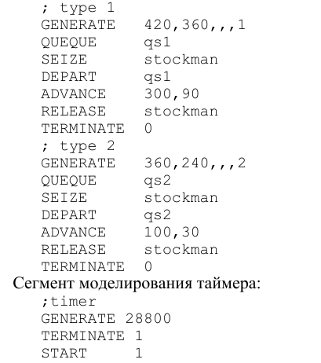
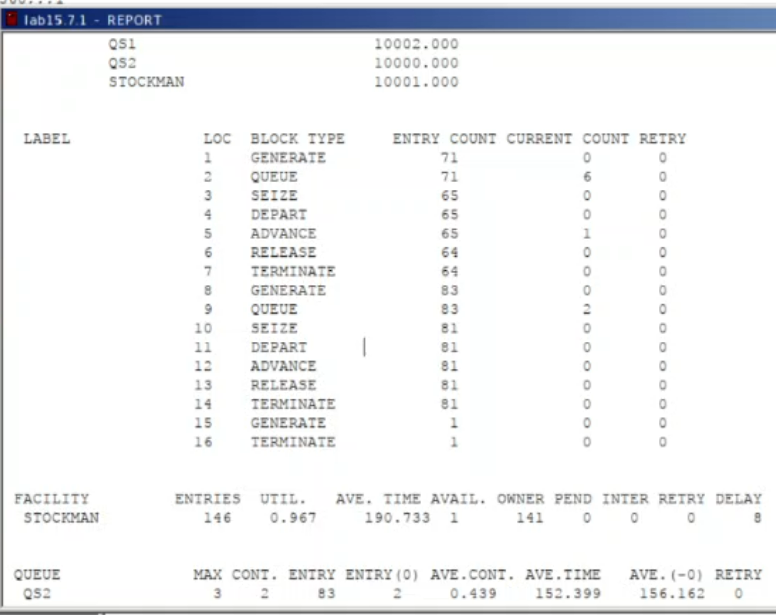

---
## Front matter
lang: ru-RU
title: Лабораторная работа №15
subtitle: Имитационное моделирование
author:
  - Александрова УВ
institute:
  - Российский университет дружбы народов, Москва, Россия
date: 7 марта 2025

## i18n babel
babel-lang: russian
babel-otherlangs: english

## Formatting pdf
toc: false
toc-title: Содержание
slide_level: 2
aspectratio: 169
section-titles: true
theme: metropolis
header-includes:
 - \metroset{progressbar=frametitle,sectionpage=progressbar,numbering=fraction}
---

# Информация

## Докладчик

:::::::::::::: {.columns align=center}
::: {.column width="70%"}

  * Александрова Ульяна
  * студентка 3го курса
  * Факультет физико-математических и естественных наук
  * Российский университет дружбы народов
  * [1132226444@rudn.ru](mailto:1132226444@rudn.ru)

:::
::: {.column width="30%"}

:::
::::::::::::::

# Цель работы

Целью работы является построение двух моделей на GPSS: обслуживания механиков на складе и  обслуживания в порту судов двух типов.

# Теоретическое введение

Пакет GPSS(General Purpose Simulation System — система моделирования общего  назначения) предназначен для имитационного моделирования дискретных систем.
 
**Имитационная модель в GPSS** представляет собой последовательность текстовых строк, каждая из которых определяет правила создания, перемещения, задержки и удаления транзактов.
 
**Транзакт** — динамический объект, отождествляемый с заявкой на обслуживание, который перемещается между элементами системы.

# Задачи

Построить с помощью GPSS:

1. Модель обслуживания механиков на складе
2. Модель обслуживания в порту судов двух типов

# Выполнение лабораторной работы

## Модель обслуживания механиков на складе

На фабрике на складе работает один кладовщик, который выдает запасные части механикам, обслуживающим станки. Время, необходимое для удовлетворения запроса, зависит от типа запасной части. Запросы бывают двух категорий. Для первой категории интервалы времени прихода механиков 420 ± 360 сек., время обслуживания — 300 ± 90 сек. Для второй категории интервалы времени прихода механиков 360 ± 240 сек., время обслуживания — 100 ± 30 сек.

## Построение модели

:::::::::::::: {.columns align=center}
::: {.column width="60%"}

Есть два различных типа заявок, поступающих на обслуживание к одному устройству. Различаются распределения интервалов приходов и времени обслуживания для этих типов заявок. Приоритеты запросов задаются путем использования для операнда E блока GENERATE запросов второй категории большего значения, чем для
запросов первой категории.

:::
::: {.column width="50%"}

:::
::::::::::::::

##

:::::::::::::: {.columns align=center}
::: {.column width="50%"}

:::
::: {.column width="70%"}

Информация об одноканальном устройстве FACILITY (оператор, оформляющий заказ), откуда видим, что к оператору попало 146 заказа от клиенто. Полезность работы оператора составила 0,967. При этом среднее время занятости оператора составило 190,733 мин.

:::
::::::::::::::

##  Модель обслуживания в порту судов двух типов

Морские суда двух типов прибывают в порт, где происходит их разгрузка. В порту есть два буксира, обеспечивающих ввод и вывод кораблей из порта. К первому типу судов относятся корабли малого тоннажа, которые требуют использования одного буксира. Корабли второго типа имеют большие размеры, и для их ввода и вывода из порта требуется два буксира. Из-за различия размеров двух типов кораблей необходимы и причалы различного размера. Кроме того, корабли имеют различное время погрузки/разгрузки.

##

:::::::::::::: {.columns align=center}
::: {.column width="70%"}

Параметры модели:

- для корабля первого типа:
- интервал прибытия: 130 ± 30 мин;
- время входа в порт: 30 ± 7 мин;
- количество доступных причалов: 6;
- время погрузки/разгрузки: 12 ± 2 час;
- время выхода из порта: 20 ± 5 мин;
- для корабля второго типа:
- интервал прибытия: 390 ± 60 мин;
- время входа в порт: 45 ± 12 мин;
- количество доступных причалов: 3;
- время погрузки/разгрузки: 18 ± 4 час;
- время выхода из порта: 35 ± 10 мин.
- время моделирования: 365 дней по 8 часов.

:::
::: {.column width="50%"}

:::
::::::::::::::

## Отчет

# Выводы

В результате работы я составила две модели при помощи GPSS.

# Список литературы{.unnumbered}

1. [Л.15. Модели обслуживания с приоритетами](https://esystem.rudn.ru/mod/resource/view.php?id=1223384)
2. [Видео-пояснение: GPSS — заявки с приоритетами](https://esystem.rudn.ru/mod/page/view.php?id=1223385)
