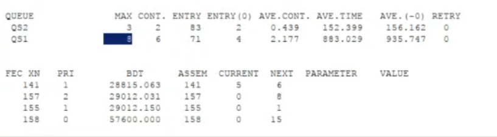
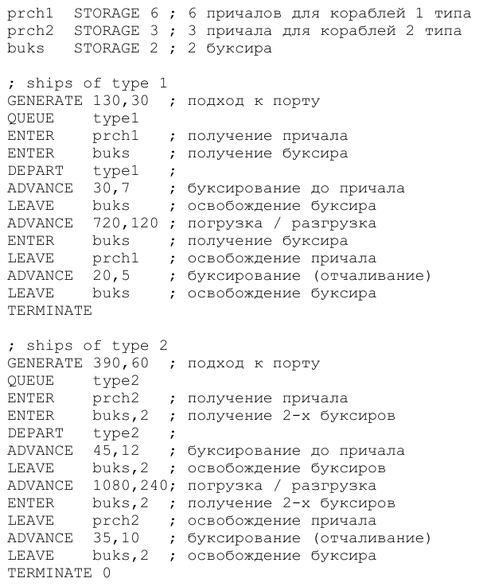
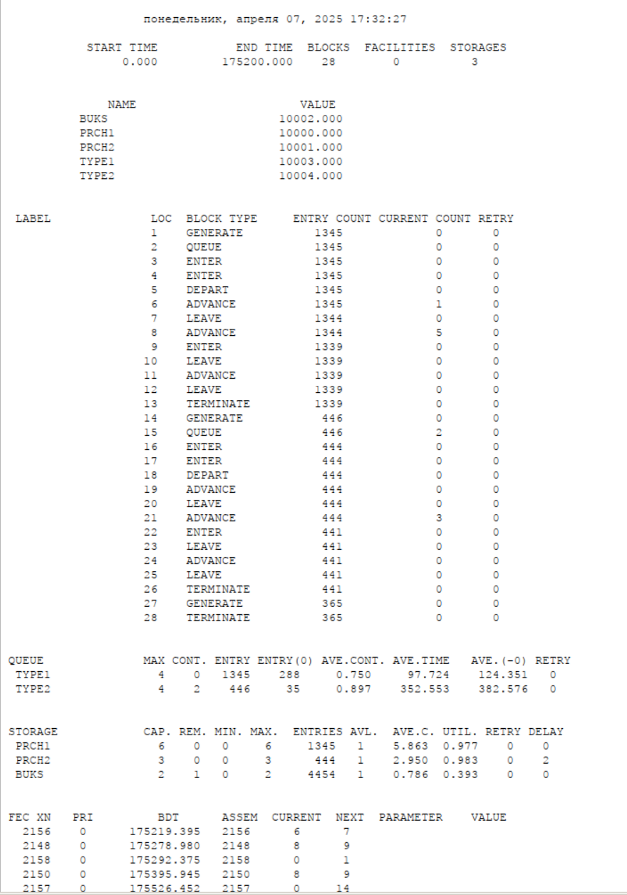

---
## Front matter
title: "Лабораторная работа №15"
subtitle: "Имитационное моделирование"
author: "Александрова Ульяна Вадимовна"

## Generic otions
lang: ru-RU
toc-title: "Содержание"

## Bibliography
bibliography: bib/cite.bib
csl: pandoc/csl/gost-r-7-0-5-2008-numeric.csl

## Pdf output format
toc: true # Table of contents
toc-depth: 2
lof: true # List of figures
lot: false # List of tables
fontsize: 12pt
linestretch: 1.5
papersize: a4
documentclass: scrreprt
## I18n polyglossia
polyglossia-lang:
  name: russian
  options:
	- spelling=modern
	- babelshorthands=true
polyglossia-otherlangs:
  name: english
## I18n babel
babel-lang: russian
babel-otherlangs: english
## Fonts
mainfont: IBM Plex Serif
romanfont: IBM Plex Serif
sansfont: IBM Plex Sans
monofont: IBM Plex Mono
mathfont: STIX Two Math
mainfontoptions: Ligatures=Common,Ligatures=TeX,Scale=0.94
romanfontoptions: Ligatures=Common,Ligatures=TeX,Scale=0.94
sansfontoptions: Ligatures=Common,Ligatures=TeX,Scale=MatchLowercase,Scale=0.94
monofontoptions: Scale=MatchLowercase,Scale=0.94,FakeStretch=0.9
mathfontoptions:
## Biblatex
biblatex: true
biblio-style: "gost-numeric"
biblatexoptions:
  - parentracker=true
  - backend=biber
  - hyperref=auto
  - language=auto
  - autolang=other*
  - citestyle=gost-numeric
## Pandoc-crossref LaTeX customization
figureTitle: "Рис."
tableTitle: "Таблица"
listingTitle: "Листинг"
lofTitle: "Список иллюстраций"
lotTitle: "Список таблиц"
lolTitle: "Листинги"
## Misc options
indent: true
header-includes:
  - \usepackage{indentfirst}
  - \usepackage{float} # keep figures where there are in the text
  - \floatplacement{figure}{H} # keep figures where there are in the text
---

# Цель работы

Целью работы является построение двух моделей на GPSS: обслуживания механиков на складе и  обслуживания в порту судов двух типов.

# Задание

Построить с помощью GPSS:

1. Модель обслуживания механиков на складе
2. Модель обслуживания в порту судов двух типов

# Теоретическое введение

Пакет GPSS(General Purpose Simulation System — система моделирования общего  назначения) предназначен для имитационного моделирования дискретных систем.
 
**Имитационная модель в GPSS** представляет собой последовательность текстовых строк, каждая из которых определяет правила создания, перемещения, задержки и удаления транзактов.
 
**Транзакт** — динамический объект, отождествляемый с заявкой на обслуживание, который перемещается между элементами системы.

### **Типы объектов в GPSS**

- **Транзакты**: Динамические элементы, такие как заявки, пакеты, требования на обслуживание.
- **Блоки**: Определяют логику функционирования имитационной модели и пути движения транзактов.
- **Одноканальные устройства (Facility)**: Могут обрабатывать только один транзакт в любой момент времени.
- **Многоканальные устройства (Storage)**: Могут использоваться несколькими транзактами одновременно.
- **Логические ключи**: Используются для блокировки или изменения направления движения транзактов в зависимости от событий.
- **Арифметические и логические переменные**: Используются для вычислений и проверки условий.
- **Очереди**: Сбор статистики о времени задержки транзактов из-за недоступности или занятости устройств.
- **Таблицы и ячейки**: Хранение статистической информации и числовых данных.

# Выполнение лабораторной работы

## Постановка задачи 

На фабрике на складе работает один кладовщик, который выдает запасные части механикам, обслуживающим станки. Время, необходимое для удовлетворения запроса, зависит от типа запасной части. Запросы бывают двух категорий. Для первой категории интервалы времени прихода механиков 420 ± 360 сек., время обслуживания — 300 ± 90 сек. Для второй категории интервалы времени прихода механиков 360 ± 240 сек., время обслуживания — 100 ± 30 сек.

Порядок обслуживания механиков кладовщиком такой: запросы первой категории обслуживаются только в том случае, когда в очереди нет ни одного запроса второй категории. Внутри одной категории дисциплина обслуживания — «первым пришел – первым обслужился». Необходимо создать модель работы кладовой, моделирование выполнять в течение восьмичасового рабочего дня.

## Построение модели

Есть два различных типа заявок, поступающих на обслуживание к одному устройству. Различаются распределения интервалов приходов и времени обслуживания для этих типов заявок. Приоритеты запросов задаются путем использования для операнда E блока GENERATE запросов второй категории большего значения, чем для
запросов первой категории (рис. [-@fig:001]).

{#fig:001 width=70%}

Запустим симуляцию и посмотрим отчет (рис. [-@fig:002]), (рис. [-@fig:003]).

{#fig:002 width=70%}

{#fig:003 width=70%}

Моделью было сгенерировано 71 заявок типа 1 и 83 заявки - второго.

Информация об одноканальном устройстве FACILITY (оператор, оформляющий заказ), откуда видим, что к оператору попало 146 заказа от клиенто. Полезность работы оператора составила 0,967. При этом среднее время занятости оператора составило 190,733 мин.

Далее информация об очереди:

- QUEUE=qs1 — имя объекта типа «очередь»;
- MAX=3 — в очереди находилось не более одной ожидающей заявки от клиента;
- CONT=2 — на момент завершения моделирования очередь была пуста;
- ENTRIES=83 — общее число заявок от клиентов, прошедших через очередь в течение периода моделирования;
- ENTRIES(O)=2 — число заявок от клиентов, попавших к оператору без ожидания в очереди;
- AVE.CONT=0,439 заявок от клиентов в среднем были в очереди;
- AVE.TIME=152,399 минут в среднем заявки от клиентов провели в очереди (с учётом всех входов в очередь);
- AVE.(–0)=156,162 минут в среднем заявки от клиентов провели в очереди (без учета «нулевых» входов в очередь);
- QUEUE=qs2 — имя объекта типа «очередь»;
- MAX=8 — в очереди находилось не более одной ожидающей заявки от клиента;
- CONT=6 — на момент завершения моделирования очередь была пуста;
- ENTRIES=71 — общее число заявок от клиентов, прошедших через очередь в течение периода моделирования;
- ENTRIES(O)=4 — число заявок от клиентов, попавших к оператору без ожидания в очереди;
- AVE.CONT=2,177 заявок от клиентов в среднем были в очереди;
- AVE.TIME=883,029 минут в среднем заявки от клиентов провели в очереди (с учётом всех входов в очередь);
- AVE.(–0)=935,747 минут в среднем заявки от клиентов провели в очереди (без учета «нулевых» входов в очередь).

# Выполнение лабораторной работы

## Постановка задачи 

Морские суда двух типов прибывают в порт, где происходит их разгрузка. В порту есть два буксира, обеспечивающих ввод и вывод кораблей из порта. К первому типу судов относятся корабли малого тоннажа, которые требуют использования одного буксира. Корабли второго типа имеют большие размеры, и для их ввода и вывода из порта требуется два буксира. Из-за различия размеров двух типов кораблей необходимы и причалы различного размера. Кроме того, корабли имеют различное время погрузки/разгрузки.

Требуется построить модель системы, в которой можно оценить время ожидания кораблями каждого типа входа в порт. Время ожидания входа в порт включает время ожидания освобождения причала и буксира. Корабль, ожидающий освобождения причала, не обслуживается буксиром до тех пор, пока не будет предоставлен нужный причал. Корабль второго типа не займёт буксир до тех пор, пока ему не будут доступны оба буксира.

## Построение модели

Параметры модели:

- для корабля первого типа:
- интервал прибытия: 130 ± 30 мин;
- время входа в порт: 30 ± 7 мин;
- количество доступных причалов: 6;
- время погрузки/разгрузки: 12 ± 2 час;
- время выхода из порта: 20 ± 5 мин;
- для корабля второго типа:
- интервал прибытия: 390 ± 60 мин;
- время входа в порт: 45 ± 12 мин;
- количество доступных причалов: 3;
- время погрузки/разгрузки: 18 ± 4 час;
- время выхода из порта: 35 ± 10 мин.
- время моделирования: 365 дней по 8 часов. (рис. [-@fig:004]).

{#fig:004 width=70%}

Запустим симуляцию и посмотрим отчет (рис. [-@fig:005]).

{#fig:005 width=70%}

Имена, используемые в программе модели: TYPE1(первый тип судов), TYPE2(второй тип судов), PRCH1(первый тип причала), PRCH2(второй тип причала). Моделью было сгенерировано 1345 заявок типа 1 и 446 заявки - второго.

Далее информация об очереди:

- QUEUE=TYPE1 — имя объекта типа «очередь»;
- MAX=4 — в очереди находилось не более одной ожидающей заявки от клиента;
- CONT=0 — на момент завершения моделирования очередь была пуста;
- ENTRIES=1345 — общее число заявок от клиентов, прошедших через очередь в течение периода моделирования;
- ENTRIES(O)=288 — число заявок от клиентов, попавших к оператору без ожидания в очереди;
- AVE.CONT=0,750 заявок от клиентов в среднем были в очереди;
- AVE.TIME=97,724 минут в среднем заявки от клиентов провели в очереди (с учётом всех входов в очередь);
- AVE.(–0)=124,351 минут в среднем заявки от клиентов провели в очереди (без учета «нулевых» входов в очередь);
- QUEUE=TYPE2 — имя объекта типа «очередь»;
- MAX=4 — в очереди находилось не более одной ожидающей заявки от клиента;
- CONT=2 — на момент завершения моделирования очередь была пуста;
- ENTRIES=446 — общее число заявок от клиентов, прошедших через очередь в течение периода моделирования;
- ENTRIES(O)=35 — число заявок от клиентов, попавших к оператору без ожидания в очереди;
- AVE.CONT=0,897 заявок от клиентов в среднем были в очереди;
- AVE.TIME=352,553 минут в среднем заявки от клиентов провели в очереди (с учётом всех входов в очередь);
- AVE.(–0)=382,576 минут в среднем заявки от клиентов провели в очереди (без учета «нулевых» входов в очередь).

# Выводы

В результате работы я составила две модели при помощи GPSS.

# Список литературы{.unnumbered}

1. [Л.15. Модели обслуживания с приоритетами](https://esystem.rudn.ru/mod/resource/view.php?id=1223384)
2. [Видео-пояснение: GPSS — заявки с приоритетами](https://esystem.rudn.ru/mod/page/view.php?id=1223385)

:::
:::
