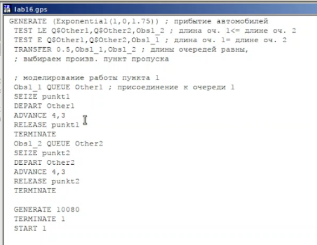
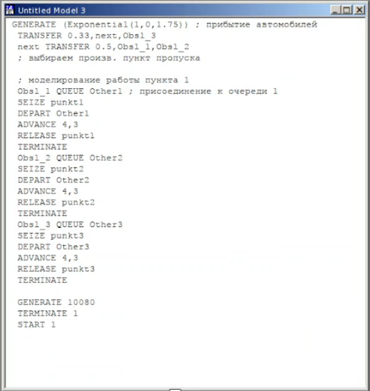
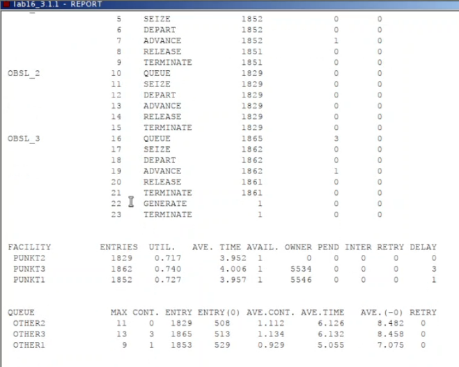
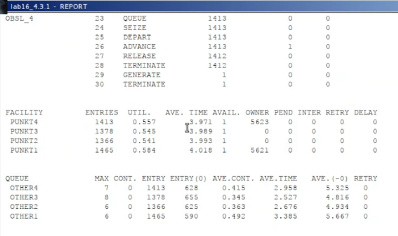
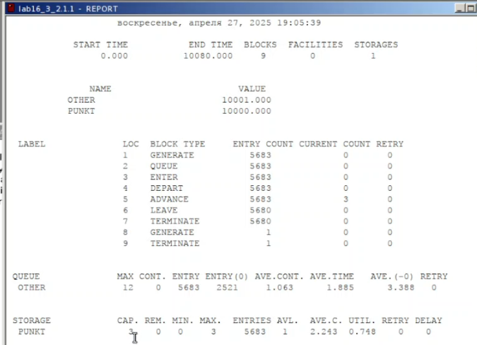

---
## Front matter
lang: ru-RU
title: Лабораторная работа №16
subtitle: Имитационное моделирование
author:
  - Александрова УВ
institute:
  - Российский университет дружбы народов, Москва, Россия
date: 27 апреля 2025

## i18n babel
babel-lang: russian
babel-otherlangs: english

## Formatting pdf
toc: false
toc-title: Содержание
slide_level: 2
aspectratio: 169
section-titles: true
theme: metropolis
header-includes:
 - \metroset{progressbar=frametitle,sectionpage=progressbar,numbering=fraction}
---

# Информация

## Докладчик

:::::::::::::: {.columns align=center}
::: {.column width="70%"}

  * Александрова Ульяна
  * студентка 3го курса
  * Факультет физико-математических и естественных наук
  * Российский университет дружбы народов
  * [1132226444@rudn.ru](mailto:1132226444@rudn.ru)

:::
::: {.column width="30%"}

:::
::::::::::::::

# Цель работы

Целью данной лабораторной работы является построение моделей двух стратегий обслуживания и решение задачи оптимизации.

# Задание

На пограничном контрольно-пропускном пункте транспорта имеются 2 пункта
пропуска. Интервалы времени между поступлением автомобилей имеют экспоненциальное распределение со средним значением $\mu$. Время прохождения автомобилями
пограничного контроля имеет равномерное распределение на интервале $[a, b]$.
Предлагается две стратегии обслуживания прибывающих автомобилей:

1) автомобили образуют две очереди и обслуживаются соответствующими пунктами
пропуска;
2) автомобили образуют одну общую очередь и обслуживаются освободившимся
пунктом пропуска.
Исходные данные: $\mu$ = 1, 75 мин, $a$ = 1 мин, $b$ = 7 мин.

# Выполнение лабораторной работы

## Построение моделей

В качестве критериев, используемых для сравнения стратегий обслуживания
автомобилей, выберем:

- коэффициенты загрузки системы;
- максимальные и средние длины очередей;
- средние значения времени ожидания обслуживания.

## Первая стратегия

:::::::::::::: {.columns align=center}
::: {.column width="70%"}

{#fig:001 width=70%}

:::
::: {.column width="70%"}

{#fig:002 width=70%}

:::
::::::::::::::

## Вторая стратегия

:::::::::::::: {.columns align=center}
::: {.column width="70%"}

{#fig:003 width=70%}

:::
::: {.column width="70%"}

{#fig:004 width=70%}

:::
::::::::::::::

## Сравнение

:Сравнение стратегий {#tbl:sr}:

| Показатель                 | стратегия 1 |         |          |  стратегия 2 |
|----------------------------|-------------|---------|----------|--------------|
|                            | пункт 1     | пункт 2 | в целом  | в целом      |
| Поступило автомобилей      | 2928        | 2925    | 5853     | 5719         |
| Обслужено автомобилей      | 2540        | 2536    | 5076     | 5049         |
| Коэффициент загрузки       | 0,997       | 0,996   | 0,9965   | 1            |
| Максимальная длина очереди | 393         | 393     | 786      | 668          |
| Средняя длина очереди      | 187,098     | 187,114 | 374,212  | 344,466      |
| Среднее время ожидания     | 644,107     | 644,823 | 644,465  | 607,138      |

# Выполнение задания

Теперь построим модели так, чтобы найти оптимальное количество пунктов (1-4) для каждой стратегии, при этом: 

- коэффициент загрузки пропускных пунктов принадлежит интервалу [0, 5; 0, 95];
- среднее число автомобилей, одновременно находящихся на контрольно пропускном пункте, не должно превышать 3;
- среднее время ожидания обслуживания не должно превышать 4 мин.

## Построение моделей для первой стратегии

:::::::::::::: {.columns align=center}
::: {.column width="70%"}

{#fig:005 width=70%}

:::
::: {.column width="70%"}

{#fig:006 width=70%}

:::
::::::::::::::

##

:::::::::::::: {.columns align=center}
::: {.column width="70%"}

{#fig:007 width=70%}

{#fig:008 width=70%}

:::
::: {.column width="70%"}

{#fig:009 width=70%}

:::
::::::::::::::

## Вывод по первой стратегии

Модель с четырьмя пунктами является оптимальной для первой стратегии.

## Построение моделей для второй стратегии

:::::::::::::: {.columns align=center}
::: {.column width="70%"}

{#fig:010 width=70%}

:::
::: {.column width="70%"}

{#fig:011 width=70%}

:::
::::::::::::::

### Вывод по первой стратегии

Модель с тремя и четырьмя пунктами является оптимальной для первой стратегии.

# Выводы

В результате работы я составила две модели с разными стратегиями при помощи GPSS, а также оптимизировала.

# Список литературы{.unnumbered}

1. [Л.16. Задачи оптимизации. Модель двух стратегий обслуживания](https://esystem.rudn.ru/mod/resource/view.php?id=1223387)

:::
:::
