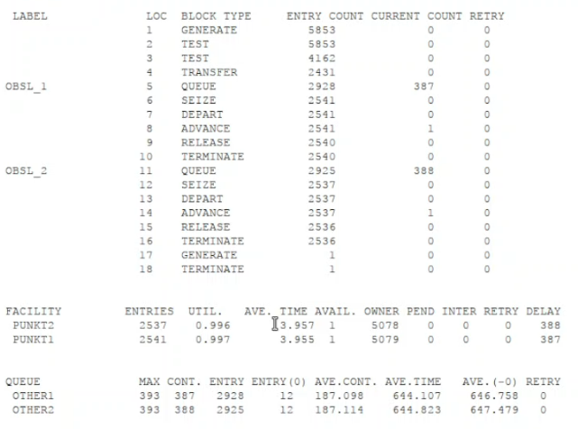
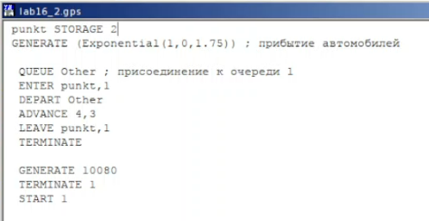
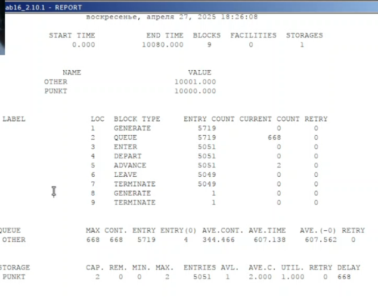
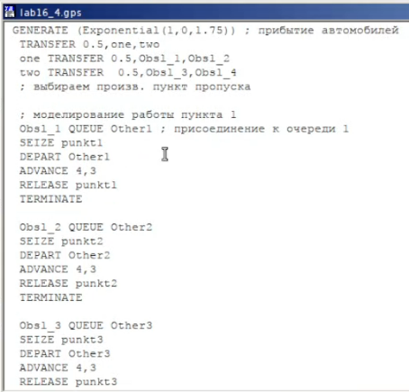
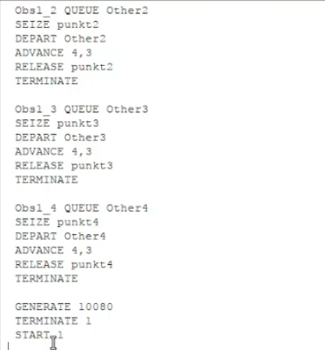
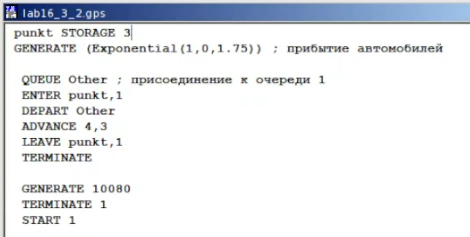

---
## Front matter
title: "Лабораторная работа №16"
subtitle: "Имитационное моделирование"
author: "Александрова Ульяна Вадимовна"

## Generic otions
lang: ru-RU
toc-title: "Содержание"

## Bibliography
bibliography: bib/cite.bib
csl: pandoc/csl/gost-r-7-0-5-2008-numeric.csl

## Pdf output format
toc: true # Table of contents
toc-depth: 2
lof: true # List of figures
lot: false # List of tables
fontsize: 12pt
linestretch: 1.5
papersize: a4
documentclass: scrreprt
## I18n polyglossia
polyglossia-lang:
  name: russian
  options:
	- spelling=modern
	- babelshorthands=true
polyglossia-otherlangs:
  name: english
## I18n babel
babel-lang: russian
babel-otherlangs: english
## Fonts
mainfont: IBM Plex Serif
romanfont: IBM Plex Serif
sansfont: IBM Plex Sans
monofont: IBM Plex Mono
mathfont: STIX Two Math
mainfontoptions: Ligatures=Common,Ligatures=TeX,Scale=0.94
romanfontoptions: Ligatures=Common,Ligatures=TeX,Scale=0.94
sansfontoptions: Ligatures=Common,Ligatures=TeX,Scale=MatchLowercase,Scale=0.94
monofontoptions: Scale=MatchLowercase,Scale=0.94,FakeStretch=0.9
mathfontoptions:
## Biblatex
biblatex: true
biblio-style: "gost-numeric"
biblatexoptions:
  - parentracker=true
  - backend=biber
  - hyperref=auto
  - language=auto
  - autolang=other*
  - citestyle=gost-numeric
## Pandoc-crossref LaTeX customization
figureTitle: "Рис."
tableTitle: "Таблица"
listingTitle: "Листинг"
lofTitle: "Список иллюстраций"
lotTitle: "Список таблиц"
lolTitle: "Листинги"
## Misc options
indent: true
header-includes:
  - \usepackage{indentfirst}
  - \usepackage{float} # keep figures where there are in the text
  - \floatplacement{figure}{H} # keep figures where there are in the text
---

# Цель работы

Целью данной лабораторной работы является построение моделей двух стратегий обслуживания и решение задачи оптимизации.

# Задание

На пограничном контрольно-пропускном пункте транспорта имеются 2 пункта
пропуска. Интервалы времени между поступлением автомобилей имеют экспоненциальное распределение со средним значением $\mu$. Время прохождения автомобилями
пограничного контроля имеет равномерное распределение на интервале $[a, b]$.
Предлагается две стратегии обслуживания прибывающих автомобилей:

1) автомобили образуют две очереди и обслуживаются соответствующими пунктами
пропуска;
2) автомобили образуют одну общую очередь и обслуживаются освободившимся
пунктом пропуска.
Исходные данные: $\mu$ = 1, 75 мин, $a$ = 1 мин, $b$ = 7 мин.

Свести полученные статистики моделирования в таблицу.

Построить с помощью GPSS:

Определить оптимальное число пропускных пунктов (от 1 до 4) под следующие критерии:

- коэффициент загрузки пропускных пунктов принадлежит интервалу [0, 5; 0, 95];
- среднее число автомобилей, одновременно находящихся на контрольно пропускном пункте, не должно превышать 3;
- среднее время ожидания обслуживания не должно превышать 4 мин.

# Теоретическое введение

Пакет GPSS(General Purpose Simulation System — система моделирования общего  назначения) предназначен для имитационного моделирования дискретных систем.
 
**Имитационная модель в GPSS** представляет собой последовательность текстовых строк, каждая из которых определяет правила создания, перемещения, задержки и удаления транзактов.
 
**Транзакт** — динамический объект, отождествляемый с заявкой на обслуживание, который перемещается между элементами системы.

### **Типы объектов в GPSS**

- **Транзакты**: Динамические элементы, такие как заявки, пакеты, требования на обслуживание.
- **Блоки**: Определяют логику функционирования имитационной модели и пути движения транзактов.
- **Одноканальные устройства (Facility)**: Могут обрабатывать только один транзакт в любой момент времени.
- **Многоканальные устройства (Storage)**: Могут использоваться несколькими транзактами одновременно.
- **Логические ключи**: Используются для блокировки или изменения направления движения транзактов в зависимости от событий.
- **Арифметические и логические переменные**: Используются для вычислений и проверки условий.
- **Очереди**: Сбор статистики о времени задержки транзактов из-за недоступности или занятости устройств.
- **Таблицы и ячейки**: Хранение статистической информации и числовых данных.

# Выполнение лабораторной работы

## Построение моделей

В качестве критериев, используемых для сравнения стратегий обслуживания
автомобилей, выберем:

- коэффициенты загрузки системы;
- максимальные и средние длины очередей;
- средние значения времени ожидания обслуживания.

Для первой стратегии обслуживания, когда прибывающие автомобили образуют
две очереди и обслуживаются соответствующими пропускными пунктами, имеем
следующую модель (рис. [-@fig:001]).

{#fig:001 width=70%}

Запустим симуляцию и посмотрим отчет (рис. [-@fig:002]).

{#fig:002 width=70%}

Для второй стратегии обслуживания, когда прибывающие автомобили образуют одну очередь и обслуживаются соответствующими пропускными пунктами, имеем следующую модель (рис. [-@fig:003]).

{#fig:003 width=70%}

Запустим симуляцию и посмотрим отчет (рис. [-@fig:004]).

{#fig:004 width=70%}

Составим таблицу по полученной статистике (табл. [-@tbl:sr]).

:Сравнение стратегий {#tbl:sr}:

| Показатель                 | стратегия 1 |         |          |  стратегия 2 |
|----------------------------|-------------|---------|----------|--------------|
|                            | пункт 1     | пункт 2 | в целом  | в целом      |
| Поступило автомобилей      | 2928        | 2925    | 5853     | 5719         |
| Обслужено автомобилей      | 2540        | 2536    | 5076     | 5049         |
| Коэффициент загрузки       | 0,997       | 0,996   | 0,9965   | 1            |
| Максимальная длина очереди | 393         | 393     | 786      | 668          |
| Средняя длина очереди      | 187,098     | 187,114 | 374,212  | 344,466      |
| Среднее время ожидания     | 644,107     | 644,823 | 644,465  | 607,138      |

Из таблицы можем сделать вывод, что стратегия 2 является более эффективной, так как позволяет обслужить больше устройств (разнница между обсуженными и не обсулженными меньше, чем у первой стратегии), очередь проходит быстрее (из максимальной длины очереди и среднего времени ожидания), а также коэффициент загрузги говорит о том, что пункты работали без перерыва, что тоже способствовало более эффективной работе.

## Выполнение задания

Теперь построим модели так, чтобы найти оптимальное количество пунктов (1-4) для каждой стратегии, при этом: 

- коэффициент загрузки пропускных пунктов принадлежит интервалу [0, 5; 0, 95];
- среднее число автомобилей, одновременно находящихся на контрольно пропускном пункте, не должно превышать 3;
- среднее время ожидания обслуживания не должно превышать 4 мин.

### Построение моделей для первой стратегии

Изменим модель так, чтобы устройства обслуживались тремя пунктами (рис. [-@fig:005]).

{#fig:005 width=70%}

Запустим симуляцию и посмотрим отчет (рис. [-@fig:006]).

{#fig:006 width=70%}

В результате мы видим, что:

- коэффициент загрузки пропускных пунктов действительно принадлежит интервалу [0, 5; 0, 95];
- среднее число автомобилей, одновременно находящихся на контрольно пропускном пункте, не превышает 3;
- среднее время ожидания обслуживания **больше** 4 мин.

Изменим модель так, чтобы устройства обслуживались четырьмя пунктами (рис. [-@fig:007]), (рис. [-@fig:008])

{#fig:007 width=70%}

{#fig:008 width=70%}

Запустим симуляцию и посмотрим отчет (рис. [-@fig:009]).

{#fig:009 width=70%}

В результате мы видим, что:

- коэффициент загрузки пропускных пунктов действительно принадлежит интервалу [0, 5; 0, 95];
- среднее число автомобилей, одновременно находящихся на контрольно пропускном пункте, не превышает 3;
- среднее время ожидания обслуживания меньше 4 мин.

### Вывод по первой стратегии

Модель с четырьмя пунктами является оптимальной для первой стратегии.

### Построение моделей для второй стратегии

Изменим модель так, чтобы устройства обслуживались тремя пунктами (рис. [-@fig:010]).

{#fig:010 width=70%}

Запустим симуляцию и посмотрим отчет (рис. [-@fig:011]).

{#fig:011 width=70%}

В результате мы видим, что:

- коэффициент загрузки пропускных пунктов действительно принадлежит интервалу [0, 5; 0, 95];
- среднее число автомобилей, одновременно находящихся на контрольно пропускном пункте, не превышает 3;
- среднее время ожидания обслуживания не больше 4 мин.

### Вывод по первой стратегии

Модель с тремя и четырьмя пунктами является оптимальной для первой стратегии.

# Выводы

В результате работы я составила две модели с разными стратегиями при помощи GPSS, а также оптимизировала.

# Список литературы{.unnumbered}

1. [Л.16. Задачи оптимизации. Модель двух стратегий обслуживания](https://esystem.rudn.ru/mod/resource/view.php?id=1223387)

:::
:::
