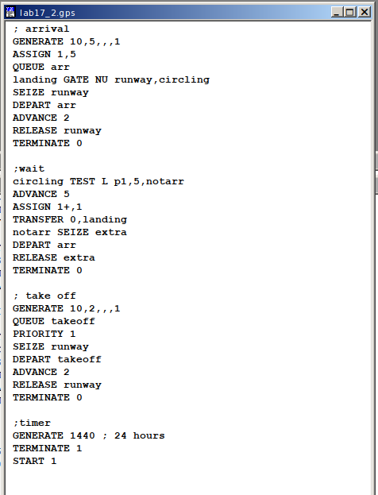
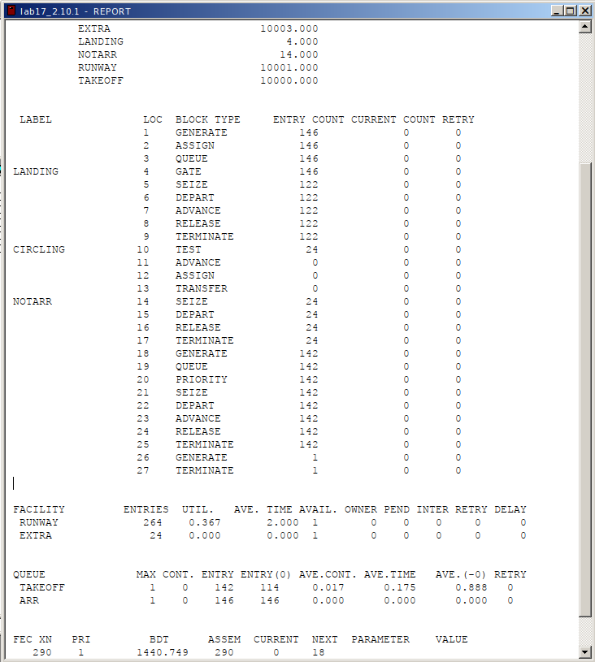
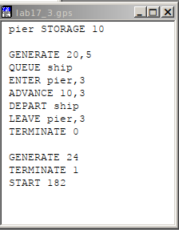
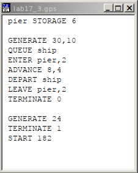
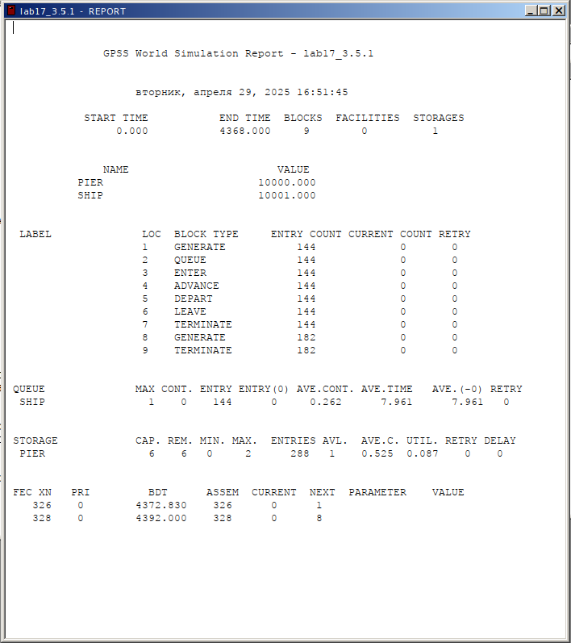

---
## Front matter
lang: ru-RU
title: Лабораторная работа №17
subtitle: Имитационное моделирование
author:
  - Александрова УВ
institute:
  - Российский университет дружбы народов, Москва, Россия
date: 29 апреля 2025

## i18n babel
babel-lang: russian
babel-otherlangs: english

## Formatting pdf
toc: false
toc-title: Содержание
slide_level: 2
aspectratio: 169
section-titles: true
theme: metropolis
header-includes:
 - \metroset{progressbar=frametitle,sectionpage=progressbar,numbering=fraction}
---

# Информация

## Докладчик

:::::::::::::: {.columns align=center}
::: {.column width="70%"}

  * Александрова Ульяна
  * студентка 3го курса
  * Факультет физико-математических и естественных наук
  * Российский университет дружбы народов
  * [1132226444@rudn.ru](mailto:1132226444@rudn.ru)

:::
::: {.column width="30%"}

:::
::::::::::::::

# Цель работы

Целью данной лабораторной работы является решение задач для самостоятельной работы:

- Моделирование работы вычислительного центра
- Модель работы аэропорта
- Моделирование работы морского порта

# Выполнение лабораторной работы

## Моделирование работы вычислительного центра

На вычислительном центре в обработку принимаются три класса заданий А, В и С. Исходя из наличия оперативной памяти ЭВМ задания классов А и В могут решаться одновременно, а задания класса С монополизируют ЭВМ. Задания класса А поступают через 20 ± 5 мин, класса В — через 20 ± 10 мин, класса С — через 28 ± 5 мин и требуют для выполнения:

- класс А — 20 ± 5 мин,
- класс В — 21 ± 3 мин,
- класс С — 28 ± 5 мин.

Задачи класса С загружаются в ЭВМ, если она полностью свободна. Задачи классов А и В могут дозагружаться к решающей задаче. Смоделировать работу ЭВМ за 80 ч. Определить её загрузку.

## Решение

:::::::::::::: {.columns align=center}
::: {.column width="50%"}

:::
::: {.column width="50%"}

:::
::::::::::::::

## Вывод

Загрузка модели UTIL = 0.994, что достаточно высоко. Это объясняется постоянной загруженностью центра классом C в особенности, так как у него самая большая и продолжительная очередь.

## Модель работы аэропорта

Самолёты прибывают для посадки в район аэропорта каждые 10 ± 5 мин. Если взлетно-посадочная полоса свободна, прибывший самолёт получает разрешение на посадку. Если полоса занята, самолет выполняет полет по кругу и возвращается в аэропорт каждые 5 мин. Если после пятого круга самолет не получает разрешения на посадку, он отправляется на запасной аэродром.

В аэропорту через каждые 10 ± 2 мин к взлетно-посадочной полосе выруливают готовые к взлёту самолёты и получают разрешение на взлёт, если полоса свободна. Для взлета и посадки самолёты занимают полосу ровно на 2 мин. Если при свободной полосе одновременно один самолёт прибывает для посадки, а другой — для взлёта, то полоса предоставляется взлетающей машине.

Требуется:

- выполнить моделирование работы аэропорта в течение суток;
- подсчитать количество самолётов, которые взлетели, сели и были направлены на запасной аэродром;
- определить коэффициент загрузки взлетно-посадочной полосы.

## Решение

:::::::::::::: {.columns align=center}
::: {.column width="50%"}

:::
::: {.column width="50%"}

:::
::::::::::::::

## Вывод

Из отчета можно сделать вывод, что:

- Кол-во взлетевших самолетов: 114
- Кол-во севших самолетов: 146
- Кол-во самолетов, направленных в запасной аэродром: 24
- Коэффициент загрузки: 0.367

## Моделирование работы морского порта

Морские суда прибывают в порт каждые $[a \pm \delta]$ часов. В порту имеется $N$ причалов. Каждый корабль по длине занимает $M$ причалов и находится в порту $[b \pm \epsilon]$ часов. Требуется построить GPSS-модель для анализа работы морского порта в течение полугода, определить оптимальное количество причалов для эффективной работы порта.

**Исходные данные:**
1. $a = 20$ ч, $\delta = 5$ ч, $b = 10$ ч, $\epsilon = 3$ ч, $N = 10$, $M = 3$;
2. $a = 30$ ч, $\delta = 10$ ч, $b = 8$ ч, $\epsilon = 4$ ч, $N = 6$, $M = 2$.

## Решение

:::::::::::::: {.columns align=center}
::: {.column width="50%"}

:::
::: {.column width="50%"}

:::
::::::::::::::

## 

:::::::::::::: {.columns align=center}
::: {.column width="50%"}

:::
::: {.column width="50%"}

:::
::::::::::::::

## Вывод

Обе модели показывают значительно пониженную загруженность, что может свидетельствовать о низкой работе системы. Однако, модель с 10 причалами справляется с задачей немного лучше.

# Выводы

Я построила и проанализировала три различные модели при помощи языка GPSS. 

# Список литературы

[Л.17. Задания для самостоятельной работы](https://esystem.rudn.ru/mod/resource/view.php?id=1223391)
