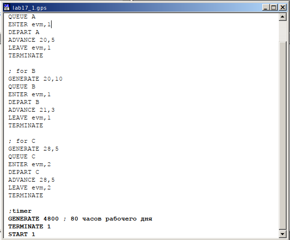
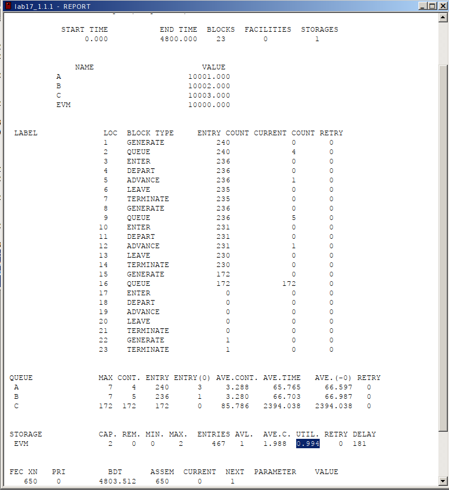
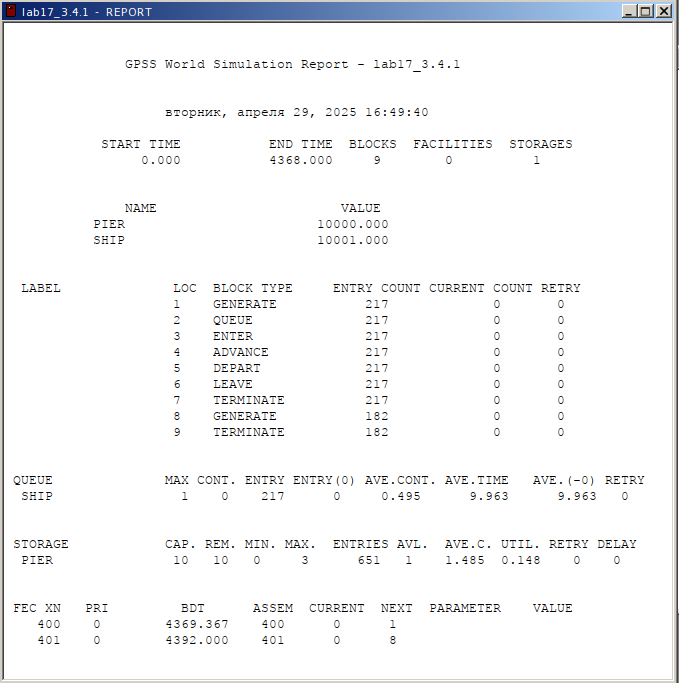

---
## Front matter
title: "Лабораторная работа №17"
subtitle: "Имитационное моделирование"
author: "Александрова Ульяна Вадимовна"

## Generic otions
lang: ru-RU
toc-title: "Содержание"

## Bibliography
bibliography: bib/cite.bib
csl: pandoc/csl/gost-r-7-0-5-2008-numeric.csl

## Pdf output format
toc: true # Table of contents
toc-depth: 2
lof: true # List of figures
lot: false # List of tables
fontsize: 12pt
linestretch: 1.5
papersize: a4
documentclass: scrreprt
## I18n polyglossia
polyglossia-lang:
  name: russian
  options:
	- spelling=modern
	- babelshorthands=true
polyglossia-otherlangs:
  name: english
## I18n babel
babel-lang: russian
babel-otherlangs: english
## Fonts
mainfont: IBM Plex Serif
romanfont: IBM Plex Serif
sansfont: IBM Plex Sans
monofont: IBM Plex Mono
mathfont: STIX Two Math
mainfontoptions: Ligatures=Common,Ligatures=TeX,Scale=0.94
romanfontoptions: Ligatures=Common,Ligatures=TeX,Scale=0.94
sansfontoptions: Ligatures=Common,Ligatures=TeX,Scale=MatchLowercase,Scale=0.94
monofontoptions: Scale=MatchLowercase,Scale=0.94,FakeStretch=0.9
mathfontoptions:
## Biblatex
biblatex: true
biblio-style: "gost-numeric"
biblatexoptions:
  - parentracker=true
  - backend=biber
  - hyperref=auto
  - language=auto
  - autolang=other*
  - citestyle=gost-numeric
## Pandoc-crossref LaTeX customization
figureTitle: "Рис."
tableTitle: "Таблица"
listingTitle: "Листинг"
lofTitle: "Список иллюстраций"
lotTitle: "Список таблиц"
lolTitle: "Листинги"
## Misc options
indent: true
header-includes:
  - \usepackage{indentfirst}
  - \usepackage{float} # keep figures where there are in the text
  - \floatplacement{figure}{H} # keep figures where there are in the text
---

# Цель работы

Целью данной лабораторной работы является решение задач для самостоятельной работы:

- Моделирование работы вычислительного центра
- Модель работы аэропорта
- Моделирование работы морского порта

# Теоретическое введение

Пакет GPSS(General Purpose Simulation System — система моделирования общего  назначения) предназначен для имитационного моделирования дискретных систем.
 
**Имитационная модель в GPSS** представляет собой последовательность текстовых строк, каждая из которых определяет правила создания, перемещения, задержки и удаления транзактов.
 
**Транзакт** — динамический объект, отождествляемый с заявкой на обслуживание, который перемещается между элементами системы.

**Типы объектов в GPSS**

- **Транзакты**: Динамические элементы, такие как заявки, пакеты, требования на обслуживание.
- **Блоки**: Определяют логику функционирования имитационной модели и пути движения транзактов.
- **Одноканальные устройства (Facility)**: Могут обрабатывать только один транзакт в любой момент времени.
- **Многоканальные устройства (Storage)**: Могут использоваться несколькими транзактами одновременно.
- **Логические ключи**: Используются для блокировки или изменения направления движения транзактов в зависимости от событий.
- **Арифметические и логические переменные**: Используются для вычислений и проверки условий.
- **Очереди**: Сбор статистики о времени задержки транзактов из-за недоступности или занятости устройств.
- **Таблицы и ячейки**: Хранение статистической информации и числовых данных.

# Выполнение лабораторной работы

## Моделирование работы вычислительного центра

### Задание

На вычислительном центре в обработку принимаются три класса заданий А, В и С. Исходя из наличия оперативной памяти ЭВМ задания классов А и В могут решаться одновременно, а задания класса С монополизируют ЭВМ. Задания класса А поступают через 20 ± 5 мин, класса В — через 20 ± 10 мин, класса С — через 28 ± 5 мин и требуют для выполнения:

- класс А — 20 ± 5 мин,
- класс В — 21 ± 3 мин,
- класс С — 28 ± 5 мин.

Задачи класса С загружаются в ЭВМ, если она полностью свободна. Задачи классов А и В могут дозагружаться к решающей задаче. Смоделировать работу ЭВМ за 80 ч. Определить её загрузку.

### Решение

Для модели работы вычислительного центра имеем следующую модель (рис. [-@fig:001]).

{#fig:001 width=70%}

Задаем хранилище на два места (одно для классов A и B, так как они работают одновременно, а второе -- для класса C, коорый монополизирует ЭВМ), для каждого класса расписываем его работу, учитывая данные параметры.

Запустим симуляцию и посмотрим отчет (рис. [-@fig:002]).

{#fig:002 width=70%}

### Вывод

Загрузка модели UTIL = 0.994, что достаточно высоко. Это объясняется постоянной загруженностью центра классом C в особенности, так как у него самая большая и продолжительная очередь.

## Модель работы аэропорта

### Задание

Самолёты прибывают для посадки в район аэропорта каждые 10 ± 5 мин. Если взлетно-посадочная полоса свободна, прибывший самолёт получает разрешение на посадку. Если полоса занята, самолет выполняет полет по кругу и возвращается в аэропорт каждые 5 мин. Если после пятого круга самолет не получает разрешения на посадку, он отправляется на запасной аэродром.

В аэропорту через каждые 10 ± 2 мин к взлетно-посадочной полосе выруливают готовые к взлёту самолёты и получают разрешение на взлёт, если полоса свободна. Для взлета и посадки самолёты занимают полосу ровно на 2 мин. Если при свободной полосе одновременно один самолёт прибывает для посадки, а другой — для взлёта, то полоса предоставляется взлетающей машине.

Требуется:

- выполнить моделирование работы аэропорта в течение суток;
- подсчитать количество самолётов, которые взлетели, сели и были направлены на запасной аэродром;
- определить коэффициент загрузки взлетно-посадочной полосы.

### Решение

Для модели работы аэропорта имеем следующую программу (рис. [-@fig:003]).

{#fig:003 width=70%}

Мы разбили программу на три части: прибытие, ожидание (круг) и отбытие. Если полоса (runway) не пуста, то мы отправляем самолет в цикл wait/circling, в котором он находится, пока либо не освободится полоса, либо не пролетит 5 кругов. При этом у полосы на вылет приоритет 1, то есть сначала самолет взлетает. Моделирование выполнено на протяжении 1440 минут (24 часов).

Запустим симуляцию и посмотрим отчет (рис. [-@fig:004]).

{#fig:004 width=70%}

### Вывод

Из отчета можно сделать вывод, что:

- Кол-во взлетевших самолетов: 114
- Кол-во севших самолетов: 146
- Кол-во самолетов, направленных в запасной аэродром: 24
- Коэффициент загрузки: 0.367

## Моделирование работы морского порта

### Задание

Морские суда прибывают в порт каждые $[a \pm \delta]$ часов. В порту имеется $N$ причалов. Каждый корабль по длине занимает $M$ причалов и находится в порту $[b \pm \epsilon]$ часов. Требуется построить GPSS-модель для анализа работы морского порта в течение полугода, определить оптимальное количество причалов для эффективной работы порта.

**Исходные данные:**
1. $a = 20$ ч, $\delta = 5$ ч, $b = 10$ ч, $\epsilon = 3$ ч, $N = 10$, $M = 3$;
2. $a = 30$ ч, $\delta = 10$ ч, $b = 8$ ч, $\epsilon = 4$ ч, $N = 6$, $M = 2$.

### Решение

Для моделирования работы морского порта с параметрами 1 имеем следующую программу (рис. [-@fig:005]).

{#fig:005 width=70%}

Запустим симуляцию и посмотрим отчет (рис. [-@fig:006]).

{#fig:006 width=70%}

Для моделирования работы морского порта с параметрами 2 имеем следующую программу  (рис. [-@fig:007]).

{#fig:007 width=70%}

Запустим симуляцию и посмотрим отчет (рис. [-@fig:008]).

{#fig:008 width=70%}

### Вывод

Обе модели показывают значительно пониженную загруженность, что может свидетельствовать о низкой работе системы. Однако, модель с 10 причалами справляется с задачей немного лучше.

# Выводы

Я построила и проанализировала три различные модели при помощи языка GPSS. 

# Список литературы

[Л.17. Задания для самостоятельной работы](https://esystem.rudn.ru/mod/resource/view.php?id=1223391
